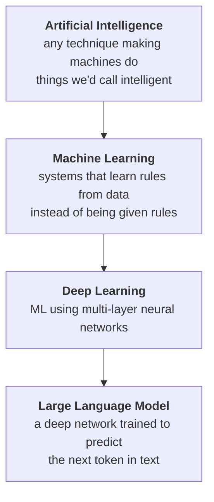

# Glossary — Key Terms and Abbreviations

Every term used across the 16 sessions, in one place. Each entry gives a plain-English definition and points to the session that teaches it properly.

**Use this as a lookup**, not a reading. If a term appears in a session and you can't remember it, find it here, then go to the session named in the last column for the full treatment.

---

## Orientation — the nested stack

Most confusion comes from these four being used interchangeably. They are nested, not synonymous:

> Every LLM is deep learning; not all deep learning is an LLM. Every ML system is AI; most AI in a vendor pitch is not ML. → **Session 2**

---

## A–Z

| Term | What it means | Taught in |
|---|---|---|
| **Activation function** | The small non-linear function at each neuron (ReLU, sigmoid) that lets a network model curves, not just straight lines. Without it, stacking layers gains you nothing. | S6 |
| **Agent** | An LLM wired into a loop and given the ability to *act* — call tools, read results, decide the next step. Distinct from a single prompt (no loop) and a workflow (fixed path). | **S12** |
| **AGI** (Artificial General Intelligence) | A system that can acquire new skills across domains as efficiently as a human. No agreed definition — the goalposts have moved repeatedly, and the major labs openly disagree on whether it's coming. | **S16** |
| **Alignment** | Training a model to produce output matching human preference and intent (e.g. via RLHF). Not the same as being *correct*. | S16 |
| **Attention / self-attention** | The mechanism letting a model weigh how much each token relates to every other token — how it tells *"Who is Snow White?"* from *"Why is snow white?"* | **S9** |
| **Backpropagation** | The algorithm that assigns blame for an error backwards through a network's layers so each weight knows which way to move. Taught by intuition here, not calculus. | S6 |
| **Bagging** | Training many models on random resamples of the data and averaging/voting. The trick that turns one overfitting tree into a random forest. | S5 |
| **Base rate** | How common something actually *is* in the population you deploy into. Ignoring it is the single most common way to be fooled by a true accuracy number. | **S13** |
| **Batch size** | How many training examples the model processes before updating its weights once. | S7 |
| **Benchmark** | A standard test set used to compare models. Treat with suspicion: benchmark authors often also build models, and most agent benchmarks ignore cost entirely. | S16, S12 |
| **Bias** (statistical) | A model's tendency to systematically miss in one direction — the flip side of variance. Distinct from *social bias*, below. | S8 |
| **Bias** (social/data) | Skewed training data producing skewed outputs. Mechanically the same failure as hallucination: pattern-completion running ahead of evidence. | **S1** |
| **Calibration** | Whether a model's stated confidence matches reality — if it says 70%, is it right ~70% of the time? Usually poor, and rarely reported. | S16 |
| **Chain of thought (CoT)** | Prompting the model to reason step by step before answering. Note: modern reasoning models do this internally; prompting for it explicitly is often obsolete. | **S10** |
| **Classification** | Predicting a category (spam / not spam). Contrast with regression. | S3 |
| **Clustering** | Grouping records with no labels, by similarity. The basis of anomaly detection. | **S4** |
| **Confusion matrix** | The 2×2 table of true/false positives and negatives. The instrument that reveals what a single accuracy figure hides. | **S8** |
| **Context window** | The maximum tokens a model can consider at once — prompt plus conversation plus output. Finite, and it costs quadratically. | **S2**, S9 |
| **DBSCAN** | A clustering method based on density. Unlike k-means it finds odd shapes and explicitly labels noise, but is sensitive to its two parameters. | **S4** |
| **Deep learning** | Machine learning using neural networks with more than one hidden layer. | **S2**, S6 |
| **Dimensionality reduction** | Describing each record with fewer numbers while keeping its structure (PCA, t-SNE, UMAP). | S4 |
| **Embedding** | A list of numbers representing a word, sentence or document, positioned so that similar meanings sit close together. | **S9** |
| **Epoch** | One complete pass over the training data. | S7 |
| **Extrinsic hallucination** | Output that can't be verified from the source given to the model — it came from pre-training, not from your document. Contrast intrinsic. | S1, S13 |
| **Few-shot** | Putting worked examples in the prompt so the model infers the pattern. Contrast zero-shot (instruction only). | **S10** |
| **Fine-tuning** | Further training a base model on your own data to change its behaviour. Usually the wrong tool for *adding facts* — use retrieval instead. | S10 |
| **Gini impurity** | The measure a decision tree uses to pick each split — how mixed a group is. The same "cost/distance" idea seen throughout the course. | **S5** |
| **Gradient descent** | The training procedure: measure the error, work out which way is downhill, take a small step, repeat. The flashlight-in-the-mountains metaphor. | **S6** |
| **Ground truth** | **What is actually true in the world**, against which an output can be checked — as opposed to what the model, the documents, or the test set *say* is true. The recurring problem: for many real tasks no ground truth is available at the moment you need it, which is why "the model scored well on the test set" and "the system works" are different claims. A model reads documents; it does not observe reality. | **S15**, S14 |
| **Guardrail** | A control constraining what a model may receive or emit. Useful, and never sufficient on its own. | S14 |
| **Hallucination** | Fluent, confident output that is not true. Not a bug to be patched — a direct consequence of generating a plausible continuation rather than retrieving a fact. | **S1**, S13 |
| **Hyperparameter** | A number a *human* sets before training (learning rate, epochs, layer sizes) — as opposed to parameters, which the model learns. | **S2** |
| **Inference** | Using a trained model to get an answer. Cheap per call; this is what you normally pay for. Contrast training. | **S2** |
| **Intrinsic hallucination** | Output that contradicts the source you supplied — RAG's characteristic failure. Checkable, which is what makes it the better problem to have. | S1, S13 |
| **Jailbreak** | Getting a model to bypass its own safety training via crafted input. Related to but distinct from prompt injection. | **S14** |
| **k-means** | The classic clustering algorithm: pick K centres, assign points, move centres, repeat. Requires you to choose K. | **S4** |
| **Learning rate** | How big a step training takes each update. Too large overshoots; too small never arrives. | S6, S7 |
| **LLM** (Large Language Model) | A deep neural network trained to predict the next token, at a scale where useful general language behaviour emerges. *"Autocomplete on steroids — a pattern-matcher, not a search engine."* | **S2**, S9 |
| **Machine learning** | Systems that infer rules from data rather than being given rules. The inversion: classical software is *data + rules → answers*; ML is *data + answers → rules*. | **S2**, S3 |
| **MCP** (Model Context Protocol) | An open standard (Linux Foundation) for connecting models to tools and data sources, so integrations aren't rebuilt per vendor. | **S11** |
| **Overfitting** | Learning the training data rather than the pattern — excellent on data it has seen, poor on anything new. | **S8** |
| **Parameter** | A number the model *learns* during training. Model size is quoted in these (e.g. "70B parameters"). Related to capability, not identical to it. | **S2** |
| **PCA** (Principal Component Analysis) | Finding the directions along which data varies most, to compress many columns into few. *Rule of thumb: t-SNE to look, PCA to compute.* | **S4** |
| **Precision** | Of everything the model flagged, how much was right. Falls hard when the base rate is low — the heart of the vendor case study. | **S13**, S8 |
| **Prompt injection** | Hostile instructions smuggled into content a model reads, hijacking its behaviour. Direct (typed by a user) or indirect (hidden in a document or web page). No clean fix exists. | **S14** |
| **RAG** (Retrieval-Augmented Generation) | Fetching relevant documents and giving them to the model so it answers from supplied text rather than memory. Makes hallucination *auditable*, not absent. | S9, S13 |
| **Random forest** | Many decision trees trained on resampled data, voting. More accurate than one tree and still far more interpretable than a neural network. | **S5** |
| **ReAct** | The core agent loop: **Thought → Action → Observation**, repeated until done. | **S12** |
| **Recall** (sensitivity) | Of everything that was actually positive, how much the model caught. The number a vendor quotes when it flatters them. | **S8**, S13 |
| **Regression** | Predicting a continuous number (a price, a duration). Contrast classification. | S3 |
| **Reflection** | An agent pattern: the system critiques its own draft before returning it. | S12 |
| **Reinforcement learning** | Learning by trial and reward rather than from labelled examples. Underlies RLHF. | S16 |
| **RLHF** | Reinforcement Learning from Human Feedback — the main technique for aligning a model to human preference. | S16 |
| **S-curve** | The shape of AI capability growth: fast early progress, then a long expensive plateau. *"It is not AI capability that is exponential — it is the expense of the last increment."* | **S15** |
| **Structured output** | Constraining a model to return a defined shape (JSON against a schema), which is what makes it usable inside real tooling. | **S10** |
| **Supervised learning** | Learning from labelled examples. The dominant paradigm; contrast unsupervised. | **S3** |
| **System prompt** | The standing instruction defining a model's role and constraints, separate from the user's message. | S10, S14 |
| **Temperature** | The randomness dial on generation. 0 = most likely token every time (repeatable); higher = more varied and more inventive. | **S9** |
| **Token** | The unit a model reads, generates, and **is billed in** — roughly ¾ of an English word. Code, German and JSON cost more tokens per word than English prose. | **S2** |
| **Tool use / function calling** | Letting a model invoke a defined function and use the result. The mechanism an agent is built from. | **S11**, S12 |
| **Training** | The expensive one-off process that produces a model. Contrast inference. | **S2**, S3 |
| **Transformer** | The architecture behind modern LLMs, built on attention. | **S9** |
| **Unsupervised learning** | Finding structure in data with no labels — clustering, dimensionality reduction. | **S4** |
| **Zero-shot** | Asking with instructions only, no examples. Contrast few-shot. | S10 |

---

## Abbreviations, quickly

| | | | |
|---|---|---|---|
| **AI** — Artificial Intelligence | **AGI** — Artificial General Intelligence | **CoT** — Chain of Thought | **DL** — Deep Learning |
| **LLM** — Large Language Model | **MCP** — Model Context Protocol | **ML** — Machine Learning | **NN** — Neural Network |
| **PCA** — Principal Component Analysis | **RAG** — Retrieval-Augmented Generation | **RLHF** — RL from Human Feedback | **SGD** — Stochastic Gradient Descent |
| **SSE** — Sum of Squared Errors | **t-SNE** — t-distributed Stochastic Neighbor Embedding | **UMAP** — Uniform Manifold Approximation & Projection | **OOB** — Out-of-Bag (error) |

---

## The six terms most often used wrongly

Worth knowing before Session 2, because misusing these causes real confusion in meetings:

| Said | Often meant | The distinction that matters |
|---|---|---|
| "AI" | An LLM, or a chatbot | Most things branded AI are neither ML nor an LLM. Ask which. |
| "It's trained on our data" | Documents were *retrieved* at query time | Training changes the model; retrieval doesn't. Very different cost, risk, and data-handling. |
| "Accuracy" | A flattering number | Meaningless without the base rate and the confusion matrix. → **S13** |
| "Hallucination" | A bug | A structural property of generation. It cannot be patched out, only bounded. → **S1** |
| "Agent" | Any LLM feature | An agent has a loop and can *act*. If it can't act, it's a prompt. → **S12** |
| "The model is confident" | It's probably right | Fluency is produced identically whether the output is true or invented. Confidence carries no information about truth. → **S1** |

---

*Terms are taught in depth in the session shown in bold. If a term you need is missing, it is probably session-specific — check that session's `content/` files and `99-key-takeaways.md`.*
