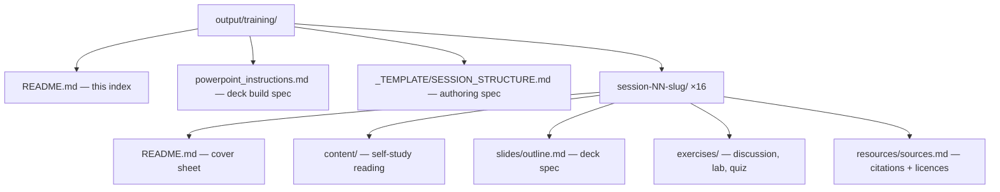

# AI Training Series — Course Materials
### Internal training for Qualcomm (Release / Problem / Configuration Management + Developers)

16 sessions · 45 minutes content + 15 minutes Q&A each · English · Python for all code.

This folder holds the **full self-study material** for the series proposed in [`../training_proposal.md`](../training_proposal.md), plus a build spec for the PowerPoint decks. Every session is a self-contained folder; a reader who missed the live session can learn the topic from the `content/` files alone.

---

## How this folder is organised

- **Start here:** each session's `README.md` is its entry point (objectives, agenda, prerequisites).
- **To learn the material:** read that session's `content/` files in numeric order.
- **To build the deck:** read [`powerpoint_instructions.md`](powerpoint_instructions.md), then the session's `slides/outline.md`.
- **To run a lab or the Q&A:** see the session's `exercises/`.

---

## The 16 sessions

| # | Session | Block | Goals (from brief) | Hands-on |
|---|---|---|---|---|
| 1 | What AI Is, and How It Relates to Human Thinking | Understand | 1 | — |
| 2 | The Vocabulary, and the Cost Meter | Understand | 2 | tokenizer demo |
| 3 | Methods I — Learning From Data | Methods | 3 | — |
| 4 | Methods II — Unsupervised Learning | Methods | 3 | Python demo |
| 5 | Methods III — Decision Trees & Random Forests | Methods | 3 | Python demo |
| 6 | Methods IV — Deep Learning, Conceptually | Methods | 3 | — |
| 7 | Hands-On I — Build & Train a Network in Keras | Do | 4 | **full lab** |
| 8 | Hands-On II — Make It Better | Do | 4 | **full lab** |
| 9 | How LLMs Work — From Neural Networks to Claude | Do | 3 | Transformer Explainer demo |
| 10 | Prompting I — The Craft | Use well | 5 | prompt lab |
| 11 | Prompting II + Working With Claude | Use well | 5, 6 | Claude workflow lab |
| 12 | Agents and Tool Use | Use well | 5, 6 (extension) | ReAct loop in Python |
| 13 | Risk I — When AI Is Confidently Wrong | Use safely | 7 | — |
| 14 | Risk II — Security, Privacy & Mitigation | Use safely | 7 | Gandalf live |
| 15 | What AI Can and Can't Do — and Your Jobs | Judge | 8, 9 | — |
| 16 | What Is AGI, and an Outlook on Quantum | Judge | 10, 11 | — |

> **Session 12 was added after the initial build.** Agents were referenced in six sessions but taught in none — the material leaned on the concept (cost in S2, benchmark skepticism in S10, tool use and MCP in S11, the whole attack surface in S14) without ever establishing what an agent is. It sits after tool use/MCP and before the security session that depends on it.

Full rationale, source mapping, and effort estimates are in [`../training_proposal.md`](../training_proposal.md). The consolidated source extract is in [`../AI_input.md`](../AI_input.md).

---

## Conventions

- **Language:** English throughout.
- **Code:** Python only (numpy, scikit-learn, tensorflow.keras, Anthropic/OpenAI SDKs). Expected output shown in comments.
- **Diagrams:** Mermaid, rendered inline. Tables used liberally.
- **Voice:** technical, honest, vendor-neutral, skeptical of hype. Distinguish demo from production.
- **Licence discipline:** slide/content text and figures are derived only from reuse-safe sources (permissive code licences, CC-BY/BSD, standards bodies, explicitly CC-licensed course material). All-rights-reserved material is referenced or demoed live, never copied. Each session's `resources/sources.md` records the verdict per source.

## Delivery order

Run the sessions in numeric order — the series is built as a learning journey: understand it → know the methods → do it → use it well → use it safely → judge it. Sessions 1 and 15 bookend the emotional arc (how is this like my mind? → what does it mean for my job?).

## Recommended pilot

Session 13 needs no authoring beyond what's here, no lab, and no currency-sensitive content, and it carries the strongest single teaching asset in the course (evaluating an AI vendor's accuracy claim). Run it first to test format and appetite before investing in the authored-heavy sessions (2, 11, 12, 14, 15).
