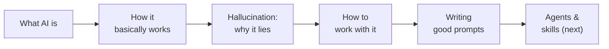

# AI in 35 Minutes

A single 35-minute presentation that stands on its own, condensed from the 16-session series. For a first exposure, a lunch-and-learn, a kickoff before the full course, or anyone who needs the essentials in one sitting.

**Audience:** anyone at Qualcomm — technical or not. Assumes nothing.
**Runs:** ~35 minutes talking + ~10 minutes questions.
**Language:** English. Any code is Python.

---

## What it covers

The essentials, in the order that builds — the five things asked for, plus where the field is heading next:

| # | Beat | Minutes |
|---|---|---|
| 1 | Hook + what we'll cover | 0–3 |
| 2 | What AI is — learning from examples, not rules | 3–7 |
| 3 | How it basically works — autocomplete on steroids | 7–12 |
| 4 | Hallucination — why confident and wrong look identical | 12–18 |
| 5 | How to work with it — the decision rule + do's & don'ts + live demo | 18–24 |
| 6 | Writing good prompts — anatomy + before/after | 24–29 |
| 7 | Agents — when the model acts, not just answers | 29–32 |
| 8 | Skills — teaching it your way, once | 32–34 |
| 9 | Takeaways | 34–35 |
| — | Q&A | +10 |

## Files

| File | What it is |
|---|---|
| [`talk.md`](talk.md) | The full talk as self-study reading — a no-show reader learns it from this alone. Tables and diagrams throughout. |
| [`slides/outline.md`](slides/outline.md) | Slide-by-slide spec for the deck. |
| `../decks/overview-30min.pptx` | The generated PowerPoint (run `../build_decks.py`). |

## The one mental model to leave with

> **An LLM is autocomplete on steroids — a pattern-matcher, not a fact-lookup. It is fluent whether it is right or wrong, so confidence tells you nothing about truth. Use it where you can check the answer, and always own the output.**

## Where to go next

This talk is the front door to the full [16-session series](../README.md). Natural follow-ups: Session 1 (AI and human thinking), Session 13 (when AI is confidently wrong), Sessions 10–11 (prompting, working with Claude, skills), Session 12 (agents and tool use). Terms are in the [glossary](../GLOSSARY.md).

## Before presenting

- Refresh anything marked *"verify at delivery"* — model names and prices drift.
- Slide 12 is a **live demo** (a hallucinated bio, or a before/after prompt). Rehearse it; have a screenshot fallback if there's no network.
- Apply the corporate template/font; the generated deck uses a neutral default.
