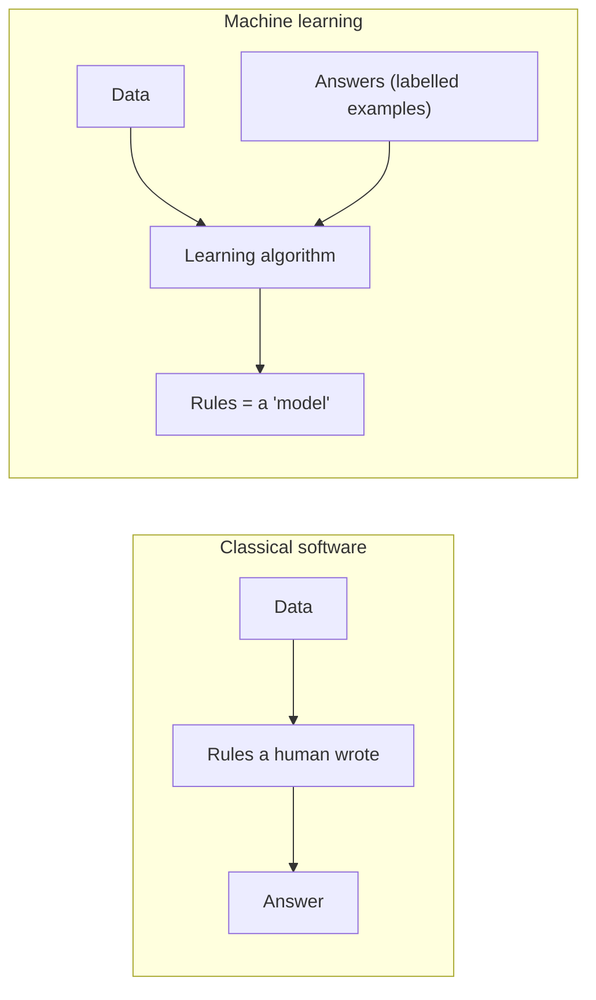
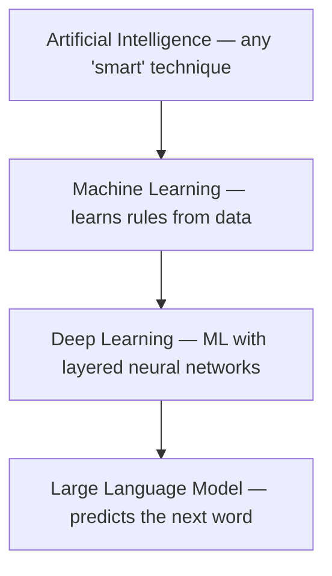
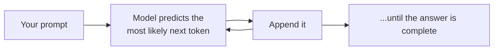
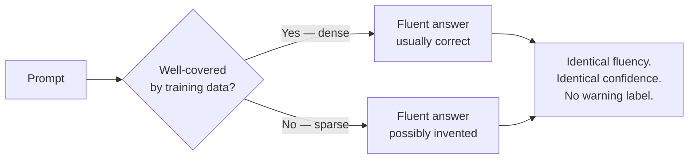
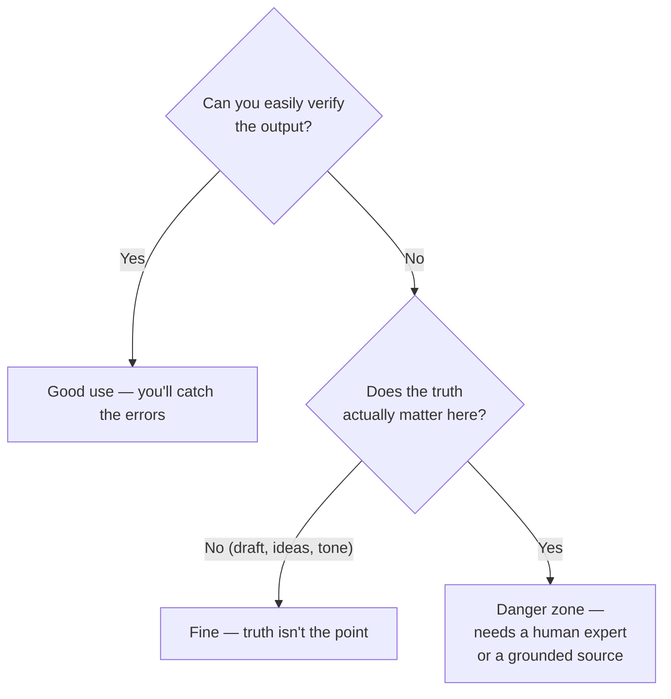
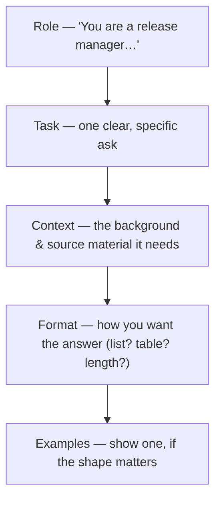
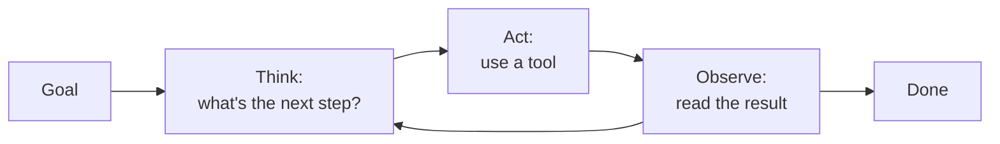
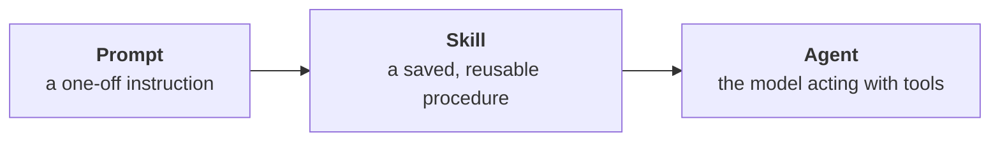

# AI in 30 Minutes

A standalone introduction: what AI is, how it basically works, why it makes things up, how to work with it, how to write a good prompt, and where it's heading next — agents and skills. Everything here is drawn from the full 16-session course; this is the essentials in one sitting.

---

## 1. Start with a familiar failure

Have you ever remembered something *vividly* — a conversation, where you left your keys, who said what in a meeting — and been completely, provably wrong?

You have. Everyone has. And here is the important part: **it didn't feel like a guess.** It felt exactly like a true memory. You could not tell from the inside.

Hold onto that, because it is the single best intuition for how modern AI works — and how it fails. An AI system can be fluent, confident, and wrong, in exactly the way your memory sometimes is, and for a surprisingly similar reason.

---

## 2. What AI is: learning from examples, not rules

For most of computing history, software worked one way: a human wrote the rules, and the computer applied them.

Machine learning turns that around. You give the computer the data *and* the answers, and it works out the rules itself. Those learned "rules" are just a big pile of numbers, and we call that pile a **model**.

Why bother? Because some rules can't be written down. Try writing the exact rule for "is this photo a cat or a dog." You can't — but a three-year-old does it instantly, from having seen many cats and dogs. That is the class of problem machine learning solves: **fuzzy, perceptual tasks where examples exist but rules can't be spelled out.**

The words you'll hear are nested, not interchangeable:

| Term | One sentence |
|---|---|
| **AI** | Any technique that makes a machine do something we'd call intelligent. Broad, and often just marketing. |
| **Machine learning (ML)** | Systems that infer the rules from data instead of being handed them. |
| **Deep learning (DL)** | ML using neural networks with many layers. |
| **Large language model (LLM)** | A deep network trained to predict the next chunk of text. ChatGPT, Claude, Gemini. |

The tools you actually use day to day — ChatGPT, Claude, Copilot — are LLMs. So the rest of this talk focuses on them.

---

## 3. How it basically works: autocomplete on steroids

Here is the whole idea, and it is smaller than people expect.

An LLM was trained on an enormous amount of text by playing one game, billions of times: **cover the next word and guess it.** *"The capital of France is ___."* Get it wrong, nudge the internal numbers, repeat. Do that at enormous scale and the model gets extremely good at producing text that plausibly continues whatever came before.

That's it. When you ask a question, the model is not looking anything up. It is generating the most plausible *next chunk of text*, one piece at a time.

Two consequences worth internalising:

- **It's a pattern-matcher, not a search engine.** It has no database of facts it consults. It has a statistical sense of what text usually looks like. Often that produces correct facts, because true statements are common in the training text — but truth is a side effect, not the mechanism.
- **It works in tokens, not words.** A **token** is a chunk of text, roughly ¾ of an English word. It's how the model reads, how it writes, and — if you use the paid APIs — **how you're billed.** Code, German, and JSON use more tokens per word than plain English prose.

One more term you'll meet: **temperature** — a dial from 0 upward that controls randomness. At 0 the model picks the single most likely next token every time (repeatable, boring); higher values make it more varied and more creative — and more likely to wander.

> **The mental model:** an LLM is *autocomplete on steroids.* Hold that, and everything else — including why it lies — follows.

---

## 4. Hallucination: why confident and wrong look identical

When an LLM states something false as if it were fact, we call it a **hallucination**. It is the single most important thing to understand before you rely on one.

Here's the key point: **hallucination is not a bug that will be patched out. It's a direct result of how the model works.** The model's job is to produce a plausible continuation. When the pattern is well-covered by its training (a common question, dense data), the plausible continuation is usually also true. When the pattern is thin — a niche detail, a specific number, something recent — the model still produces a fluent, confident continuation. It just has nothing solid underneath it, so it fills the gap with something that *sounds* right.

This is exactly the false-memory experience from the start of the talk. Your brain reconstructs a memory and hands it to you feeling certain, whether or not it's accurate. The machine does the same: **fluency is produced the same way whether the output is true or invented, so "it sounded confident" tells you nothing about whether it's right.**

It's also the same mechanism as human **prejudice** — a confident conclusion over-generalised from a skewed or incomplete sample. When an AI does it about facts we call it hallucination; when it does it about people we call it bias. Same failure: pattern-completion running ahead of the evidence.

| It looks like… | It actually is… |
|---|---|
| Looking up an answer | Generating a plausible continuation |
| Confidence = correctness | Confidence = fluency, which is always present |
| A glitch to be fixed | A structural property to be *managed* |

**The practical takeaway:** never treat a confident answer as a verified one. The confidence is free; the verification is your job.

---

## 5. How to work with it: one decision rule and one habit

If it can always be confidently wrong, when is it safe to use? There's a clean rule.

> **Use an LLM when either (a) you can easily check the answer, or (b) the truth doesn't matter** (brainstorming, drafting, rephrasing, fiction). Be careful exactly where neither holds — an unverifiable answer that has to be right.

And one habit that follows from it: **you own the output.** The model is a fast, tireless, sometimes-wrong assistant. A human who can judge the result has to stay in the loop — and, crucially, that human has to actually be equipped to spot the mistake. A plausible-looking answer in a field you don't know is the most dangerous kind.

A few concrete do's and don'ts for daily work:

| Do | Don't |
|---|---|
| Use it to draft, summarise, rephrase, explain, and get unstuck | Paste in confidential or personal data you wouldn't email externally |
| Give it the source material and ask it to work *from that* | Trust a specific fact, number, quote, or citation without checking |
| Ask for its reasoning, then check the reasoning | Assume a fluent, confident answer is a correct one |
| Treat it as a first draft you improve | Treat it as a final authority |

Giving the model the source material to work from — pasting the document and asking it to answer *from that text* — is called **grounding** (the automated version is "RAG"). It doesn't make errors impossible, but it makes them *checkable*: you can compare the answer against the text you supplied. That is a large part of using these tools well.

---

## 6. Writing good prompts

Most disappointing AI output is a prompt problem, not a model problem. A good prompt is not a magic phrase — it's clear instructions, the way you'd brief a capable new colleague who is fast, widely read, and has no context about your specific situation.

**The anatomy of a good prompt:**

The single biggest lever is **specificity plus context.** Watch the difference:

| | Prompt | Why the result differs |
|---|---|---|
| **Before** | *"Write release notes."* | No audience, no source, no format. The model invents all three — and invents the content too. |
| **After** | *"You are writing release notes for non-technical stakeholders. Here are the 12 merged pull-request titles: [paste]. Group them into Features, Fixes, and Known Issues. One plain-English sentence each. Don't invent anything not in the list."* | Role, real source material, explicit format, and an anti-hallucination instruction. |

The "after" version also demonstrates the safety habits from section 5: it *grounds* the model in real input (the PR titles), so the output is checkable, and it explicitly tells the model not to invent.

A few techniques worth knowing by name:

| Technique | What it is | When to reach for it |
|---|---|---|
| **Be specific** | Audience, format, length, constraints — spell them out | Always. The cheapest, biggest win. |
| **Give context / ground it** | Paste the actual source material | Whenever the answer should be based on *your* facts |
| **Few-shot** | Show one or two worked examples of the input→output shape | When the format matters and is hard to describe |
| **Ask for reasoning** | "Explain your reasoning" / "think it through step by step" | For anything involving logic or multiple steps |
| **Iterate** | Treat the first answer as a draft; refine your prompt | Always — the first reply is rarely the best you can get |

And the honest anti-pattern: **there is no secret word.** "Act as a world-class expert" does far less than one concrete example of what good looks like. Clarity beats incantation every time.

---

## 7. When the model acts: agents and skills

So far we've described a model that *answers*. The fastest-moving part of the field is models that *act* — and two words dominate it: **agents** and **skills**.

**An agent is an LLM given tools and a loop.** Instead of just replying, it can search the web, run code, read a file, call an API, file a ticket — then look at the result and decide what to do next. It repeats that cycle until the task is done.

That's genuinely powerful — an agent can carry out a multi-step job you'd otherwise do by hand. But notice what changed, because it's the whole safety story in one line: **an agent acts on its output.** A wrong answer from a chatbot is an embarrassment you catch when you read it. A wrong answer from an agent that just filed the ticket, ran the command, or sent the email is an *incident*. So everything from section 5 — verify the output, keep a human who can judge it in the loop — matters *more* with agents, not less. Start them on narrow, well-defined tasks with clear limits.

**A skill is a reusable package of instructions that teaches the model how to do a task your way.** A prompt is a one-off instruction you type. A skill is a *saved procedure* — "here's exactly how we write release notes / triage an incident / format a config change" — that the model loads whenever it's relevant, so nobody re-explains it every time. Skills are what make both chats and agents *consistent* and *expert at your specific tasks* rather than generically capable.

The three fit together as a ladder:

| | What it is | Everyday analogy |
|---|---|---|
| **Prompt** | A single instruction you give the model | Asking a colleague to do one thing |
| **Skill** | A written procedure the model reuses | The team's how-to guide they follow every time |
| **Agent** | The model with tools, acting in a loop | A colleague you delegate a whole task to |

For an intro, the takeaway is awareness, not depth: agents and skills are how AI moves from *answering your questions* to *doing your tasks* — impressive, immature, and exactly where the "own the output" rule earns its keep. The full course covers both in depth.

---

## 8. What to take away

If you remember nothing else:

1. **AI learns from examples, not rules** — nobody writes the rule; it's fitted from data.
2. **An LLM is autocomplete on steroids** — it predicts plausible text; it doesn't look facts up.
3. **Hallucination is structural, not a bug** — and confidence tells you nothing about truth.
4. **Use it where you can verify, or where truth doesn't matter — and own the output.**
5. **Good prompts are clear briefs** — role, task, context, format, example. Specificity beats magic words.
6. **Agents act, skills make them consistent** — and the moment AI acts on its output, "own the output" matters more, not less.

> **The one sentence:** *An LLM is a fluent, confident, sometimes-wrong assistant — brilliant when you can check its work, dangerous when you can't. Treat it accordingly — especially once you let it act.*

---

*This talk is the front door to the full 16-session course. Next stops: Session 1 (AI and human thinking), Session 13 (when AI is confidently wrong), Sessions 10–11 (prompting in depth). Every term used here is in the [glossary](../GLOSSARY.md).*
