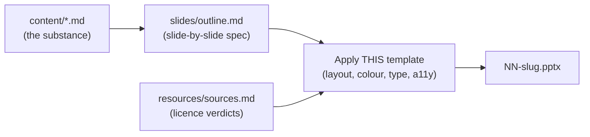
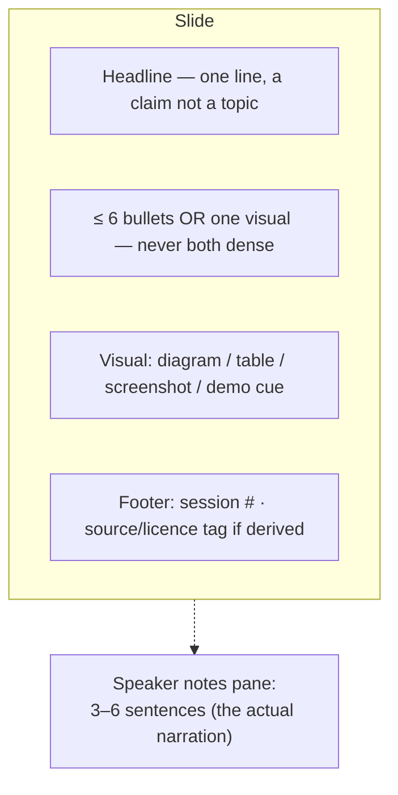
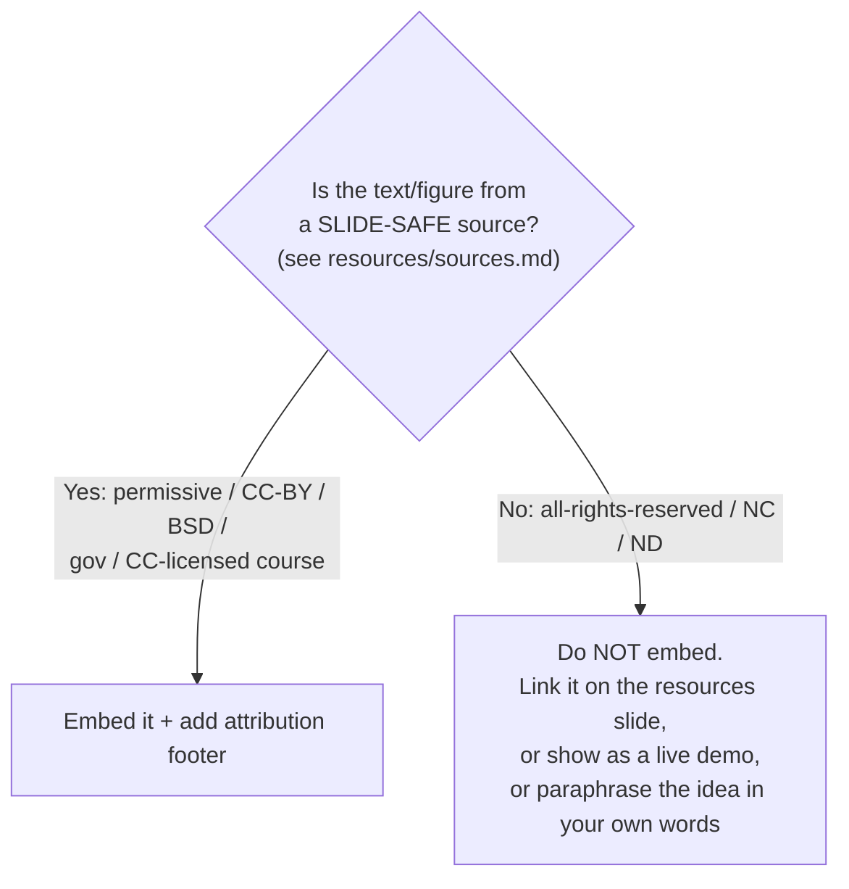

# PowerPoint Build Instructions — AI Training Series
### One deck per session · 16 decks · internal Qualcomm training

This document tells a slide-builder (a person, or an LLM given the `slides/outline.md` files) how to turn each session's `slides/outline.md` into a finished PowerPoint that is consistent across the series, on-brand-neutral, accessible, and licence-clean.

Read this once. Then, for each session, open `session-NN-<slug>/slides/outline.md` — it contains the slide-by-slide content. This file governs *how* those become a deck; the outline governs *what* is on each deck.

---

## 1. What you are producing

- **16 `.pptx` files**, named `NN-<slug>.pptx` (e.g. `01-what-ai-is.pptx`), matching the session folders.
- Each deck: **~16–24 slides** = 1 title + 1 agenda + 12–18 content + 1 "Q&A / discussion" + 1 resources/credits. Target **45 minutes of talking** (≈2–3 min per content slide) with 15 minutes Q&A after.
- Each deck is **self-consistent with the series template** defined below.

---

## 2. Two ways to build (pick one)

| Route | Use when | How |
|---|---|---|
| **A. Manual (PowerPoint / Google Slides / Keynote)** | You want full design control | Build the master template (§4) once, save as `.potx`, then fill each deck from its `outline.md`. |
| **B. Generated from Markdown** | You want speed and consistency | Convert each `outline.md` to slides with **Marp**, **Quarto**, or **pandoc + a reveal.js/pptx template**, then refine. Recommended for a first full draft. |

### Route B quick path (Marp → PPTX)
1. Each `outline.md` is already close to slide-per-section. Add Marp front-matter and `---` slide separators (or use the provided `outline.md` headings as slide breaks).
2. `marp deck.md --pptx -o NN-slug.pptx` (Marp CLI). Mermaid blocks: pre-render to SVG/PNG (Marp renders Mermaid via a plugin or the Mermaid CLI `mmdc`), then embed.
3. Import the `.pptx` into PowerPoint and apply the master theme for final polish.

> Whichever route: the **speaker notes** in each `outline.md` slide block go into the slide's Notes pane, not onto the slide. Slides stay sparse; detail lives in notes and in the `content/` files.

---

## 3. Slide anatomy (applies to every content slide)

Rules:
- **One idea per slide.** If a slide needs two ideas, split it.
- **Headline is a claim** ("Accuracy hides rare-event failure"), not a label ("Accuracy").
- **≤ 6 bullets, ≤ 6 words each** as a target. Prose belongs in notes.
- **A slide is a visual or a list, rarely both.** Prefer the visual.
- **Every derived visual carries a source tag** in the footer (e.g. "scikit-learn, BSD-3" or "OWASP LLM Top 10 2025, CC BY-SA"). Link-only material is **never embedded** — it appears as a live-demo cue or a link on the resources slide.

---

## 4. The series master template

Build this once as a `.potx` and reuse for all 16 decks.

### Layouts to define
| Layout | Purpose |
|---|---|
| Title | Session number, title, series name, block name |
| Section divider | Block transitions within a session |
| Content — bullets | Default |
| Content — full-bleed visual | Diagrams, screenshots |
| Content — two-column | Text + diagram, or before/after |
| Table | Comparisons, decision matrices |
| Quote | Pull quotes (Ng, Chollet, etc. — only if the quote is in a SLIDE-SAFE source; otherwise paraphrase) |
| Discussion / poll | The A/B/C "Safe / Unsafe / It depends" polls and Q&A prompts |
| Resources & credits | Links + licence attributions (last slide) |

### Visual system
- **Type:** one sans-serif family (e.g. the corporate standard, or Inter/Source Sans). Headline ~28–32 pt, body ~18–22 pt, minimum on-slide text **18 pt**.
- **Colour:** a small palette — one primary, one accent, neutral grey scale. **Do not use red/green as the only distinction** (colour-blind safety); pair with shape/label. Ensure ≥ 4.5:1 text contrast.
- **Diagrams:** render the Mermaid from the outline in the palette above. Keep them to ≤ ~12 nodes; split otherwise.
- **Consistency:** same footer, same slide numbers, same divider style across all 16 decks. A participant should recognise deck 9 as the same course as deck 2.

### Accessibility (required)
- Alt text on every image/diagram.
- No information by colour alone.
- 18 pt minimum; high contrast.
- Readable if printed greyscale.

---

## 5. Per-deck consistency checklist

Before a deck is "done":
- [ ] Title slide names the session #, title, and block.
- [ ] Agenda slide matches the `README.md` minute-budget.
- [ ] 12–18 content slides; none with > 6 bullets; every headline is a claim.
- [ ] Every diagram is rendered from the outline's Mermaid, in-palette, with alt text.
- [ ] Every derived element has a source/licence footer tag; **no LINK-ONLY material is embedded**.
- [ ] Speaker notes present on every content slide (the narration).
- [ ] Discussion/poll slide present for the 15-min Q&A.
- [ ] Final slide lists resources with licence attributions (from `resources/sources.md`).
- [ ] Runs in ~45 minutes when rehearsed.
- [ ] Accessible: contrast, alt text, 18 pt min, greyscale-safe.

---

## 6. Licence handling on slides (do not skip)

The single rule that keeps this deck safe to use inside Qualcomm:

- **SLIDE-SAFE examples in this course:** scikit-learn (BSD-3, prose + figures), OWASP LLM Top 10 2025 (CC BY-SA), NIST AI RMF / GenAI Profile (US-gov public domain), MITRE ATLAS (royalty-free w/ attribution), Transformer Explainer (MIT), Hugging Face courses (Apache-2.0), promptingguide.ai (MIT), The Prompt Report (CC BY), Maynez et al. via ACL Anthology (CC BY), RAGAS/ARES via Anthology (CC BY), Raschka LLMs-from-scratch (Apache-2.0), DSPy (MIT).
- **LINK-ONLY examples:** 3Blue1Brown, Jay Alammar's Illustrated Transformer (CC BY-NC), StatQuest, r2d3, Simon Willison's blog prose, Sutton & Barto PDF, OpenAI CoastRunners video, Google prompting whitepapers, vendor blog prose. Reference/demo these; never copy them onto a slide.
- When paraphrasing a LINK-ONLY idea (e.g. Willison's "lethal trifecta"), write it in your own words and attribute the concept ("framing after Simon Willison") without reproducing the text.

---

## 7. Session-specific notes for the deck-builder

| Session | Deck-build note |
|---|---|
| 2 | Live tokenizer demo (platform.openai.com/tokenizer) — build a fallback screenshot slide in case of no network. Pricing numbers must be refreshed at delivery date. |
| 4, 5 | Diagrams and figures can come straight from scikit-learn's gallery (BSD-3). Attribute. |
| 7, 8 | These decks are thin — the lab carries them. ~8–10 slides + the Colab notebook. Deck sets up and debriefs the lab. |
| 9 | Transformer Explainer is the live demo (MIT — screenshots OK). 3Blue1Brown / Illustrated Transformer are pre-reading links only. |
| 11 | Claude-workflow content is time-sensitive — verify features against current docs at delivery. If MCP is covered, land after 2026-07-28 (final spec) and show the stateless core. |
| 12 | Agents session. The ReAct loop must be shown as an explicit Python loop, not hidden behind a framework — the point is that an agent is a loop plus tools. Teach the multi-agent disagreement as a disagreement (vendors contradict each other); do not pick a winner. |
| 13 | The medical-vendor base-rate scenario is the centrepiece — build it as a **progressive reveal, one number per click** (claim → *what kind of 99%?* → 79.8% → the outside fact → the turn). It dies if the room can read the punchline while the presenter is still saying "99%". Then a correction slide: the source deck's own 3.39% is wrong twice over (arithmetic, and a denominator that re-imports the vendor's sample) — the honest figure is ~13.8%, and the deck commits a milder form of the very fallacy it exposes. Consider swapping the medical vendor for an AI-tooling vendor pitching the team. |
| 14 | Gandalf (gandalf.lakera.ai) is the live interactive — no setup, browser only. OWASP LLM Top 10 2025 is CC BY-SA (embeddable). EU AI Act = one honest slide (deployer duties: AI-literacy now, high-risk deferred to 2027-12-02). |
| 15 | The per-role job analysis is the emotional centre. Build it honestly per role (release / problem / config / developer). Confirm candour level with the requester before finalising. |
| 16 | Quantum is a ~15-min closing segment, clearly flagged as the most speculative content. Tune emphasis to Qualcomm's remit. |

---

## 8. Handover

Deliverables when done: 16 `.pptx` files + the master `.potx` + a one-page "how to present this series" note (order, pilot recommendation, per-session timing). Keep the `.potx` and the `outline.md` files together so decks can be regenerated as sources update (pricing, model names, OWASP versions, EU AI Act dates all drift).
