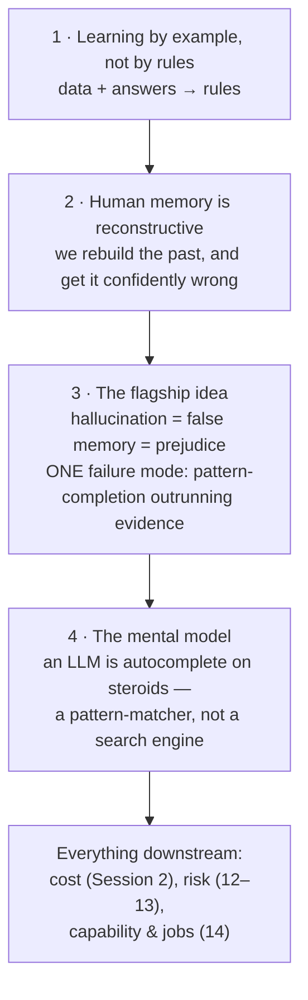

# Session 1 Overview — What AI Is, and How It Relates to Human Thinking

This session builds **one analogy** and **one disanalogy** between machine learning and human thinking, then compresses both into a single mental model you will reuse for the rest of the course. No code to run; no vocabulary to memorise yet (that is Session 2). The goal is that when Session 9 explains transformers and Session 13 explains why "99% accurate" can be dangerous, you already have the intuition to make sense of them.

## The arc

## The four ideas, in one table

| # | Idea | The one sentence | Why this audience should care |
|---|---|---|---|
| 1 | **Learning by example** | Classical software encodes rules a human wrote; ML infers the rules from data + answers. | It explains why AI is opaque: nobody wrote the rules, so nobody can simply read them back. |
| 2 | **Reconstructive memory** | Human memory is not playback; we rebuild the past each time, and the rebuild can be confidently false. | It is the human mirror of machine hallucination — and it makes the failure feel familiar, not alien. |
| 3 | **One failure mode** | Hallucination, false memory, and prejudice are the same move: fill the gap with the most *plausible* pattern, and let confidence track fluency rather than truth. | Bias in a model and a made-up citation are not two problems; they are one, and one discipline catches both. |
| 4 | **Autocomplete on steroids** | An LLM generates the next likely token; it is a pattern-matcher, not a fact-lookup. | Cost, risk, and capability all follow from this. It is the single most useful model in the series. |

## What this session is *not*

- It is **not** "how a transformer works" — that is Session 9. Resist the urge to draw attention heads today.
- It is **not** anti-AI. The voice is skeptical, not cynical: we name what the technology can't do so we can use what it can, safely. AI that *generates plausible text* is genuinely useful — provided you never mistake plausibility for truth.
- It is **not** a claim that machines think like people. The memory parallel is an **analogy** (an honest one, flagged as such throughout), not an assertion that an LLM "reconstructs a memory" the way a brain does.

## If you read one file

Read `03-hallucination-and-prejudice-same-failure-mode.md`. It is the intellectual centre of the session and the idea the brief singles out as the sharpest in the whole series.
