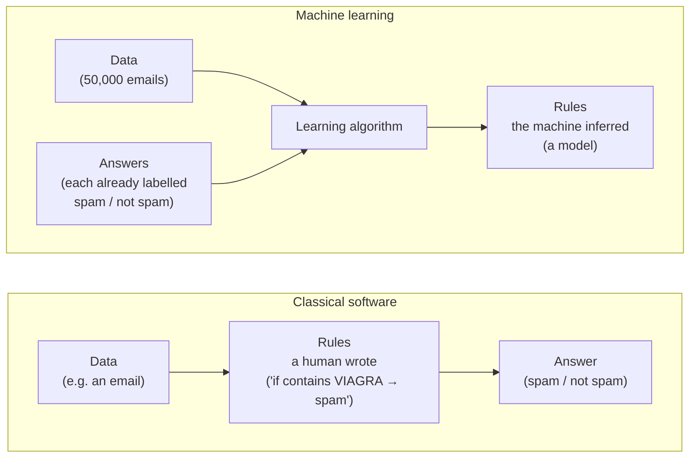
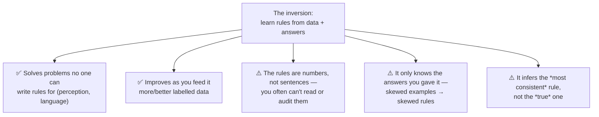

# Learning by Example, Not by Rules

The single reframe that makes everything else in the series make sense: machine learning inverts the direction of classical programming. This file explains the inversion, works one small example by hand, and is honest about what the inversion *costs* you.

## The inversion

For seventy years, "programming a computer" meant a person writing the **rules** and the machine applying them to **data** to produce **answers**. A tax calculator, a payroll system, a `git merge` conflict resolver — all of them are rules a human wrote out explicitly.

Machine learning turns the arrows around. You give the machine the **data** and the **answers**, and it works out the **rules** for itself.



Say it as a slogan and it sticks:

> **Classical software:** `data + rules → answers`
> **Machine learning:** `data + answers → rules`

The "rules" a machine learns are not English sentences. They are a pile of numbers — weights — that together behave like a rule. We call that pile **a model**. Session 6 opens it up; for now, "a model is the learned rules" is enough.

## Why invert at all? Because some rules are impossible to write

Write the rules for detecting spam and you can *almost* do it — until spammers write `V1AGR@` and your rule misses it, so you add a rule, and they change again, forever. Now try a genuinely hard one: **write the rules that tell a cat from a dog in a photograph.** Go ahead — start with "cats have pointed ears." So do German Shepherds. "Cats are smaller." Not next to a Chihuahua. Nobody can enumerate the rules, yet a three-year-old does it instantly and a model trained on labelled photos does it very well.

The pattern:

| When the rules are… | Best approach | Example |
|---|---|---|
| Few, stable, and a human can state them | **Write the rules** (classical software) | Sales tax; sorting a list; a state machine in a release pipeline |
| Too many, too fuzzy, or nobody can state them | **Learn them from examples** (ML) | Spam; image recognition; predicting which build is likely to regress |

The discipline note this audience will use for the rest of their careers: **use the simplest thing that works.** If a rule you can read and audit does the job, a learned model that you *can't* read is a worse choice, not a more sophisticated one. Session 5 (decision trees) and Session 13 (why metrics lie) both come back to this.

## A worked example, small enough to do by hand

Forget photos; take a problem with three numbers in. **Given a background colour as RGB (each channel 0–255), should the text on top be black or white?** You have a stack of examples a designer already labelled:

| R | G | B | Good text colour (the answer) |
|---|---|---|---|
| 255 | 255 | 255 | black |
| 0 | 0 | 0 | white |
| 240 | 230 | 20 | black |
| 30 | 30 | 120 | white |
| … | … | … | … |

Nobody handed you the rule. But feed a learning algorithm a few hundred rows like these and it discovers something close to *"if the background is bright, use black text; if dark, use white,"* expressed as weights on R, G, and B. You never wrote "bright." The machine inferred where the boundary sits from the answers you supplied.

> **A note we will not gloss over:** the natural rule here is roughly "predict *dark background → light text*." In one of the source decks this exact example carries a slip — one slide says a model output ≥ 0.5 means *dark*, another says it means *light* (they contradict). The lesson for us is not the colour; it is that **once the rule lives inside a model as numbers, a human can no longer just glance at it and see which way round it goes.** That opacity is the price of the inversion, and it is why the later sessions spend so long on *testing* models rather than *reading* them.

Here is the same idea as a few lines of Python, so "the machine learns the rule" is concrete rather than mystical. This is illustrative — you do not need to run it — and it is the only code in this concept session.

```python
# Learning a rule from answers, not writing the rule.
# scikit-learn; classical ML, not deep learning (that's Session 6+).
from sklearn.linear_model import LogisticRegression

# A handful of labelled examples: [R, G, B] -> 0 = use black text, 1 = use white text
X = [[255, 255, 255], [0, 0, 0], [240, 230, 20], [30, 30, 120], [200, 200, 200], [10, 10, 10]]
y = [0,               1,         0,               1,             0,                 1]

model = LogisticRegression().fit(X, y)     # <- the machine infers the rule here

# We never wrote "if bright use black". Ask it about a colour it never saw:
print(model.predict([[250, 250, 250]]))    # bright grey  -> expected: [0]  (black text)
print(model.predict([[20, 20, 40]]))       # dark navy    -> expected: [1]  (white text)
```

The `.fit(...)` line *is* the inversion. We passed data (`X`) and answers (`y`); the model came out.

## What the inversion buys — and what it costs



Hold on to costs **C2** and **C3** — they are the whole of the next three files. A model that learned from skewed answers will confidently apply a skewed rule (that becomes *prejudice*, file 03). And a system built to infer "the most consistent continuation" will, when the evidence runs out, produce a continuation that is consistent-sounding but false (that becomes *hallucination*, files 02–04).

## Key takeaways

- Classical software: `data + rules → answers`. Machine learning: `data + answers → rules`. That one flip reframes the entire field.
- We invert because for perception and language **nobody can write the rules** — but a model can infer them from enough labelled examples.
- Prefer the simplest approach that works: an auditable rule beats an opaque model when it can do the job.
- The price of the inversion is **opacity** (the rules are numbers) and **dependence on the examples** (skewed data → skewed rules). Everything unsettling about AI downstream grows from these two costs.
