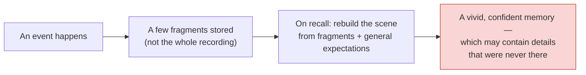
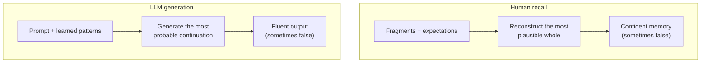

# Human Memory Is Reconstructive — and That Is the Mirror of Hallucination

Before we say anything unkind about AI "making things up," it helps to notice that the most trusted information system most of us own — our own memory — does exactly the same thing, constantly, and we rarely catch it. This file establishes that human memory *reconstructs* rather than *replays*, shows that reconstruction produces **confident** errors, and lines it up against how an LLM produces text. That alignment is the setup for the flagship idea in file 03.

## Memory is not a recording

The intuitive model of memory is a video camera: an event happens, it is filed away, and remembering is pressing play. Cognitive science has spent a century dismantling that picture. Memory is **reconstructive**: each time you recall something you *rebuild* it from fragments — a few real details, plus your general expectations of how such events usually go — and you experience the rebuild as if it were playback (see `resources/sources.md` #4, #5).

The rebuild is efficient (you don't store every pixel of your life) but lossy in a specific, dangerous way: **the gaps get filled with what is plausible, not with what happened.** And because the filling is seamless, the finished memory feels just as vivid and certain as a true one.

## The evidence: confident false memories are easy to create

Two lines of research make the point cleanly. State them as findings, in our own words — we are not reproducing the papers, only citing what they established (see `resources/sources.md` #5, #6):

| Finding | What was shown | Why it matters here |
|---|---|---|
| **Misinformation effect** (Loftus and colleagues) | After watching a filmed car crash, people asked how fast the cars were going when they *"smashed"* recalled higher speeds — and were more likely to "remember" broken glass that was never in the film — than people asked when the cars *"hit."* The wording seeded a detail, and memory absorbed it. | Memory updates itself to fit new, plausible-sounding input, then reports the blend as a genuine recollection. |
| **False-memory word lists (DRM)** | Show people a list — *bed, rest, awake, tired, dream, night, blanket…* — then test them. A large fraction confidently "remember" seeing **sleep**, which was never on the list. It fits the pattern, so the mind supplies it. | The error is not a fuzzy guess; people report the false item with *high confidence*. Fluency masquerades as evidence. |

> **Verify at delivery:** the specific percentages and study designs above are stable, decades-old results, but if you put a number on a slide, pull the exact figure from the cited paper rather than a secondhand summary. The *direction* of the effect is not in dispute; a precise statistic is what a technical audience will fact-check.

The uncomfortable headline: **you cannot tell a reconstructed false memory from a true one by how it feels.** Certainty is not a truth signal. Hold that sentence — it returns, unchanged, when we talk about model confidence.

## Now line it up against an LLM

An LLM does not look a fact up in a table and copy it out. It **generates** text one token at a time, each token chosen because it is a likely continuation of everything so far (file 04 unpacks the mechanism; Session 9 does the transformer detail). When the training data richly supports the continuation, the output is reliably correct. When it doesn't, the model still produces a fluent, plausible continuation — it has no separate "do I actually know this?" check — and that continuation can be false. That is a **hallucination**.

Put the two side by side:

| | Human reconstructed memory | LLM hallucination |
|---|---|---|
| Core move | Fill gaps with the plausible | Continue with the probable |
| Uses a stored, verifiable record? | No — rebuilt on the fly | No — generated on the fly |
| How the error presents | Vivid, certain | Fluent, confident |
| Built-in truth check? | None | None |
| Corrective that helps | An external record (notes, photos) | An external record (grounding / RAG — Session 13) |

## The honest caveat — keep it visible

The parallel is genuinely striking, and it is a superb teaching device *because* it makes an alien machine failure feel like a familiar human one. But it is an **analogy, not a proven identity.** The source that inspired this framing says so in as many words — its author notes he does *not* necessarily believe an LLM hallucination is literally the machine "reconstructing a memory," only that the parallels are hard to ignore (see `resources/sources.md` #2). We keep that caveat on the table for two reasons:

1. **Intellectual honesty** — the mechanisms differ in their details, and a Qualcomm engineering audience will (rightly) push on any claim that "the machine remembers like you do."
2. **It is the course's voice** — we earn trust by naming the limits of our own analogies, exactly as we will name the limits of the technology.

So: the analogy is a **ladder to the real idea**, not the idea itself. The real idea — the thing that *is* a shared mechanism, not just a resemblance — is in file 03: both are cases of **pattern-completion outrunning the evidence.**

## Key takeaways

- Human memory reconstructs the past from fragments plus expectations; it does not replay a recording.
- Reconstruction fills gaps with the *plausible*, and reports the result with full confidence — you cannot feel the difference between a true and a false memory.
- An LLM likewise *generates* a plausible continuation rather than *retrieving* a stored fact, with no built-in truth check — so it, too, produces confident falsehoods (hallucinations).
- This is an **analogy**, flagged honestly as such. The genuine shared mechanism — pattern-completion outrunning evidence — is the subject of the next file.
