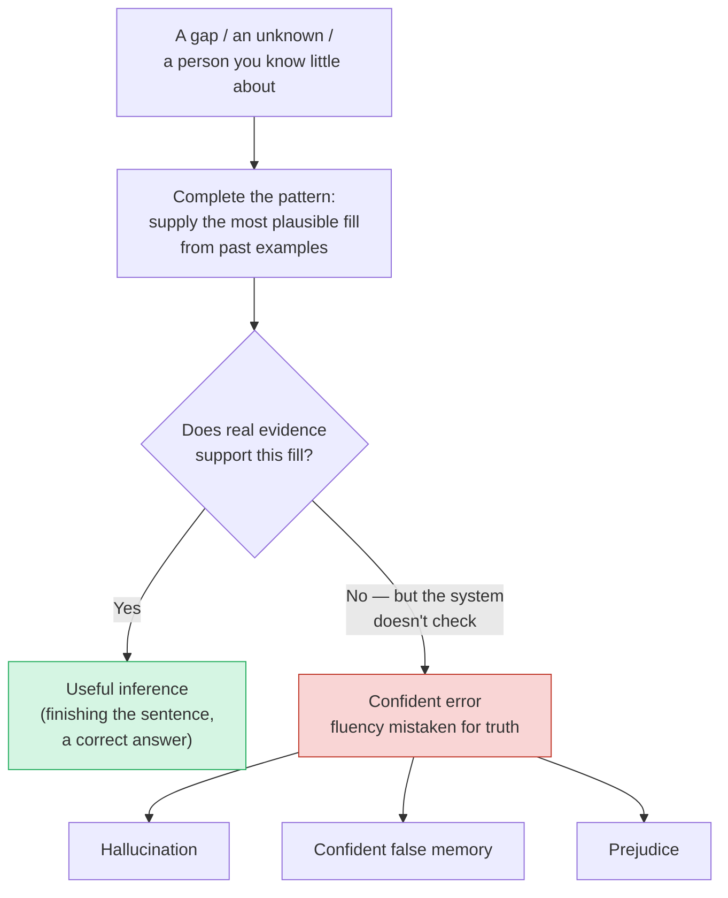
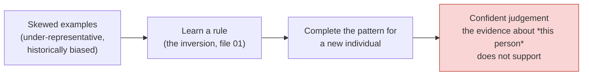

# Hallucination and Prejudice Are the Same Failure Mode

This is the intellectual centre of the session — the idea the brief singles out as the sharpest in the whole series. Three phenomena that we normally file in three different drawers — an AI **hallucinating** a fact, a person holding a false but **confident memory**, and a person (or a model) acting on a **prejudice** — are one failure mode wearing three coats. Name the mechanism once and you can spot all three, and you understand why one discipline catches them all.

## The mechanism, in one line

> **Pattern-completion outrunning the evidence.**

A system — a brain or a model — is very good at completing patterns: filling a gap with whatever is most consistent with everything it has seen. That is a feature, not a bug; it is how you finish a colleague's sentence and how an LLM writes fluent prose. The failure happens when the pattern-completion **keeps going past the point where the evidence supports it**, and the system reports the completion with a confidence that reflects how *fluent* or *plausible* it feels — not how *true* it is.

The decisive detail is the missing check at `Q`. In all three cases nothing inside the system separates "I am completing this because the evidence demands it" from "I am completing this because it *sounds right*." The confidence signal is attached to plausibility, and plausibility and truth only sometimes coincide.

## The three coats of one failure

| | **Hallucination** | **Confident false memory** | **Prejudice** |
|---|---|---|---|
| System | An LLM | A human brain | A human mind, or a model trained on people-data |
| The gap being filled | A fact the model wasn't really taught | A detail that wasn't really stored | What an individual is like, when you know little about *them* |
| The pattern used | Statistical regularities of language | Your general expectations of such events | A generalisation from the (skewed) examples you've seen |
| The output | A fluent, false statement | A vivid, false recollection | A confident judgement about a person that the evidence doesn't support |
| Why it's confident | Fluent text feels authoritative | Reconstruction feels like playback | The stereotype feels like "pattern recognition" |

**The shared bug — one statement true of every column above:** *pattern-completion ran past the evidence, and confidence tracked plausibility, not truth.* That single row is really the whole point of the table.

## Prejudice is the same mechanism, pointed at people

Prejudice usually gets discussed as a *moral* failing, and it is one. But mechanically it is an **over-generalisation from skewed data** — the identical move as hallucination, aimed at a person instead of a fact. You have seen a non-representative sample (of a group, a role, a name on a CV), your mind completes the pattern to fill what it doesn't actually know about *this individual*, and it delivers the completion with unwarranted confidence. Swap "brain" for "model" and nothing about the mechanism changes:

This is not a metaphor stretched for effect. A hiring model trained mostly on past hires from one demographic will *confidently* down-rank a strong candidate outside that pattern — it is hallucinating a conclusion about that person, from skewed data, with no check against the person's actual merits. The machine version of prejudice is just the human version with the reconstructive brain swapped for a learned model (recall cost **C2** from file 01: *skewed examples → skewed rules*).

Two consequences worth stating plainly for this audience:

- **Bias in AI is not a separate, exotic problem.** It is hallucination with a demographic target. The same reflex — *don't trust a confident completion until you've checked it against evidence* — mitigates both.
- **"The model is just recognising patterns, it can't be prejudiced" gets it exactly backwards.** Pattern-recognition from skewed data is *precisely* the mechanism of prejudice. The model inherits the skew in its examples and launders it as objectivity.

## Why "confidently wrong" is worse than "obviously wrong"

Because the confidence is real and the check is absent, these systems fail in the most expensive possible way: **plausibly.** An obviously broken output (code that won't compile, a memory you know is a dream) is safe — you discard it. A *plausible* falsehood — a fabricated but well-formatted citation, a vivid but invented memory, a data-driven but biased score — slips through precisely because it pattern-matches to "correct." This is why the later sessions insist that human-in-the-loop review is necessary but **not sufficient** (Session 13): a reviewer swimming in fluent, confident output is being asked to catch the one item that looks exactly like the rest.

## The reframe you take away

Stop asking *"is the AI lying?"* — lying requires knowing the truth and choosing to conceal it, and these systems have no such faculty. Ask instead:

> **"Is this a pattern-completion I have checked against evidence, or one I am trusting because it sounds right?"**

That single question works on an LLM's output, on your own certain-feeling memory, and on a snap judgement about a person. One mechanism; one habit of mind to counter it.

## Key takeaways

- Hallucination, confident false memory, and prejudice are **one failure mode**: pattern-completion outrunning the evidence, with confidence tracking plausibility instead of truth.
- Prejudice is that mechanism pointed at people — an over-generalisation from skewed data. AI bias is hallucination with a demographic target, not a separate problem.
- The dangerous failures are the **plausible** ones; obvious errors are safe because you discard them.
- The counter-habit is a single question: *have I checked this completion against evidence, or am I trusting it because it sounds right?*
