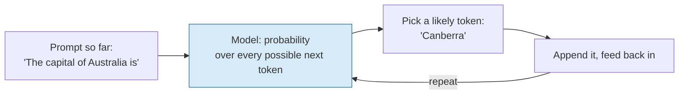
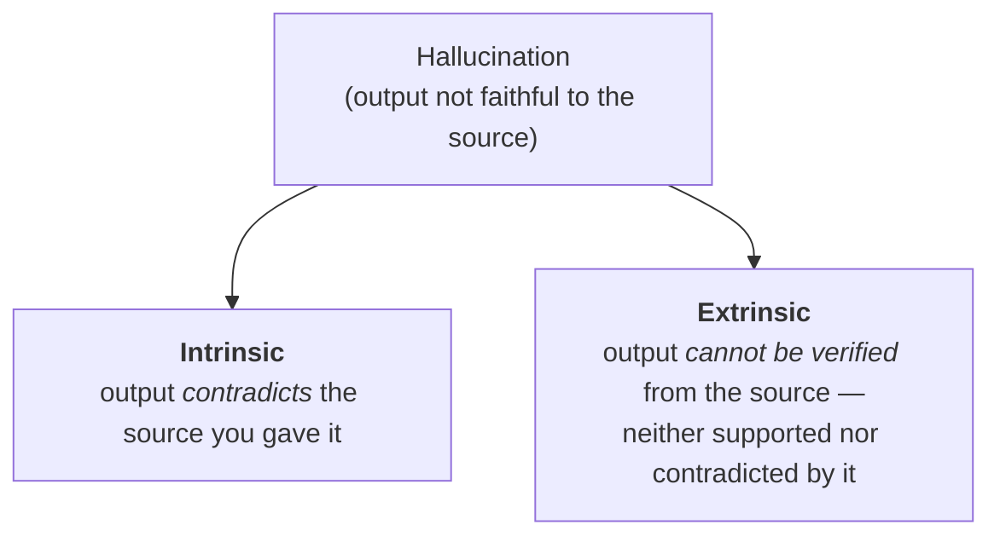
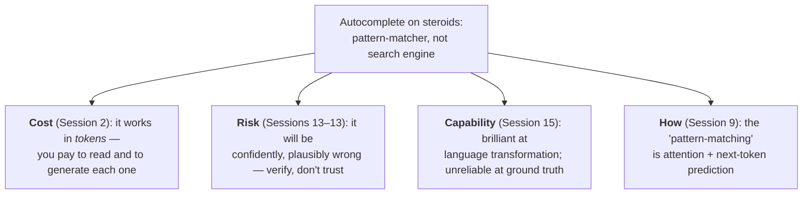

# Autocomplete on Steroids — A Pattern-Matcher, Not a Search Engine

This file compresses the whole session into the mental model you will carry through the rest of the series, and gives you the precise vocabulary to describe *what kind* of wrong an LLM is being when it hallucinates. It ends on the one sentence to remember.

## The model: generation, not lookup

When you type into a search engine, it **retrieves** — it goes to an index, finds documents that exist, and returns them. You can, in principle, trace every result back to a stored source. An LLM does something fundamentally different. Given everything so far, it **generates** the next token by asking *"what is the most probable continuation?"* — then repeats, one token at a time, feeding its own output back in.



Nothing in that loop consults a table of facts. "Canberra" comes out because, across the training text, *"the capital of Australia is"* is overwhelmingly followed by *Canberra* — the pattern is strong, so the answer is right. Ask instead for *"the capital of a country that doesn't exist"* and the same machinery still produces a fluent, confident, entirely invented answer, because the mechanism is **pattern-completion, not retrieval** (files 02–03). There is, in the words of the source framing, *no search engine looking up facts* underneath — it is a **pattern-spotting and matching engine** (see `resources/sources.md` #3).

A ten-line toy makes "generation is sampling from a distribution, not a lookup" concrete. It is not a real LLM — it is the *shape* of one.

```python
# Generation = repeatedly sampling the next token from a probability distribution.
# There is no fact table anywhere in here.
import random

# A toy "model": for a given context, how likely is each next word.
next_word = {
    "the capital of australia is": {"canberra": 0.86, "sydney": 0.13, "melbourne": 0.01},
    "the capital of atlantis is":  {"poseidonia": 0.4, "atlantis": 0.35, "the": 0.25},  # all invented
}

def generate(context):
    dist = next_word[context]
    words, probs = list(dist.keys()), list(dist.values())
    return random.choices(words, weights=probs)[0]   # sample, don't look up

print(generate("the capital of australia is"))  # -> almost always 'canberra' (pattern is real -> correct)
print(generate("the capital of atlantis is"))   # -> a confident, fluent, INVENTED place (no real pattern)
```

The second call is a hallucination in miniature: identical machinery, but the underlying pattern is thin, so the "answer" is manufactured. The model cannot tell the two situations apart — it has no evidence-check (`Q` in file 03). It just samples.

## Why "on steroids"

Your phone's autocomplete suggests the next word from a few words of context. An LLM does the same thing — predict the next token — but with two differences of *degree* so large they become a difference of *kind*: it conditions on thousands of tokens of context at once, and its patterns were learned from an enormous slice of human text. That scale is what makes the output astonishing, coherent, and useful. But scaling up autocomplete does not bolt on a fact-checker. **A very, very good next-token predictor is still a next-token predictor.** Hence the slogan:

> **An LLM is autocomplete on steroids — a pattern-matcher, not a search engine.**

## Naming the wrongness precisely: intrinsic vs. extrinsic hallucination

"Hallucination" is a bucket. To reason about it — and to know which *fix* applies — you need to split it in two. The standard split comes from **Maynez et al. (2020)**, *On Faithfulness and Factuality in Abstractive Summarization* (see `resources/sources.md` #1 — **CC BY 4.0, slide-safe**). They distinguish, for a system given some source text to work from:



| | **Intrinsic hallucination** | **Extrinsic hallucination** |
|---|---|---|
| Definition (Maynez et al. 2020) | The output **contradicts** the provided source content. | The output **cannot be verified** against the source — it introduces content the source neither states nor denies. |
| Everyday example | You paste a report saying revenue *fell*; the summary says it *rose*. | You ask a bare question with no source; the model supplies a plausible but unsupported "fact." |
| Where it bites | Summarisation, RAG, "answer from this document" tasks | Open-ended questions with no grounding |
| The main lever against it | Grounding won't save you *if the model ignores the source* — you also need faithfulness checks | **Grounding / retrieval** (RAG, Session 13): give the model a source so answers can be verified against it |

Two things to carry forward. First, **grounding (RAG) is the main tool against extrinsic hallucination** but does not by itself eliminate intrinsic hallucination — a model handed the right document can still contradict it. Second, this is exactly why the risk sessions insist the human stays in the loop: naming the failure precisely tells you *where* to put the check, not that you can remove it.

> **Verify at delivery:** the intrinsic/extrinsic terminology is standard and stable, and Maynez et al. 2020 is the citation to put on the slide. If you later cite specific hallucination *rates* (e.g. the claim that some reasoning models regressed on recall relative to earlier models — noted in the AGI source, `resources/sources.md` #2), pull current numbers at delivery; those drift with every model release, and they are LINK-ONLY besides.

## A one-line aside that grounds the mechanism (cut this first if short on time)

Why does the invented "capital of Atlantis" come out confident? One useful framing from the safety source (`resources/sources.md` #3): models are good at **interpolation** — answering within the dense region of what they've seen — and poor at **extrapolation** — reaching into sparse, thinly-supported space. Hallucination is what extrapolation looks like from the outside: the machinery keeps producing fluent tokens even where the data ran out. It is the file-03 mechanism in one more vocabulary.

## What follows from the model — the bridge to the whole series

Once you hold "pattern-matcher, not search engine," the rest of the course stops being surprising:



If it predicts tokens, it costs by the token (Session 2). If it completes patterns without checking them, it will be confidently wrong and you must design for verification (Sessions 13–13). If it is a language engine rather than a truth engine, it will shine at drafting and summarising and stumble on guaranteed correctness (Session 15). Every later session is a consequence of this one sentence.

## Key takeaways

- An LLM **generates** the next likely token; it does not **retrieve** stored facts. Right answers come from strong patterns; hallucinations come from the same machinery running where patterns are thin.
- "Autocomplete on steroids" is scale, not a new capability — a superb next-token predictor is still a next-token predictor, with no built-in fact-check.
- **Intrinsic** hallucination *contradicts* a given source; **extrinsic** hallucination *can't be verified* against it (Maynez et al. 2020). Grounding/RAG mainly targets the extrinsic kind and does not fully cure the intrinsic kind.
- The one line for the whole series: **an LLM is autocomplete on steroids — a pattern-matcher, not a search engine.** Cost, risk, and capability all follow from it.
