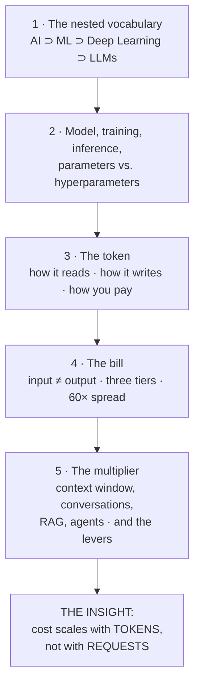

# Session 2 Overview — The Vocabulary, and the Cost Meter

Two halves that look unrelated and are not. First: the words, built once, cleanly, against one running example. Second: the bill — what AI actually costs and why the meter runs in a unit most people have never budgeted in. The join between them is a single term that turns out to do three jobs at once: **the token**.

## The arc

## The running example (used for every term in the first half)

Everything in `content/01` and `content/02` is defined against **one system**: an automated **defect-ticket triage** tool for a release/problem-management team. A ticket comes in; something has to decide what it is, how urgent it is, and what to say about it.

That example is deliberate. It lets us show all four layers of the vocabulary *on the same problem*, which is the only way to make the nesting feel real rather than like a Venn diagram someone drew:

| Layer | What it would look like on ticket triage |
|---|---|
| **AI, not ML** | Hand-written rules: `if title contains "kernel panic" → route to Platform, severity 1`. Somebody wrote every rule. |
| **ML, not deep learning** | A classifier trained on 40,000 past tickets that predicts *"will this breach SLA?"* from structured fields. Nobody wrote the rule; it was fitted. |
| **Deep learning** | A neural network that reads the raw *text* of the ticket — no hand-built feature list — and predicts the same thing, better. |
| **LLM** | A general-purpose language model that *summarises* the ticket, proposes a root-cause hypothesis, drafts the customer-facing note, and answers follow-up questions about it. |

Each row is a strict subset of the one above it in capability-type, and a strict superset in cost and opacity. That trade is the spine of the whole course.

## The four vocabulary terms, in one table

| Term | The one sentence | The trap it saves you from |
|---|---|---|
| **Model** | The fitted numbers — the learned rule — plus the code that runs them. | Thinking a model is a program someone wrote. Nobody wrote the rule; it was fitted from data. |
| **Training vs. inference** | Training makes the model (once, expensively). Inference uses it (constantly, cheaply-per-call). | Assuming that because "training a model costs millions," using one is expensive too. Usually you pay only for inference. |
| **Parameters** | The numbers the training process *learns*. | Confusing "how big the model is" with "how good it is." Related, not the same. |
| **Hyperparameters** | The numbers a *human* sets before training, which shape how learning happens. | Thinking model behaviour is fixed by the data alone. Choices were made; they are auditable. |

## The cost half, in four facts

1. **A token is roughly ¾ of an English word.** 1,000 words ≈ 1,300 tokens. It is also the unit of billing.
2. **Input and output are priced separately, and output costs several times more** — commonly 4–5× per token. So a chatty model is expensive in a way a verbose prompt is not.
3. **Chat APIs are stateless.** Every turn re-sends the entire conversation. An *n*-turn conversation costs roughly *n²*, not *n*.
4. **Therefore cost scales with tokens, not with requests.** Two workloads with identical request counts can differ by 10× on the bill. This is the counter-intuitive bit, and it is where cost estimates go wrong.

## What this session is *not*

- It is **not** a vendor comparison. The three price tiers in `content/04` are labelled *frontier / workhorse / small* precisely so the lesson survives the next price change. Named models are examples, not recommendations.
- It is **not** a prompting session. How to make prompts *shorter and better* is Session 10. Here we only establish that length has a price.
- It is **not** a claim that cheap models are good enough. The honest position — which Session 10 will make concrete — is that a **well-prompted cheap model often matches a badly-prompted expensive one**, and that this is discovered by testing, not asserted.
- It is **not** current. Prices in this course go stale in months. Every table is marked; re-verify before you deliver or quote.

## If you read one file

Read `04-what-ai-costs.md`. It carries the one insight that changes how this audience plans, budgets, and challenges vendor projections: **you are not buying requests, you are buying tokens.**
