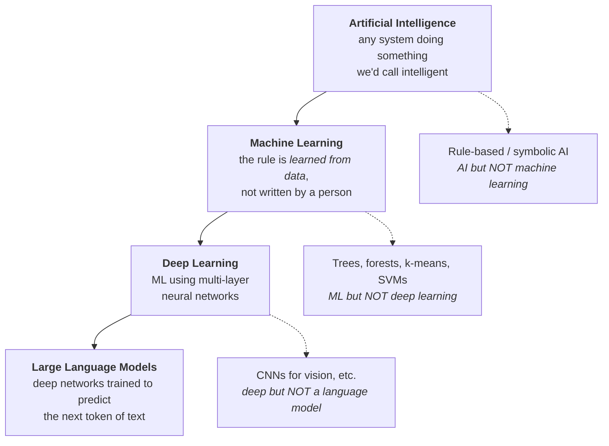
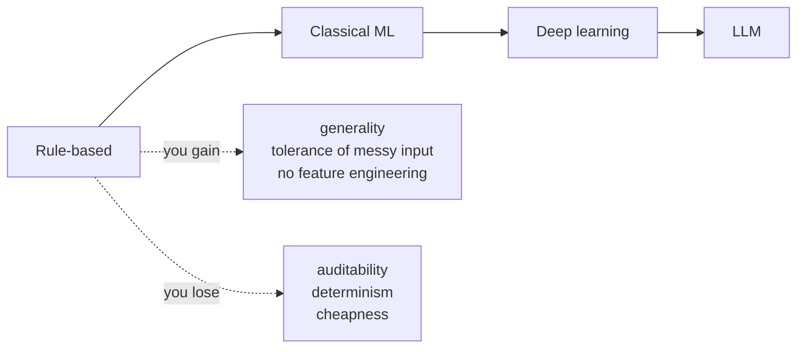
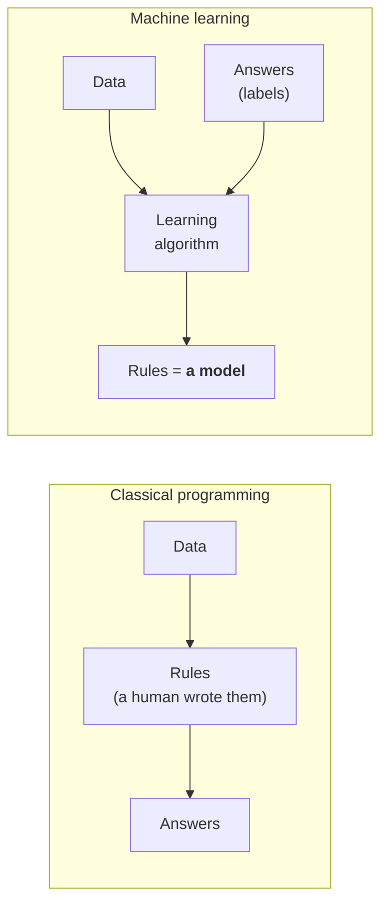
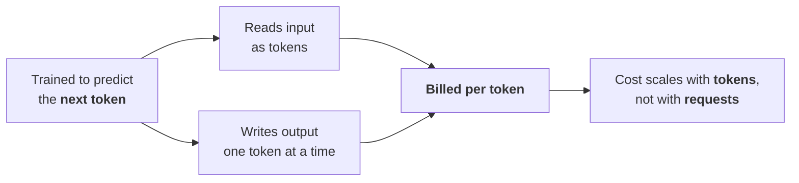
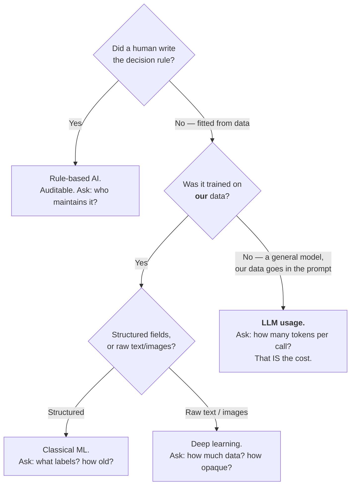

# The Nested Vocabulary — AI ⊃ ML ⊃ Deep Learning ⊃ LLMs

Four words that get used as synonyms in meetings and are not synonyms. This file builds the nesting once, cleanly, against the running example from `00-overview.md`: an automated **defect-ticket triage** system. By the end you should be able to hear "we're adding AI to the pipeline" and immediately ask the useful follow-up question — *which layer?*

---

## 1. The picture

The relationship is **containment**, not comparison. Every LLM is a deep-learning system; every deep-learning system is machine learning; all machine learning is AI. None of the arrows run backwards.

The dotted branches matter more than the solid ones. They are the reason the nesting is worth teaching: **most working AI in industry sits in a dotted branch, not in the LLM box.**

---

## 2. The four layers on one example

| Layer | Ticket-triage implementation | Who wrote the rule? | What it needs | Typical failure |
|---|---|---|---|---|
| **AI (rule-based)** | `if title matches /kernel panic/i → team=Platform, sev=1` — a few hundred hand-written rules. | A human, explicitly. | Domain experts and maintenance time. | Silent rot. A component gets renamed; the rule stops firing and nobody notices. |
| **Machine learning** | A classifier trained on 40,000 closed tickets, predicting *"will this breach SLA?"* from structured fields (component, reporter, severity, reopen count, day-of-week). | Nobody. It was **fitted** from data. | Labelled history — the answers, not just the questions. | Learns the past, including the parts of the past you didn't want repeated. |
| **Deep learning** | A neural network reading the ticket's **raw text** — no hand-built feature list — predicting the same label, plus a component guess. | Nobody, and now nobody can read it back either. | Much more data, and GPUs. | Opaque. Confidently right until the input distribution shifts. |
| **LLM** | A general-purpose language model that **summarises** the ticket, **proposes** a root-cause hypothesis, **drafts** the customer note, and **answers** follow-up questions. | Nobody wrote it *and it was never trained on your tickets at all.* | A prompt, an API key, and a budget. | Fluent and wrong. Nothing in the mechanism checks the output against truth (Session 1). |

Read that table top to bottom and you can see what you trade as you descend:

**The discipline note this audience will actually use:** descend only as far as the problem forces you to. A regex that routes 60 % of tickets correctly, that you can read, version, and diff, is a *better* engineering artefact than an opaque model that routes 63 % — unless the extra 3 % is worth the loss of auditability. Session 5 (decision trees) makes this concrete; Session 13 makes it uncomfortable.

---

## 3. Layer 1 — Artificial Intelligence

**Definition:** the broad field of building systems that perform tasks we would describe as requiring intelligence — perceiving, classifying, planning, reasoning, generating language.

It is a *field*, not a technique. That is why the word is nearly useless in a procurement conversation. "It uses AI" tells you nothing about whether anything was learned, what data was involved, or what it costs to run.

**The important counter-example: AI that is not machine learning.** Rule-based (or *symbolic*, or *expert*) systems were the dominant form of AI for decades and are still everywhere: a chess engine's opening book, a tax-filing wizard, a routing table, a compiler's optimiser, a fraud rules engine. Every rule was written by a person. They are AI. They contain zero machine learning.

Why insist on this? Because the failure modes are opposite:

| | Rule-based AI | Machine learning |
|---|---|---|
| Wrong because… | someone wrote a wrong rule | the data taught it something wrong |
| Fix by… | editing the rule | retraining, or changing the data |
| Can you read the logic? | Yes, line by line | Not really |
| Behaves the same twice? | Yes | Yes for a fixed model; **no** for a sampled LLM |
| Degrades when the world changes? | Loudly (rules stop matching) | **Quietly** (accuracy drifts) |

The last row is the one that costs organisations money. A rules engine that breaks tends to break visibly. A model that drifts keeps producing confident answers at a slowly worsening rate — this is *data drift*, and it returns in Sessions 13 and 14.

---

## 4. Layer 2 — Machine Learning

**Definition:** a system whose rule is **inferred from data** rather than written by a person.

The inversion from Session 1, restated in the vocabulary of this session:

You supply the questions *and* the answers; the algorithm produces the rule. That output — the fitted rule — is the **model** (`content/02`).

**The three families**, named here so later sessions have somewhere to attach:

| Family | You give it | It produces | Ticket-triage version | Session |
|---|---|---|---|---|
| **Supervised** | Inputs **and** correct answers | A predictor for new inputs | 40,000 labelled tickets → "will this breach SLA?" | 3 |
| **Unsupervised** | Inputs only, no answers | Structure — groups, axes, outliers | Cluster tickets into recurring incident families nobody had named | 4 |
| **Reinforcement** | An environment and a reward | A policy — what to do next | Not used here; think game-playing, control | mentioned in 15 |

Classical ML is not a lesser thing. Gradient-boosted trees still beat neural networks on ordinary tabular business data, and they train in seconds on a laptop. **The rule of thumb worth memorising: structured/tabular data → simple models; perceptual/fuzzy problems (images, audio, free text) → neural networks.**

---

## 5. Layer 3 — Deep Learning

**Definition:** machine learning using **neural networks with multiple layers**, where each layer learns a representation of the data that the next layer builds on.

The reason it matters is *feature learning*. In the classical-ML row of our example, a human had to decide what to measure: component, reporter, severity, reopen count. Those choices are called **features**, and choosing them well was most of the job. A deep network is handed the raw ticket text and works out its own internal features. That is the whole trick, and it is why deep learning took over every perceptual domain.

The price is data, compute, and opacity — the layers' internal features are real and effective, and mostly not interpretable by a human.

> ### Honesty note on the word "deep" (see `resources/sources.md` — correction #13)
> You will read that deep learning means "more than one hidden layer." That is a **convention, not a defined threshold.** One of our source decks uses exactly that definition and then teaches an example network with a single hidden layer — which, by its own definition, is not deep learning. We are not repeating that.
>
> The honest version: *"deep"* is a loose label meaning "enough stacked layers that the network learns useful intermediate representations by itself." Nobody is going to hand you a number. If somebody insists on a threshold, they are describing a habit, not a fact. Say so; a technical room respects it.

---

## 6. Layer 4 — Large Language Models

**Definition:** a deep neural network with a very large number of parameters, trained on a very large amount of text with one objective — **predict the next token** — and subsequently tuned to follow instructions.

Three properties of LLMs that the rest of this session and the rest of the course depend on:

1. **It is general, and it never saw your data.** Unlike the other three layers, an LLM is not trained on your tickets. You bring your data *at inference time*, in the prompt. This is why prompting matters (Sessions 10–11), why RAG exists (Session 13), and — critically for today — **why your data volume shows up on your bill instead of in your training run.**
2. **It generates; it does not retrieve.** Session 1's model: *autocomplete on steroids — a pattern-matcher, not a search engine* (framing after the LLM-safety source deck; see `resources/sources.md`). Nothing in the mechanism verifies the output against truth.
3. **It works in tokens.** It reads tokens, emits tokens one at a time, and is billed in tokens. Which is `content/03`.

The connection from the definition straight to the bill:

That arrow from "trained to predict the next token" to "billed per token" is not a coincidence or a pricing fashion. **The token is the unit of computation**, so it is the natural unit of price. Understanding that is most of what `content/04` needs from you.

---

## 7. Placing a system: a three-question test

When someone says "we're adding AI," ask these in order:

Each leaf has a different first question, and each of those questions is a release/problem/configuration-management question:

| If it's… | Your first question | Why |
|---|---|---|
| Rule-based | Who owns the rule set, and how is it versioned? | Rules rot silently when systems get renamed. |
| Classical ML | What were the labels, and how old is the training data? | The model encodes the past, including its mistakes. |
| Deep learning | What happens when the input distribution shifts? | The classic degradation is quiet, not loud. |
| LLM | How many tokens per call, and how many calls? | Because that product **is** your invoice. |

---

## Key points

- The nesting is **containment**: AI ⊃ ML ⊃ DL ⊃ LLM. The dotted branches — rule-based AI, classical ML, non-language deep learning — hold most of the working systems in industry.
- Descending the stack buys generality and costs auditability, determinism, and money. Descend only as far as the problem forces you.
- "Deep" has no defined layer threshold. Anyone who gives you one is quoting a convention.
- An LLM is the only layer that **never trained on your data** — you supply it per call, which moves your data volume from a one-off training cost to a **recurring per-token bill.** That is the bridge to the rest of this session.
