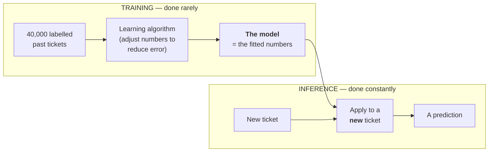
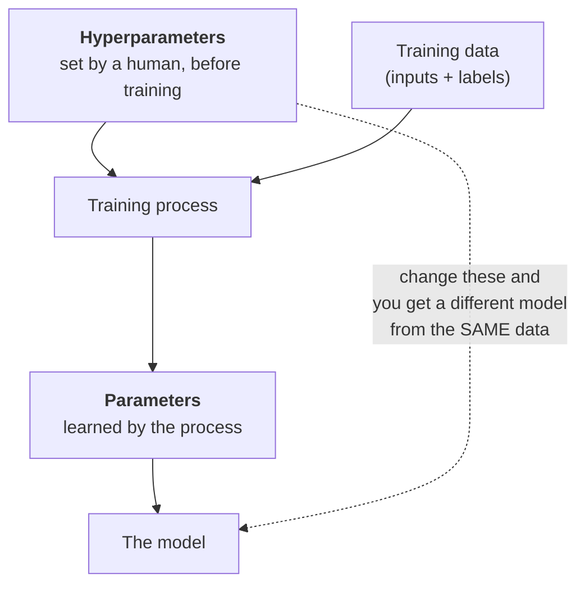
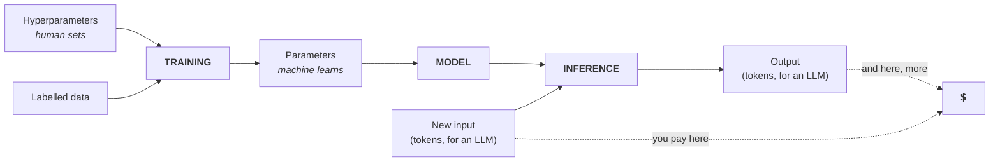

# Model, Training vs. Inference, Parameters vs. Hyperparameters

Four terms that get used loosely and that you cannot budget without. All four are defined here against the same running example — the defect-ticket SLA-breach classifier from `content/01`.

---

## 1. What a model actually is

**Definition:** a **model** is the fitted rule — a specific set of numbers — together with the code that applies those numbers to a new input.

That is genuinely all it is. Not a program someone wrote. Not a database of answers. A pile of numbers plus the arithmetic that uses them.

Make it concrete. Suppose our SLA-breach classifier is a logistic regression over four features. The *entire* model is five numbers:

| What | Value (illustrative) | Meaning |
|---|---|---|
| weight on `reopen_count` | **+0.84** | each reopen strongly raises breach probability |
| weight on `severity` (1 = worst) | **−0.55** | lower severity number → higher breach risk |
| weight on `component_is_platform` | **+0.31** | platform tickets breach more often |
| weight on `days_open` | **+0.12** | slow tickets breach more (weakly) |
| bias | **−2.10** | the baseline — most tickets don't breach |

Those five numbers *are* the model. Ship them in a file, apply them with four multiplications and an addition, push the result through a sigmoid, and you have a probability.

```python
import numpy as np

# The model IS these numbers. Nothing else.
weights = np.array([0.84, -0.55, 0.31, 0.12])   # reopen, severity, is_platform, days_open
bias = -2.10

def predict_breach_probability(reopen_count, severity, is_platform, days_open):
    """Apply the fitted rule to one ticket. This is 'inference'."""
    x = np.array([reopen_count, severity, is_platform, days_open], dtype=float)
    z = float(weights @ x + bias)          # weighted sum
    return 1.0 / (1.0 + np.exp(-z))        # sigmoid -> a probability in (0, 1)

# A nasty ticket: reopened 3 times, severity 1, platform component, open 9 days
print(round(predict_breach_probability(3, 1, 1, 9), 3))
# Expected output: 0.902

# A routine ticket: never reopened, severity 3, not platform, open 1 day
print(round(predict_breach_probability(0, 3, 0, 1), 3))
# Expected output: 0.026
```

Two things to notice, because they generalise all the way up to a trillion-parameter LLM:

1. **Nobody wrote `+0.84`.** A training process produced it by fitting to 40,000 past tickets. That is the whole difference from classical programming.
2. **Running the model is cheap.** Four multiplications. A modern laptop does this a hundred million times a second. Finding the numbers in the first place was the expensive part.

That second point is the entire training/inference distinction, and it is where most cost intuitions go wrong.

---

## 2. Training vs. inference



| | **Training** | **Inference** |
|---|---|---|
| What happens | The numbers are **found** | The numbers are **used** |
| How often | Once, then occasionally on retrain | Every single request, forever |
| Needs labels? | **Yes** — the answers are the whole point | No |
| Cost shape | Large, lumpy, capital-like | Small per call, **recurring**, operational |
| Who pays, for an LLM | The vendor (already spent) | **You**, per token, per call |
| Failure mode | Bad data → bad model | Good model → drifting input → quietly worse predictions |

### Why this distinction is a budgeting distinction

The most common cost misunderstanding in this room's world goes: *"I read that training a frontier model costs hundreds of millions of dollars, so using AI must be expensive."*

Both halves are true and they are unrelated to each other. **Training that model already happened, at the vendor's expense.** What you buy is inference: the model runs your tokens through numbers that already exist. A single ticket-summarisation call on a mid-tier model costs well under a cent (`content/04`). The reason your bill can still get large has nothing to do with training cost and everything to do with **volume of tokens**, which is the point of the second half of this session.

The inverse misunderstanding is just as common and more expensive: *"the per-call cost is tiny, so cost isn't a concern."* Tiny × very large × a context window that grows every turn = a real number. Also `content/04`.

### Where training cost *does* land on you

Three cases, so nobody leaves thinking training is always someone else's problem:

| Case | Do you pay training cost? | Notes |
|---|---|---|
| Calling a hosted LLM API | **No** | You pay inference only, per token. |
| Fine-tuning a hosted model on your data | **Yes, modestly** | A training job charged in tokens processed, then *higher* inference prices on the fine-tuned model. Frequently not worth it versus better prompting — test before committing (Session 10). |
| Training your own classical model (our SLA classifier) | **Yes, trivially** | Minutes of CPU. The real cost is labelling and maintaining the data, not the compute. |

The third row deserves emphasis for a problem-management audience: for classical ML, **the expensive part is almost never the training run. It is producing and maintaining labelled data.** Forty thousand tickets whose SLA outcome is reliably recorded is an organisational achievement, not a download.

---

## 3. Parameters

**Definition:** a **parameter** is a number that the **training process learns**. In our classifier, the five numbers in §1 are the parameters.

Scale that idea up and you get the number everybody quotes about LLMs. A model described as "70 billion parameters" has seventy billion of those fitted numbers. Same concept, same role: they are the learned rule.

| Model | Parameters (order of magnitude) | Rough working memory to run it |
|---|---|---|
| Our ticket classifier | **5** | negligible |
| A small on-device language model | ~1–3 × 10⁹ | ~1–3 GB |
| A mid-size open-weights model | ~7–70 × 10⁹ | ~7–70 GB |
| A frontier hosted model | not disclosed; presumed ≫ 10¹¹ | data-centre scale |

*(Memory figures assume roughly one byte per parameter — the common 8-bit-quantised case. At 16-bit precision, double them. Illustrative — verify against the specific model at delivery.)*

**What parameter count does and does not tell you.**

| Tells you | Does *not* tell you |
|---|---|
| Roughly what hardware is needed to run it | How good it is at your task |
| Roughly why the vendor charges what they charge | Whether it will hallucinate less |
| Whether it can run on-device | How well it was instruction-tuned |

The size-quality link is real but loose, and it has weakened noticeably: training data quality, tuning, and distillation now let much smaller models match much larger ones on many tasks. **Do not accept parameter count as a proxy for capability, and do not accept it as a proxy for price either** — vendors price on a tier, not on a count, and often do not publish the count at all.

---

## 4. Hyperparameters

**Definition:** a **hyperparameter** is a number (or choice) a **human sets before training**, which shapes *how* the learning happens. Hyperparameters are not learned; they are decided.



| | **Parameter** | **Hyperparameter** |
|---|---|---|
| Set by | The training algorithm | A human (or a search over humans' guesses) |
| When | During training | Before training |
| Example (our classifier) | `weight_on_reopen_count = 0.84` | `learning_rate = 0.01` |
| Example (neural net) | Every weight and bias | Number of layers, neurons per layer, epochs, batch size, dropout rate |
| Count | Five to a trillion | A handful to a few dozen |
| Auditable? | Not really | **Yes — and they should be recorded** |

The common ones you will hear named, with what each does:

| Hyperparameter | Controls | Set it wrong and… |
|---|---|---|
| **Learning rate** | How big a step each training update takes | Too big: it overshoots and never settles. Too small: training takes forever. |
| **Epochs** | How many passes over the training data | Too few: underfitted. Too many: memorises the training set (Session 8). |
| **Batch size** | How many examples per update | Affects speed and stability more than final quality. |
| **Network architecture** | Layers, widths, activations | The capacity ceiling of the whole model. |
| **Train/validation/test split** | How data is held back for honest evaluation | Get this wrong and every number you report is a lie (Sessions 3, 8, 12). |

**Why a configuration-management audience should care about this term specifically.** Hyperparameters are exactly the kind of thing your discipline exists to control: they are human decisions, made once, that determine the artefact, and they are trivially easy to lose. Two teams with the same data and different hyperparameters produce two different models. If the hyperparameters were not recorded, **the model is not reproducible** — you have a binary artefact whose provenance you cannot reconstruct. That is a configuration-management defect, not a data-science one.

### The word you will meet again: "temperature"

**Temperature** is an *inference-time* setting on an LLM — how much randomness to allow when picking each next token. Low temperature → the most probable token nearly every time, more repetitive, more deterministic. Higher → more variety, more risk of drift.

It is often called a hyperparameter, and that is defensible by analogy (a human sets it, it shapes behaviour) but it is worth keeping the distinction clean: **hyperparameters shape training; temperature shapes a single generation.** It costs you nothing and changes the output every time you call. It returns properly in Sessions 9 and 10.

---

## 5. The whole vocabulary, on one diagram



The two dotted lines are the entire second half of this session.

---

## Key points

- A **model** is fitted numbers plus the arithmetic to apply them. Nothing more mystical than that.
- **Training** finds the numbers — rare, expensive, needs labels. **Inference** uses them — constant, cheap per call, and the only part you pay for when calling a hosted LLM.
- "Training frontier models costs hundreds of millions" is true and irrelevant to your invoice. Your invoice is inference, measured in tokens.
- **Parameters** are learned; **hyperparameters** are chosen. Parameter count tells you about hardware, not about quality.
- Unrecorded hyperparameters make a model irreproducible. Treat them as configuration items, because that is what they are.
