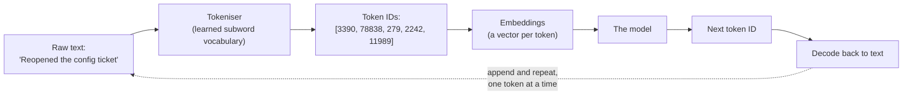
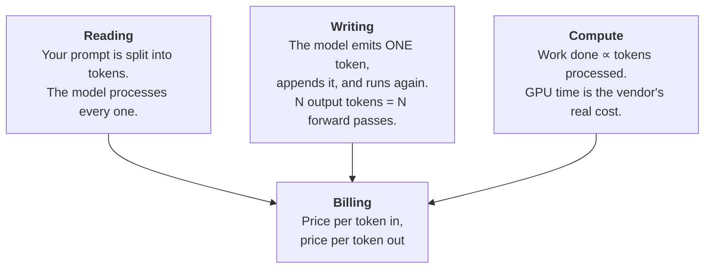

# The Token — How It Reads, How It Writes, How You Pay

The token is the pivot of this whole session. It is the unit of three different things at once, and once you see that, the entire cost model stops being surprising.

---

## 1. Why not words? Why not characters?

A language model needs a fixed, finite vocabulary of symbols it can predict over. Two obvious choices both fail:

| Unit | Vocabulary size | Problem |
|---|---|---|
| **Characters** | ~100 | Sequences become enormous. "configuration" is 13 steps instead of 1–2. Compute scales badly with sequence length. |
| **Whole words** | Unbounded | Every typo, product code, German compound, function name, and new word is unknown. `QCA6390_wlan_init` is not in any dictionary. |
| **Subwords (tokens)** | ~50k–200k | **The compromise that works.** Common words get one token; rare things get split into familiar pieces; nothing is ever unknown. |

Subword tokenisation is the standard everywhere. The vocabulary is *learned* from a corpus: frequent character sequences get merged into single tokens, rare ones stay split. That is why the segmentation looks arbitrary — it is statistical, not linguistic. **Tokens are not syllables, not morphemes, and not always words.**



The model never sees your letters. It sees a list of integers. Every count that appears on your invoice is the length of that list.

---

## 2. What the split actually looks like

Approximately, for a common English tokeniser:

| Text | Rough segmentation | Tokens |
|---|---|---|
| `The release is blocked.` | `The` · ` release` · ` is` · ` blocked` · `.` | ~5 |
| `unbelievable` | `un` · `bel` · `ievable` | ~3 |
| `configuration` | `configuration` | 1 |
| `Konfigurationsverwaltung` | `Kon` · `fig` · `ur` · `ations` · `ver` · `wal` · `tung` | ~7 |
| `QCA6390` | `Q` · `CA` · `63` · `90` | ~4 |
| `def get_ticket_status(id):` | `def` · ` get` · `_t` · `icket` · `_status` · `(` · `id` · `):` | ~8 |

Three observations that pay for themselves:

1. **The leading space usually belongs to the token.** ` release` and `release` are different tokens. This is why prompt formatting can move counts around slightly.
2. **Common English words are one token; anything unusual fragments.** The tokeniser was fitted mostly on English web text, so English prose is the best-compressed thing you can send it.
3. **Identifiers, part numbers, hashes, and UUIDs are the worst case.** They have no frequent substrings, so they shred into many tokens. A git SHA is ~10 tokens. A UUID can be ~20.

> **Note the practical consequence:** if your prompts are full of build IDs, component names, and log lines — which, in this audience's world, they will be — your token count per character is materially worse than the English-prose rule of thumb. Measure; don't assume.

---

## 3. The rule of thumb: ≈ ¾ of a word per token

For ordinary English prose:

> **1 token ≈ 0.75 words ≈ 4 characters.**
> Equivalently: **1 word ≈ 1.3 tokens**, and **1,000 words ≈ 1,300 tokens.**

Some anchors worth carrying in your head:

| Thing | Words | ≈ Tokens |
|---|---|---|
| One sentence | 15–20 | ~25 |
| One paragraph | 100 | ~130 |
| One page of prose (A4, single-spaced) | ~500 | ~650 |
| A typical defect ticket + comments | ~600 | ~800 |
| A 10-page design document | ~5,000 | ~6,500 |
| A 40-page specification | ~20,000 | ~26,000 |
| A 200-page manual | ~100,000 | ~130,000 |

And the ratio by content type — this is the table to actually remember, because it is where estimates go wrong:

| Content type | Tokens per word (approx.) | Why |
|---|---|---|
| **English prose** | **1.3** | The baseline the vocabulary was fitted on |
| Technical English (jargon-heavy) | 1.5–1.7 | Domain terms are rarer, so they split |
| **German / compounding languages** | **1.8–2.2** | Long compounds fragment; less training weight |
| Source code | 1.8–2.5 | Identifiers, punctuation, indentation |
| **JSON / XML** | **2.0–3.0** | Braces, quotes, and repeated key names all cost |
| Log lines with timestamps and IDs | 2.5–4.0 | Timestamps and hashes have no reusable substrings |
| CJK languages (Chinese, Japanese, Korean) | often ≥ 1 token *per character* | Worst case; can be 2–3× the cost of the same meaning in English |

**The non-obvious operational point:** the *same information* costs different amounts depending on how you serialise it. Sending 50 ticket records as JSON can cost roughly twice what sending them as a compact CSV or a markdown table costs, for identical content. That is a free saving that requires no cleverness at all — just a format choice.

> ⚠️ **All of these ratios are approximate, and they differ between vendors.** Every model family has its own tokeniser and its own vocabulary. The same paragraph can be 128 tokens on one model and 141 on another. Use the rule of thumb to plan; use the actual tokeniser (or the API's own reported usage) to bill.

---

## 4. Counting tokens for real, in Python

`tiktoken` is OpenAI's tokeniser library, MIT-licensed, and works offline once the encoding is cached. It gives exact counts for OpenAI models and a very good approximation for planning against others.

```python
# pip install tiktoken
import tiktoken

# An "encoding" is a specific learned vocabulary. Different model families use
# different ones; o200k_base is used by recent OpenAI models, cl100k_base by older ones.
enc = tiktoken.get_encoding("o200k_base")

def count_tokens(text: str) -> int:
    """Exact token count for this encoding."""
    return len(enc.encode(text))

samples = {
    "english_prose":  "The release is blocked by a configuration mismatch in the build pipeline.",
    "german":         "Die Konfigurationsverwaltung blockiert die Freigabe der Auslieferung.",
    "code":           "def get_ticket_status(ticket_id):\n    return db.query(Ticket).get(ticket_id).status",
    "json":           '{"ticket_id": "QCA-88412", "severity": 1, "component": "wlan_host", "reopened": 3}',
    "log_line":       "2026-07-19T04:11:57.884Z [ERROR] wlan_host: assert failed at qca6390_init.c:2214 (rc=-22)",
}

for name, text in samples.items():
    n_tokens = count_tokens(text)
    n_words = len(text.split())
    print(f"{name:15} words={n_words:3d}  tokens={n_tokens:3d}  tokens/word={n_tokens/n_words:.2f}")

# Expected output (approximate — exact counts depend on the encoding version):
# english_prose   words= 12  tokens= 14  tokens/word=1.17
# german          words=  8  tokens= 19  tokens/word=2.38
# code            words=  8  tokens= 24  tokens/word=3.00
# json            words= 10  tokens= 34  tokens/word=3.40
# log_line        words= 10  tokens= 39  tokens/word=3.90
```

Run this yourself before you quote a number to anyone. **The qualitative pattern — prose cheap, German expensive, JSON and logs very expensive — is stable across every tokeniser.** The exact digits are not.

Seeing the actual pieces is more convincing than seeing a count:

```python
import tiktoken
enc = tiktoken.get_encoding("o200k_base")

text = "Konfigurationsverwaltung"
ids = enc.encode(text)
pieces = [enc.decode([i]) for i in ids]
print(len(ids), pieces)
# Expected output (approximate):
# 7 ['Kon', 'fig', 'ur', 'ations', 'ver', 'wal', 'tung']

print(enc.encode("configuration"), [enc.decode([i]) for i in enc.encode("configuration")])
# Expected output:
# [1712] ['configuration']      <- one common English word, one token
```

One word of German costs seven tokens; a comparable English word costs one. That single comparison lands the whole idea.

### The reliable way to get the number

Estimating is for planning. For anything you are going to be billed for, **use the number the API reports back.** Every major provider returns a usage block with the actual input and output token counts for the call. That is the billed figure; your local count is an approximation of it.

```python
# Illustrative shape only — the field names differ by provider.
# Read the usage block, don't estimate, when you care about the real number.
#
# response.usage.input_tokens          -> tokens you sent (prompt + history + documents)
# response.usage.output_tokens         -> tokens the model generated
# response.usage.cache_read_input_tokens  -> tokens served from cache, if supported
#
# Log these per call. A per-call token log is the only honest basis for a
# cost forecast, and it takes about four lines to add.
```

**Practical recommendation for this audience:** if your team is piloting anything LLM-based, instrument token usage on day one. Not cost — *tokens*. Prices change; token counts are the stable measurement, and they are what tells you whether an optimisation actually worked.

---

## 5. The live demo (do this in the session)

`https://platform.openai.com/tokenizer` — free, no login, runs in a browser. **LINK-ONLY:** demo it live, don't screenshot the interface onto a slide (see `resources/sources.md`).

Paste these in order and read the count aloud each time:

| # | Paste this | What the room sees |
|---|---|---|
| 1 | `The release is blocked by a configuration mismatch.` | ~10 tokens for 8 words. The ¾ rule, live. |
| 2 | The same sentence in German | The count jumps ~60–80 % for the same meaning. |
| 3 | A five-line function from your own codebase | Roughly double the tokens-per-word of prose. |
| 4 | One JSON object with 6 fields | Punctuation and key names dominate; visibly expensive. |
| 5 | One real log line with a timestamp and a hash | The worst case. Nearly one token per two characters. |
| 6 | Your own name, then a colleague's | Common names: 1 token. Unusual ones: 3–5. Personal, memorable. |

Then say the sentence the session turns on: **"Every one of those numbers is a line item."**

*(Fallback if the network is down: pre-render the six counts into a static table on the slide. Build this slide regardless — it is two minutes of work and saves the segment.)*

---

## 6. Why the token is the unit of billing

Three facts, one conclusion.



- **Reading** — the whole prompt is processed, so cost is proportional to its length.
- **Writing** — this is the one people miss. The model does **not** produce a paragraph in one go. It produces one token, appends it to the sequence, and runs the entire network again to produce the next. A 500-token answer is 500 full passes through the model. That is why output tokens cost more than input tokens — and it is why they cost *several times* more, not a bit more.
- **Compute** — GPU-seconds are what the vendor actually spends. Tokens are the closest cheap proxy for GPU-seconds. So tokens are what they charge for.

Which produces the sentence the rest of this session unpacks:

> **You are not buying requests. You are buying tokens.**

A "request" is not a unit of anything the vendor spends. It costs the same to accept a 20-token question as a 200,000-token document — and then costs a thousand times more to serve. Any cost model built on request counts is measuring the wrong thing.

---

## Key points

- A token is a **subword** chunk from a learned vocabulary — not a word, not a syllable. Text becomes a list of integers, and that list's length is your bill.
- **≈ ¾ of a word per token** in English; **1 word ≈ 1.3 tokens**; **1,000 words ≈ 1,300 tokens.**
- German, code, JSON, and log lines cost **1.5–4× more tokens per word** than English prose. Serialisation format is a free cost lever.
- Output tokens are expensive because **each one is a full pass through the model.**
- Estimate with the rule of thumb; **bill from the API's reported usage.** Instrument token counts from day one of any pilot.
