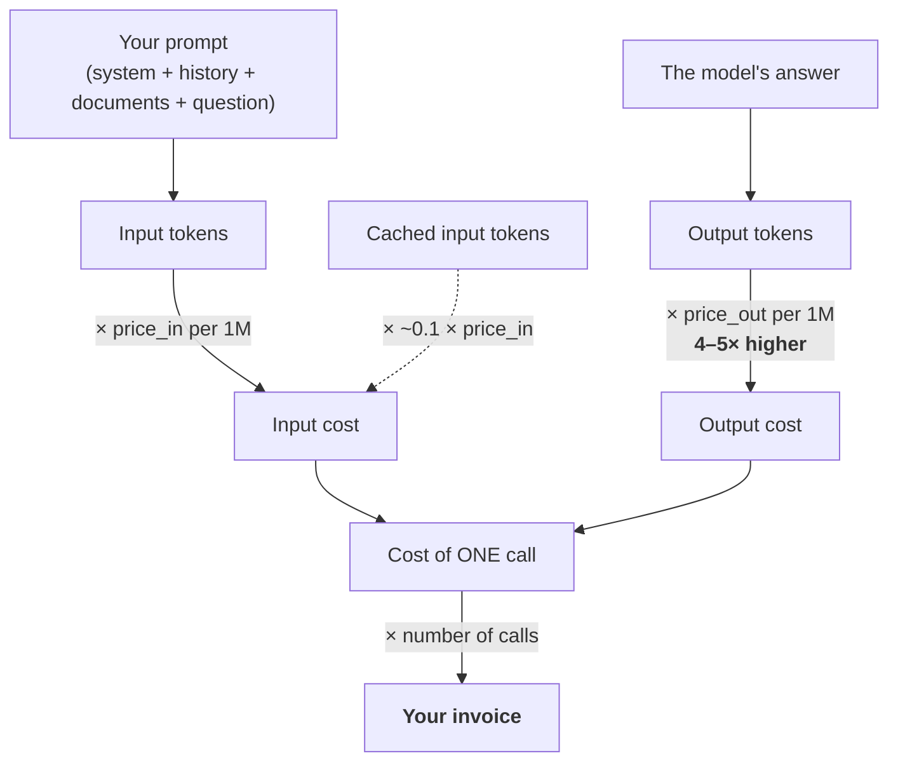
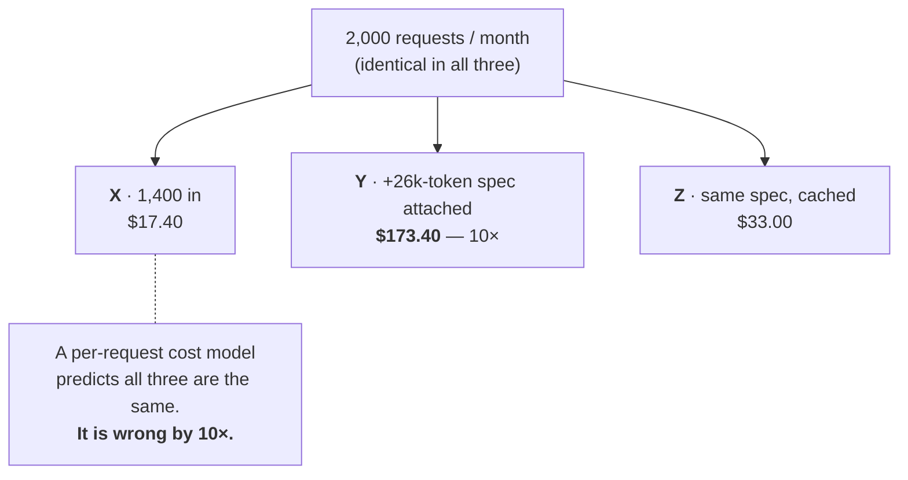

# What AI Actually Costs — The Bill, Line by Line

This is the half of the session that no source deck covers and that this audience will meet first in a budget conversation. It builds one worked example all the way from a ticket to an annual figure, across three model tiers, and lands on the insight that catches out anyone whose billing instincts came from per-transaction systems.

> ### ⚠️ Verify at delivery
> **Every price below is illustrative.** As of mid-2026 the tier shapes used here are broadly representative of hosted frontier / mid / small models, and the *relationships* (output priced ~4–5× input; ~60× spread across tiers; ~90 % discount on cached input; ~50 % discount on batch) have been stable for over a year. **The absolute numbers have not been.** Pull current figures from the vendors' own pricing pages (linked in `resources/sources.md`, LINK-ONLY) before you present or quote. The arithmetic and the lesson survive the refresh; the digits do not.

---

## 1. How you are charged



Four things this diagram asserts, each of which surprises somebody:

1. **Input and output are two separate line items** with two different unit prices.
2. **Output is priced several times higher than input** — commonly 4–5×, because each output token is a full pass through the model (`content/03` §6).
3. **The prompt is not just your question.** It is the system prompt, the entire conversation history, every attached document, every retrieved chunk, and every tool result — all of it, on every call. This is where the multiplier lives (`content/05`).
4. **Prices are quoted per *million* tokens.** That framing is doing rhetorical work: it makes every number look small. $15 per million tokens sounds like nothing until you notice that a single 200-page manual in context is 130,000 tokens, and that you might send it a thousand times.

### The tier structure (illustrative)

| Tier | Character | Input $/1M tok | Output $/1M tok | Out : In | Use it for |
|---|---|---|---|---|---|
| **A — Frontier** | Best reasoning, slowest, most expensive | **$15.00** | **$75.00** | 5× | Hard reasoning, ambiguous judgement, final-quality drafting |
| **B — Workhorse** | Strong general model, good latency | **$3.00** | **$15.00** | 5× | Most production work: summarise, classify, extract, draft |
| **C — Small/fast** | Cheap, fast, weaker on hard reasoning | **$0.25** | **$1.25** | 5× | High-volume classification, routing, extraction, filtering |

*Illustrative — verify at delivery (as of mid-2026: A ≈ $15/$75, B ≈ $3/$15, C ≈ $0.25/$1.25 per million tokens; ratios more stable than absolutes).*

The spread from A to C is **60×**. That is the single largest lever in this session, and it is available before you optimise anything else.

Discounts you should know exist, all of which need verification at delivery:

| Mechanism | Typical effect | Condition |
|---|---|---|
| **Prompt caching (cache read)** | Input tokens ~**90 % cheaper** | The prompt *prefix* must be byte-identical and recent (see `content/05`) |
| **Prompt caching (cache write)** | Input tokens ~**25 % more expensive**, once | You pay a premium to populate the cache |
| **Batch / async processing** | ~**50 % off** both directions | You accept results within hours, not seconds |
| **Long-context surcharge** | Some vendors charge **more per token above a threshold** (e.g. > 128k or > 200k in context) | Applies to the whole call, not just the excess — check |

---

## 2. The worked example

**The task.** Our defect-ticket triage system (`content/01`) sends each incoming ticket to an LLM. The model summarises it, proposes a category and a severity, and drafts two sentences for the status page.

**The token budget for one ticket:**

| Component | Tokens | Direction |
|---|---|---|
| System prompt (role, rules, output format) | 350 | in |
| Three few-shot examples of good triage | 250 | in |
| The ticket itself + comment thread | 800 | in |
| **Total input** | **1,400** | in |
| Summary + category + severity + draft note | 300 | out |
| **Total per call** | **1,700 tokens** | — |

**The volume:** 2,000 tickets per month.

### Cost of one call

| Tier | Input cost | Output cost | **Per ticket** |
|---|---|---|---|
| **A — Frontier** | 1,400 × $15/1M = **$0.0210** | 300 × $75/1M = **$0.0225** | **$0.0435** |
| **B — Workhorse** | 1,400 × $3/1M = **$0.0042** | 300 × $15/1M = **$0.0045** | **$0.0087** |
| **C — Small** | 1,400 × $0.25/1M = **$0.00035** | 300 × $1.25/1M = **$0.000375** | **$0.000725** |

### Scaled up

| Tier | Per ticket | **Per month** (2,000) | **Per year** | vs. Tier C |
|---|---|---|---|---|
| **A — Frontier** | $0.0435 | **$87.00** | $1,044 | **60×** |
| **B — Workhorse** | $0.0087 | **$17.40** | $209 | 12× |
| **C — Small** | $0.000725 | **$1.45** | $17 | 1× |

### Now read the three things that table is actually telling you

**(a) Output is 17.6 % of the tokens and 51.7 % of the cost.**

300 output tokens out of 1,700 total is under a fifth of the traffic. But at 5× the unit price, it is **more than half the bill** — identically on all three tiers.

> **The lever nobody thinks of first: make the model answer more briefly.** Cutting the drafted note from 300 tokens to 150 saves ~26 % of the total cost of the call. Cutting 150 tokens from the *prompt* saves ~5 %. Same 150 tokens, five times the effect. "Be concise. Maximum 100 words." is a cost control, not a style note.

**(b) The tier choice dominates everything else.**

Sixty-fold. No amount of prompt trimming closes a 60× gap. So the first question is never "how do I shorten this prompt?" — it is **"does this task actually need the frontier model?"**

Ticket triage is a classify-and-summarise task with three worked examples in the prompt. That is close to the definition of a task a small model does well. The honest engineering answer is *test it*: run 200 real tickets through all three tiers, have two humans grade the outputs blind, and look at the quality gap next to the 60× price gap. A well-prompted cheap model frequently matches a poorly-prompted expensive one — a finding we will make properly in Session 10. **These nuances are found through testing, not guessing.**

**(c) At this volume, the model is not the expensive part.**

$87/month for the *most expensive* option. If summarising a ticket saves a manager four minutes, and a loaded hour costs on the order of €60, you have displaced roughly €4.00 of labour per ticket with €0.04 of inference — about **1 %**.

This is the honest reading, and it cuts both ways:

- **At small volume, cost optimisation is the wrong first question.** Optimising an $87 line item while the accompanying human-review process is unmeasured is engineering theatre. Get it working and get it verified first.
- **The picture inverts fast.** Everything in §3 and in `content/05` is about the multipliers that turn this line item from $87 into six figures **without the request count changing at all.** And the labour saving does *not* scale the same way — the verification burden per output is roughly constant, which is Session 13's verification paradox arriving early.

---

## 3. The insight: cost scales with tokens, not with requests

Here is the demonstration. Same system, same model tier (B), **same number of requests**, three ways of using it.

| Workload | Requests/mo | Input tok/call | Output tok/call | Cost/call | **Monthly** |
|---|---|---|---|---|---|
| **X — Ticket only** | 2,000 | 1,400 | 300 | $0.0087 | **$17.40** |
| **Y — Ticket + attach the 40-page spec** | 2,000 | 27,400 | 300 | $0.0867 | **$173.40** |
| **Z — Ticket + spec, but the spec is cached** | 2,000 | 27,400 (26,000 cached) | 300 | $0.0165 | **$33.00** |

**X and Y have identical request counts and differ by 10×.** Z has the same request count *and the same token count* as Y, and costs a fifth of it — because 26,000 of those tokens were served from cache.



State it plainly, because this is the sentence the session exists to deliver:

> ## Cost scales with **tokens**, not with **requests**.

Why this trips people up: almost every other system this audience budgets for — API calls, transactions, tickets, builds, licences, seats — charges **per event**. Events are countable in advance, and capacity planning means counting events. LLM inference does not work that way. A request is not a unit of anything the vendor spends. **Two systems handling identical request volumes can differ by an order of magnitude on the invoice**, purely because of what is in the context.

Practical consequences for this room:

| If you're… | Don't ask | Ask |
|---|---|---|
| Sizing a pilot | "How many calls per day?" | "How many **tokens** per call — and what's in the context?" |
| Reading a vendor quote | "What's the per-request price?" | "What's the per-token price, in and out, and what does the vendor put in the context that I don't see?" |
| Reviewing a cost overrun | "Did usage go up?" | "Did the **context** grow? Did someone attach a document, add history, or add a tool?" |
| Approving a design change | "Does it add requests?" | "Does it add **tokens per request**?" — adding a retrieval step adds zero requests and can add 20,000 tokens. |

That last row is the one that will bite a change-control process. A pull request that adds "include the last 10 tickets from this component for context" changes no interface, adds no requests, passes review — and multiplies the bill.

---

## 4. Cost vs. context length

The table the room should photograph. Output fixed at 300 tokens; cost of **one call**:

| Input tokens | ≈ Content | Tier A | Tier B | Tier C |
|---|---|---|---|---|
| 500 | A short question | $0.0300 | $0.0060 | $0.00050 |
| 2,000 | A ticket + instructions | $0.0525 | $0.0105 | $0.00088 |
| 8,000 | A 12-page document | $0.1425 | $0.0285 | $0.00238 |
| 32,000 | A 50-page spec | $0.5025 | $0.1005 | $0.00838 |
| 128,000 | A 200-page manual | $1.9425 | $0.3885 | $0.03238 |
| 1,000,000 | A large codebase | $15.02 | $3.00 | $0.2504 |

*Illustrative — verify at delivery (as of mid-2026, per §1 tier prices).*

Two readings:

- **The output cost becomes rounding error.** At 500 input tokens, output is 75 % of the cost. At 128,000, it is 1.2 %. Long-context workloads are *input* workloads, and the optimisation target flips completely.
- **A single call can cost real money.** One frontier call over a 1M-token codebase is $15. Do that in a CI hook that fires on every commit, at 200 commits a day, and you have built a **$3,000-a-day** line item out of a change that added no requests, no services, and no infrastructure. This is not hypothetical; it is the single most common way LLM spend surprises an organisation.

---

## 5. A cost estimator you can actually use

```python
"""Token-based cost estimator.

Prices are ILLUSTRATIVE and must be refreshed from the vendor's pricing page
before being used for any real forecast. Verify at delivery.
"""
from dataclasses import dataclass

@dataclass(frozen=True)
class Tier:
    name: str
    price_in: float          # USD per 1,000,000 input tokens
    price_out: float         # USD per 1,000,000 output tokens
    price_cached_in: float   # USD per 1,000,000 cached input tokens

# --- Illustrative price table (as of mid-2026) — VERIFY BEFORE USE ---------
TIERS = [
    Tier("A - frontier",  price_in=15.00, price_out=75.00, price_cached_in=1.50),
    Tier("B - workhorse", price_in=3.00,  price_out=15.00, price_cached_in=0.30),
    Tier("C - small",     price_in=0.25,  price_out=1.25,  price_cached_in=0.025),
]

def cost_per_call(tier, input_tokens, output_tokens, cached_input_tokens=0):
    """Cost in USD of a single call. Cached tokens are billed at the cache-read rate."""
    fresh_input = max(input_tokens - cached_input_tokens, 0)
    return (fresh_input          * tier.price_in       / 1e6
            + cached_input_tokens * tier.price_cached_in / 1e6
            + output_tokens       * tier.price_out      / 1e6)

def report(label, input_tokens, output_tokens, calls_per_month, cached_input_tokens=0):
    print(f"\n{label}  ({input_tokens:,} in / {output_tokens:,} out"
          f"{f' / {cached_input_tokens:,} cached' if cached_input_tokens else ''}"
          f" x {calls_per_month:,} calls/mo)")
    print(f"  {'tier':<14}{'per call':>12}{'per month':>14}{'per year':>14}")
    for t in TIERS:
        c = cost_per_call(t, input_tokens, output_tokens, cached_input_tokens)
        print(f"  {t.name:<14}{c:>12.6f}{c*calls_per_month:>14.2f}{c*calls_per_month*12:>14.2f}")

report("Workload X - ticket only",              1_400,  300, 2_000)
report("Workload Y - ticket + 40-page spec",   27_400,  300, 2_000)
report("Workload Z - same, spec cached",       27_400,  300, 2_000, cached_input_tokens=26_000)

# Expected output:
#
# Workload X - ticket only  (1,400 in / 300 out x 2,000 calls/mo)
#   tier              per call     per month      per year
#   A - frontier      0.043500         87.00       1044.00
#   B - workhorse     0.008700         17.40        208.80
#   C - small         0.000725          1.45         17.40
#
# Workload Y - ticket + 40-page spec  (27,400 in / 300 out x 2,000 calls/mo)
#   tier              per call     per month      per year
#   A - frontier      0.433500        867.00      10404.00
#   B - workhorse     0.086700        173.40       2080.80
#   C - small         0.007225         14.45        173.40
#
# Workload Z - same, spec cached  (27,400 in / 300 out / 26,000 cached x 2,000 calls/mo)
#   tier              per call     per month      per year
#   A - frontier      0.082500        165.00       1980.00
#   B - workhorse     0.016500         33.00        396.00
#   C - small         0.001375          2.75         33.00
#
# Read across: X -> Y is a 10x increase with ZERO additional requests.
# Read Y -> Z: caching the unchanged 26,000-token prefix removes ~81% of the cost.
```

**How to use this honestly.** Three inputs decide everything, and only one of them is a price:

1. `input_tokens` — measure it, don't guess it. Use `tiktoken` (`content/03`) or the API's reported usage.
2. `output_tokens` — measure the *actual* median, not the length you asked for. Models overshoot.
3. `calls_per_month` — the only number a traditional capacity model would have asked for, and the least important of the three.

Then multiply. If the answer is uncomfortable, the fixes in order of leverage are: **change tier → cache the stable prefix → shorten the output → shorten the input.** That order is not arbitrary; it is the order of the multipliers.

---

## Key points

- You pay **per input token and per output token, separately**. Output is typically **4–5× more expensive** per token.
- In a realistic triage workload, output is **~18 % of the tokens and ~52 % of the cost.** Capping response length is the cheapest optimisation available.
- The **tier spread is ~60×** for the same task. Choosing the tier is a bigger decision than any prompt optimisation, and it should be decided by testing, not by assumption.
- At low volume the inference cost is ~1 % of the labour it displaces. **Do not over-optimise early** — but know exactly which multipliers can invert that, because they act fast and without warning.
- **Cost scales with tokens, not with requests.** Two systems with identical request counts can differ 10× on the invoice. Any estimate, quote, or change review framed in requests is measuring the wrong quantity.
