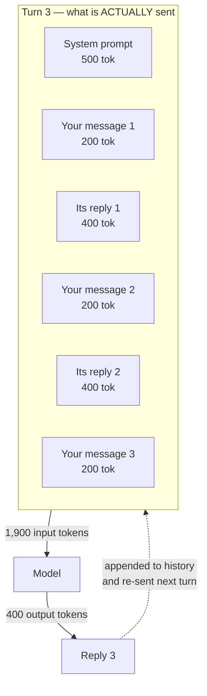
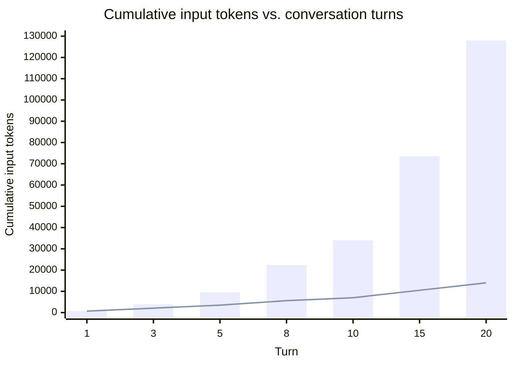
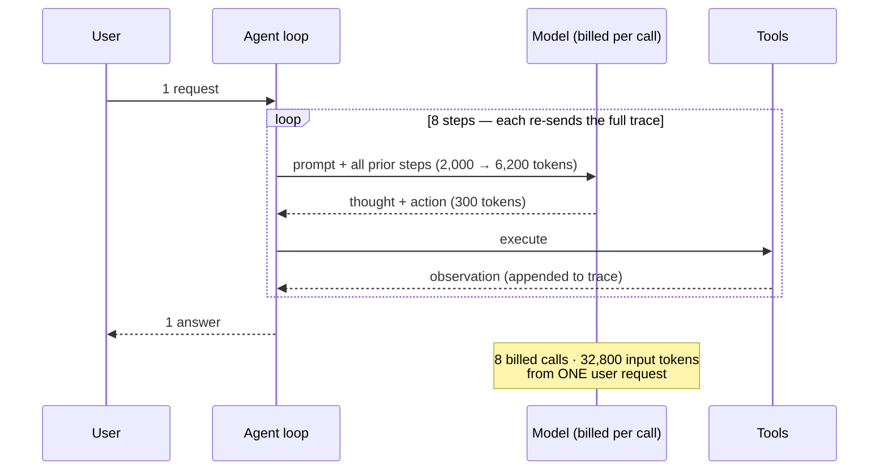
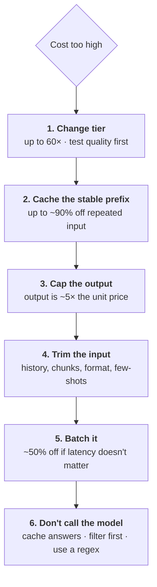

# The Context Window — The Multiplier, and the Levers

`content/04` established the unit price. This file is about the thing that multiplies it: the **context window**. Almost every unpleasant surprise in an LLM bill is a context-growth story, and almost every effective saving is a context-management technique.

> ⚠️ Prices below use the illustrative tiers from `content/04` §1. **Verify at delivery.**

---

## 1. What the context window is

**Definition:** the **context window** is the maximum number of tokens the model can have in front of it at once — everything you send *plus* everything it generates in that call.

Two facts about it, and the second is the expensive one:

1. **It is a hard ceiling.** Exceed it and the call fails or is silently truncated. Typical current windows run from ~128,000 to ~1,000,000 tokens depending on the model (verify at delivery).
2. **The model has no memory between calls.** The API is **stateless**. It does not remember your previous message. If a conversation is to continue coherently, *you* must re-send the entire history, every single time.

That second point is the whole file. The illusion of a chatbot "remembering" your conversation is produced by re-sending the transcript on every turn. **You pay for that transcript again on every turn.**



Your third message was 200 tokens. You were billed for 1,900.

---

## 2. The conversation cost curve

Take a realistic support-triage chat: a 500-token system prompt, 200-token user messages, 400-token replies.

At turn *n*, the input is `700 + (n−1) × 600` tokens. Cumulatively over *n* turns you have sent `700n + 300n(n−1)` input tokens — a **quadratic**, not a linear, function of the number of turns.

| Turn | Input this turn | **Cumulative input** | Cumulative output | Cumulative cost (Tier B) | A per-request model predicts | Understated by |
|---|---|---|---|---|---|---|
| 1 | 700 | 700 | 400 | $0.0081 | $0.0081 | 1.0× |
| 2 | 1,300 | 2,000 | 800 | $0.0180 | $0.0162 | 1.1× |
| 3 | 1,900 | 3,900 | 1,200 | $0.0297 | $0.0243 | 1.2× |
| 5 | 3,100 | 9,500 | 2,000 | $0.0585 | $0.0405 | 1.4× |
| 10 | 6,100 | 34,000 | 4,000 | $0.1620 | $0.0810 | **2.0×** |
| 20 | 12,100 | 128,000 | 8,000 | $0.5040 | $0.1620 | **3.1×** |

*Illustrative — verify at delivery.*

Look at the input column alone and the effect is starker: after 20 turns you have sent **128,000 input tokens** where a naive count of 20 messages × 700 tokens predicts **14,000**. That is **9× more** than the per-request intuition says.



*The bars are what you are billed for. The line is what a per-request estimate predicts. They diverge quadratically.*

**What this means operationally.** Scale it: 1,000 twenty-turn support conversations a month costs **$504** on Tier B, where a per-request forecast would have budgeted **$162**. Nobody did anything wrong. The estimate was simply built on the wrong unit.

**And the second-order effect:** the *last* turn of a long conversation costs `12,100 / 700` ≈ **17× more** than the first. Users experience the conversation as uniform. The meter does not. If your product exposes an open-ended chat with no turn limit and no history management, its unit economics get worse the more engaged the user is — which is precisely backwards.

---

## 3. Where the context comes from (and the three multipliers)

The context is rarely just "the conversation." Everything in this list is billed on every call:

| Context component | Typical size | Grows with |
|---|---|---|
| System prompt / instructions | 200–2,000 | Rule creep — grows monotonically, never gets pruned |
| Few-shot examples | 200–3,000 | Number of examples you add to fix edge cases |
| Conversation history | 0 → tens of thousands | **Every turn** |
| Attached documents | 5,000–200,000+ | Document size |
| **Retrieved chunks (RAG)** | 2,000–20,000 | Chunks retrieved × chunk size |
| **Tool definitions (agents)** | 500–5,000 | Number of tools exposed |
| **Tool results / observations** | 500–50,000 | Steps taken × result size |

### Multiplier 1 — Long documents

Linear and obvious: attach a 40-page spec and you add ~26,000 input tokens to every call that carries it. `content/04` §3 showed this turning $17.40 into $173.40 with no change in request count.

The non-obvious part is *persistence*. A document attached at turn 1 of a conversation is re-sent at every subsequent turn along with the history. A 26,000-token attachment in a 10-turn conversation is 260,000 input tokens, not 26,000.

### Multiplier 2 — RAG (retrieval-augmented generation)

RAG means: before calling the model, search a knowledge base and paste the most relevant chunks into the prompt. It is the standard fix for "the model doesn't know our internal information," and it is covered properly in Session 13. Here, only its cost shape matters.

**RAG adds tokens to every single call, invisibly, from a component that is not in your prompt template.**

| Retrieval config | Added input tokens/call | Added cost/call (Tier B) | At 100k calls/mo |
|---|---|---|---|
| 3 chunks × 500 tok | 1,500 | $0.0045 | **$450/mo** |
| 8 chunks × 800 tok | 6,400 | $0.0192 | **$1,920/mo** |
| 15 chunks × 1,000 tok | 15,000 | $0.0450 | **$4,500/mo** |

*Illustrative — verify at delivery.*

Retrieving more chunks improves recall, so there is real pressure to raise *k*. **Every increment of `k` is a permanent multiplier on your unit cost**, and it is set in a config file that a cost reviewer will never look at. Treat retrieval parameters as cost-bearing configuration items.

### Multiplier 3 — Agents

An **agent** is an LLM that runs in a loop: think, call a tool, observe the result, think again — until the task is done (properly covered in later sessions). The cost consequence is the sharpest in this session:

> **One user request becomes N model calls, and each call carries the whole accumulated trace.**

An 8-step agent, base prompt 2,000 tokens, each step adding ~600 tokens of thought/action/observation, 300 output tokens per step:

| | Single call | 8-step agent | Ratio |
|---|---|---|---|
| Model calls | 1 | 8 | 8× |
| Total input tokens | 2,000 | 32,800 | 16× |
| Total output tokens | 300 | 2,400 | 8× |
| **Cost (Tier B)** | **$0.0105** | **$0.1344** | **12.8×** |

*One user action. Thirteen times the cost.*



**This is where cost forecasts fail hardest**, because the request count — the number the forecast was built on — did not change at all. If you take one governance lesson from this session, take this: **an agentic design change is a cost change, and it should be reviewed as one.**

---

## 4. The levers, in order of leverage



### Lever 1 — Model tiering (up to 60×)

The largest single lever, and the first to evaluate. Not everything needs the frontier model. A common production pattern is **routing**: a small model classifies the request, and only the genuinely hard cases escalate. If 80 % of tickets are routine, an 80/20 split between Tier C and Tier B costs roughly 20 % of an all-Tier-B system.

*Caveat, stated honestly:* tier-down decisions must be **measured, not assumed**. Build a small evaluation set of real inputs with graded outputs before you switch. A cheaper model that is wrong more often can cost far more in human rework than it saved in inference — which is Session 13's territory.

### Lever 2 — Prompt caching (up to ~90 % off repeated input)

**The mechanism.** Providers can cache the internal computed state for a **prefix** of your prompt. If the next call starts with a byte-identical prefix, that portion is billed at a heavily reduced rate — commonly ~10 % of the normal input price — because the work was already done.

| | Rate (illustrative) |
|---|---|
| Normal input | 1.00× |
| **Cache write** (populating it) | ~1.25× — you pay a premium once |
| **Cache read** (a hit) | **~0.10×** |

*Verify at delivery — the discount, the write premium, the TTL, and the minimum cacheable length all vary by vendor.*

**The one engineering rule that follows, and it is the most actionable thing in this session:**

> ## Put the stable content **first** and the variable content **last**.

Caching works on a **prefix**. Anything variable placed early invalidates everything after it.

```text
❌ EXPENSIVE — a timestamp at the top invalidates the cache on every call
   [current time: 2026-07-19 04:11:57]      <- changes every call
   [system prompt: 500 tok]
   [40-page spec: 26,000 tok]
   [the ticket: 800 tok]
   -> cache hit rate: 0%. You pay full price for 27,300 tokens, every call.

✅ CHEAP — stable prefix first, variable tail last
   [system prompt: 500 tok]                 <- stable
   [40-page spec: 26,000 tok]               <- stable
   ---- cache boundary ----
   [current time]                           <- variable
   [the ticket: 800 tok]                    <- variable
   -> cache hit on 26,500 tokens. ~90% off the bulk of the call.
```

That is a **reordering**, not a rewrite. It changes no behaviour and, in the `content/04` §3 example, removes ~81 % of the cost.

**When caching does not help — be honest about all four:**

| Situation | Why it fails |
|---|---|
| Low traffic | Caches expire (TTLs are often ~5 minutes). Sparse calls miss and pay the write premium repeatedly. |
| Genuinely unique prompts | Nothing stable to cache. |
| Variable content placed early | Prefix broken; hit rate zero. The commonest mistake. |
| Short prompts | Below the minimum cacheable length; caching does nothing. |

Instrument `cache_read_input_tokens` (or the equivalent field). **A caching strategy you have not measured is a caching strategy you do not have** — a broken prefix is invisible except in the usage data and the invoice.

### Lever 3 — Cap the output

Output costs ~5× input per token. Two mechanisms:

- **Ask for brevity in the prompt** ("Answer in at most 100 words", "Return only the JSON object, no commentary"). Soft, but effective.
- **Set `max_tokens`.** Hard limit. Careful: it *truncates*, it does not summarise. A cut-off JSON object is unparseable — and you still paid for every token generated up to the cut. Use it as a runaway guard, not as a compression technique.

### Lever 4 — Trim the input

| Technique | Effect | Cost of the technique |
|---|---|---|
| **Sliding window** on history — keep the last *k* turns | Turns the quadratic curve into a linear one | The model forgets earlier turns |
| **Rolling summary** — periodically compress old history | Big saving, keeps continuity | Extra calls; summaries lose detail |
| **Compact serialisation** — markdown table over JSON | 30–50 % on structured payloads | Almost none. Free money. |
| **Retrieve, don't attach** — send 3 relevant chunks, not the whole 40-page spec | Often 80 %+ | Retrieval quality becomes a failure mode (Session 13) |
| **Prune few-shot examples** | Modest | Quality regression if you cut the wrong ones — test |

The sliding window deserves a note: it is the standard fix, and it silently changes behaviour. The model stops being able to refer to what was said 15 turns ago. Users read that as the assistant "getting dumber." **It is a cost/quality trade, not a free optimisation, and it should be a documented decision.**

### Lever 5 — Batch processing (~50 %)

If results are needed within hours rather than seconds — nightly report generation, bulk backfill classification, log summarisation — most vendors offer an asynchronous batch endpoint at roughly half price. For scheduled workloads this is a **free 50 %** requiring no quality trade at all. It is also the most commonly forgotten lever.

### Lever 6 — Don't call the model

The cheapest token is the one you never send.

- **Cache complete answers** for repeated identical questions (a normal application cache, not the provider's prompt cache).
- **Filter first.** If 70 % of incoming tickets are auto-closeable duplicates, detect that with a cheap deterministic check before spending a model call on them.
- **Use a regex.** Genuinely. If a rule catches the case reliably, it is faster, cheaper, deterministic, auditable, and diffable. `content/01`'s discipline note, arriving with a price tag attached.

---

## 5. A note on quadratic compute vs. linear pricing

You may hear that attention is **O(n²)** in sequence length — doubling the context quadruples the internal compute. That is true of the mechanism (Session 9 covers it).

But **pricing is linear per token**, not quadratic. Vendors absorb the non-linearity through architectural optimisations and, increasingly, through **long-context surcharges** — a higher per-token rate once a call exceeds some threshold.

Two practical consequences:

1. **Check for a threshold.** If a vendor charges more per token above, say, 128k or 200k context, and it applies to the *whole* call rather than the excess, then a call at 201k tokens can cost materially more than one at 199k. Know where your workload sits relative to that edge.
2. **Latency is quadratic even where price is linear.** Long contexts get slow before they get expensive. If your users are waiting, context length may be a latency problem before it is a cost problem.

---

## Key points

- The API is **stateless**. The appearance of memory is produced by re-sending the whole transcript every turn — and you pay for it every turn.
- Conversation cost grows **quadratically** with turns. Twenty turns costs ~3× what a per-request estimate predicts, and ~9× on input tokens alone.
- **Three multipliers** act without changing request count: long documents (linear), RAG (a config-file constant), and agents (**one request → 8+ billed calls, ~13× cost**).
- **Levers in order:** change tier (60×) → cache the stable prefix (~90 % off repeated input) → cap output (5× unit price) → trim input → batch (50 %) → don't call at all.
- **Put stable content first, variable content last.** It is a reordering, not a rewrite, and it can remove ~80 % of the cost of a document-heavy workload.
- Measure `cache_read_input_tokens` and per-call token usage. An unmeasured optimisation is a belief, not a result.
