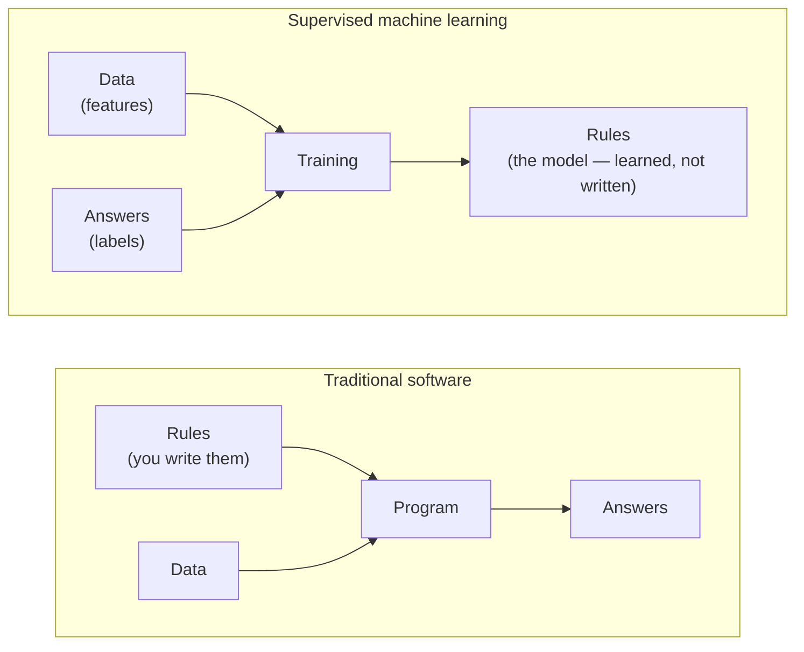
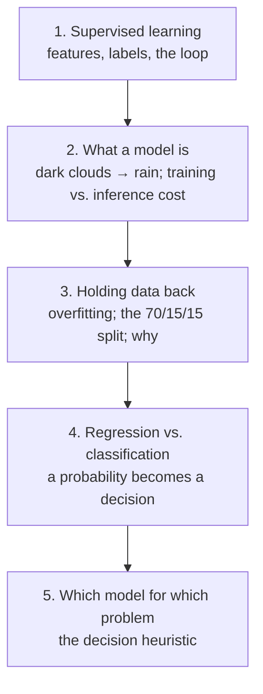

# Overview — Learning From Data

This session is the foundation for the whole Methods block. Sessions 4, 5, and 6 each teach a *specific* family of methods — unsupervised learning, decision trees and random forests, deep learning. All three sit on the same handful of ideas: what it means to learn from examples, what "a model" is, how you know whether a model actually works, and how a numeric output becomes a decision. We teach that shared machinery **once, here**, so the later sessions can get straight to what makes each method different.

## The one idea, if you take nothing else

Traditional software and machine learning are **inverted**:

*Caption: In traditional software you write the rules and the machine applies them. In supervised learning you supply the data **and** the answers, and the machine works out the rules for you. Everything else in this session is a consequence of that flip.*

You no longer hand the machine the logic. You hand it worked examples — inputs paired with correct answers — and it infers the logic. That is powerful (you can solve problems whose rules you could never write by hand, like "is this photo a hot dog") and it is dangerous (the machine's "rules" are only as good as the examples, and you often can't read them). Both the power and the danger run through the rest of the Methods block.

## The arc of this session

*Caption: five short topics, each building on the last. The last one — the decision heuristic — is the tool you will reuse most.*

| # | Topic file | The question it answers |
|---|---|---|
| 1 | `01-supervised-learning.md` | What is the machine actually learning, and from what? |
| 2 | `02-what-is-a-model.md` | What *is* a "model", and why is training expensive but using it cheap? |
| 3 | `03-train-val-test-split.md` | Why do we deliberately throw away part of our data before trusting a model? |
| 4 | `04-regression-vs-classification.md` | Does the model output a number or a label — and how does a 0.73 become a "yes"? |
| 5 | `05-which-model-for-which-problem.md` | When do I reach for a simple model, and when do I need a neural network? |

## Why this matters to release / problem / configuration managers

You are rarely the person training the model. You are the person who has to **judge** one — sign off on it, ship it, own the incident when it misbehaves, or evaluate a vendor selling one. Every idea in this session is a question you can now ask:

- *"What are the features and the label?"* — forces a vague "AI-powered" claim into something concrete.
- *"What data did you hold back, and what was the accuracy on that held-back data?"* — separates a real result from a memorised one (Session 13 shows how a model can report 98% accuracy and be useless).
- *"It outputs a probability — where's the threshold, and who chose it?"* — surfaces a business decision hiding inside a technical artefact.
- *"Does this problem actually need a neural network?"* — the difference between a model you can audit and a black box you can't.

## A note on honesty

This course keeps a skeptical voice. The source material this session draws on (a deep-learning course) is unusual in that its author spends the first third arguing *against* over-using the technique — pointing out that the toy problem he teaches "would probably be better solved with logistic regression." We keep that stance. The goal is not to make you enthusiastic about machine learning; it is to make you able to tell a well-founded model from a demo that will fall over in production — which is your professional turf already.

Read the topic files in order. `99-key-takeaways.md` is the one-page recap.
