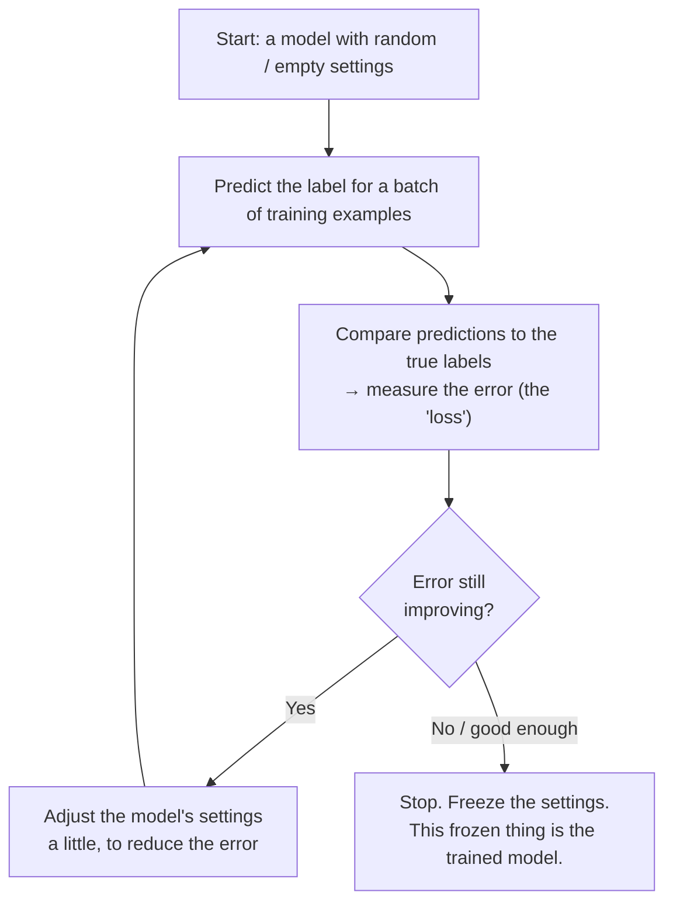

# Supervised Learning: Features, Labels, and the Loop

Supervised learning is the workhorse of practical machine learning and the setting for three of the four method families in this block (decision trees, random forests, and neural networks are all supervised; unsupervised learning in Session 4 is the exception). This file defines its two ingredients — **features** and **labels** — and walks the **training loop** that turns them into a model.

## The definition, in one sentence

> **Supervised learning** is a family of data-driven algorithms that infer a relationship between input variables and a known output, from examples where the correct output is given, so they can predict the output for new inputs where it isn't.

The word *supervised* means exactly what it sounds like: during learning, the machine is shown the right answer for every example, the way a supervisor would mark your work. Contrast this with **unsupervised** learning (Session 4), where there are no right answers given and the machine has to find structure on its own, and **reinforcement** learning, where feedback comes as rewards over time rather than labelled examples.

## Features and labels

Two terms you need cold, because every later session uses them.

| Term | What it is | In the running example |
|---|---|---|
| **Feature** | An input variable — a measurable property of one example. The columns you feed *in*. Also called an attribute, predictor, or "X". | The three colour channels of a background: **Red, Green, Blue** (each 0–255). |
| **Label** | The correct output for that example — the answer the model is trying to predict. The column you want *out*. Also called the target, the ground truth, or "y". | Whether that background needs a **light** or **dark** font (a yes/no). |

Think of a spreadsheet. Each **row** is one example (one observation). Most columns are **features** (the inputs). One special column is the **label** (the answer). Supervised learning is "given many rows where I can see the label, learn to fill in the label for a row where I can't."

Here is a small slice of the course's running dataset — 1,345 background colours, each hand-labelled light or dark:

| Red | Green | Blue | Label (font) |
|---|---|---|---|
| 238 | 121 | 66 | dark |
| 122 | 55 | 139 | light |
| 247 | 247 | 247 | dark |
| 26 | 26 | 26 | light |
| 151 | 255 | 255 | dark |

*Three feature columns, one label column. The model never sees the word "dark" as meaning anything — to it, `dark` is just a category attached to certain (R, G, B) combinations, and its whole job is to learn which combinations go with which category.*

A crucial and easy-to-miss point: **the quality of a supervised model is capped by the quality of its labels.** Those "light"/"dark" answers were decided by a person (or a rule) at some point. If the labelling was sloppy, inconsistent, or biased, no amount of clever modelling fixes it — "garbage in, garbage out" is not a cliché here, it is the governing constraint. This is why, when you evaluate someone's model, *"where did the labels come from?"* is one of the sharpest questions you can ask.

## What "learning" actually does — the loop

Training is not magic and it is not a single step. It is a **loop** that nudges the model's internal settings a little at a time until its predictions on the training examples stop improving. Every supervised method in this course — trees, forests, neural networks — is some version of this loop; they differ only in *what* gets adjusted and *how*.

*Caption: the supervised-learning loop. Predict → measure how wrong → adjust → repeat. Session 6 shows the specific version of "adjust" that neural networks use (gradient descent); Session 5 shows the version trees use (splitting on the feature that best separates the labels). The shape is always this.*

Read the loop carefully, because two of its features explain most of what follows:

1. **The model is defined by its settings.** Before training, a neural network already has its *structure* (how many layers, how many nodes) but its numeric **weights and biases** are random — so its predictions are no better than chance. Training is the process of finding good values for those numbers. When we say "the model," we mean the structure *plus* the specific learned settings. Freeze them and you have a thing that makes predictions; that frozen thing is the deliverable.

2. **The loop optimises performance on the training examples — and that is exactly the problem.** Nothing in the loop rewards the model for doing well on data it has never seen. Left unchecked, the loop will happily drive training error to zero by *memorising* the training set, which is worthless in production. That failure mode (overfitting) and the discipline that guards against it (holding data back) are the subject of file 03 — the single most important idea in this session.

## A note on where the running example is honest about itself

The light/dark-font problem is a **toy**. Its own author is explicit that it "would probably be better solved with logistic regression" — a much simpler model — and that he uses a neural network only because it is a convenient way to teach the mechanics. Keep that honesty in mind: choosing to learn from data is a real engineering decision with costs, and choosing the *heaviest* method to do it is a decision you should be able to defend. File 05 turns that instinct into a rule.

## Key points

- Supervised learning infers a rule from **examples where the answer is known** (labelled data), to predict the answer where it isn't.
- **Features** are the inputs (the columns you feed in); the **label** is the answer (the column you want out). One row = one example.
- A model is only as good as its **labels** — ask where they came from.
- **Training is a loop**: predict → measure error → adjust → repeat, until performance stops improving. The frozen result is the model.
- The loop only optimises the *training* data, which is why we must deliberately test on held-out data (file 03).
