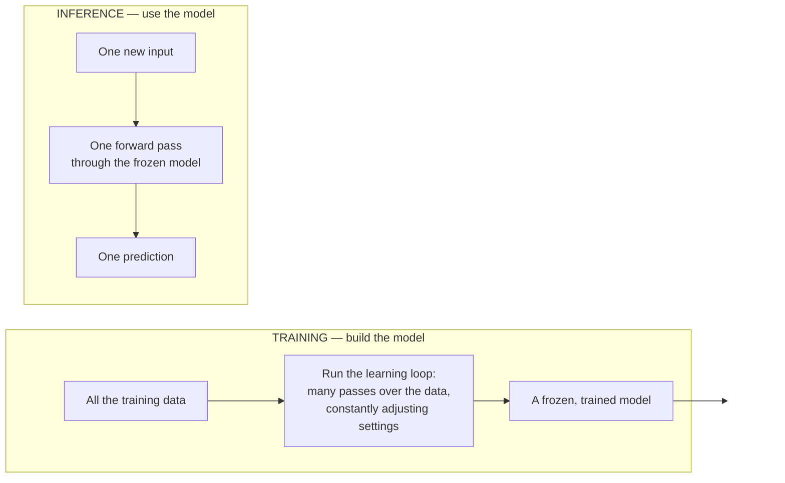

# What "a Model" Is — and Why Training Is Expensive but Using It Is Cheap

People say "the model" constantly and rarely define it. This file gives a plain answer, an intuition that sticks, and the one cost distinction — **training vs. inference** — that a release or configuration manager needs in order to reason about what a model costs to build versus what it costs to run.

## A model is a learned function: numbers in, prediction out

Strip away the mystique and a machine-learning model is a **function**: it takes numbers in (the features) and produces a prediction out. What makes it a *machine-learning* model rather than ordinary code is that the function's internal settings were **learned from data**, not written by a programmer.

> **A model = a fixed structure + a set of learned settings that, together, map features to a prediction.**

- The **structure** is chosen up front by a human: a decision tree of a certain shape, or a neural network with a certain number of layers and nodes. This is architecture — it decides what *kinds* of relationships the model can represent.
- The **settings** are the numbers filled in by training: a tree's split thresholds, a network's weights and biases. Modern models can have a lot of these — the settings are literally what the word **parameters** means (Session 2). A small tabular model might have dozens; a large language model has hundreds of billions.

"Training the model" means finding good values for the settings (file 01's loop). "The trained model" is the structure with those specific values baked in. You can save it to a file, copy it, and run it a million times — it does not change unless you retrain it.

## The intuition: dark clouds mean rain

You already run models in your head, and the clearest example is weather.

Nobody gave you a rulebook that says *"if cloud darkness > 0.6 and pressure is falling and you can smell ozone, then P(rain) = 0.8."* Instead, over years, you saw thousands of examples: skies (**features**) followed by rain-or-no-rain (**labels**). Your brain quietly fit a model. Now, when you glance up at a dark, heavy sky, you predict rain — fast, automatically, without consulting any rule you could write down.

That everyday act contains the whole idea:

| Weather intuition | Machine-learning model |
|---|---|
| The sky you look at (darkness, movement, colour) | The **features** (the inputs) |
| "It'll rain" / "it won't" | The **prediction** |
| Years of skies-then-outcomes you lived through | The **training data** (labelled examples) |
| The instinct you built, tuned by being right and wrong | The **learned settings** (parameters) |
| The one-second glance-and-judge | **Inference** (using the model) |

Two honest limits fall straight out of the analogy, and they matter for judging real systems:

- **You can be confidently wrong.** A dark sky that doesn't rain. The model outputs a strong prediction; the prediction is mistaken. A model's confidence is not the same as being correct — a theme this course returns to hard in Session 13.
- **You only know the weather where you've lived.** Your rain-instinct, trained in one climate, misfires in a desert or the tropics. A model trained on one distribution of data quietly fails when the world it meets in production looks different from its training set (this is *data drift*, and file 03's held-out testing is the first defence against learning it too late).

## Training cost vs. inference cost — the distinction to internalise

This is the practical heart of the file. The cost of a model splits cleanly into two very different phases, and confusing them leads to bad decisions about budgets, latency, and where a model can run.

*Caption: training happens once (or occasionally, on retrain); inference happens every single time the model is used. They have completely different cost profiles.*

| | **Training** | **Inference** |
|---|---|---|
| **How often** | Once, or periodically when you retrain | Every prediction — potentially millions of times |
| **What runs** | The full learning loop: many passes over the *whole* dataset, adjusting settings each time | A single pass of the input through the frozen model |
| **Cost per event** | High — hours to weeks, often on GPUs; for large models, this is the multi-million-dollar line item | Low per call — often milliseconds — but it *adds up* at scale |
| **Who pays** | The team/vendor that builds the model, up front | Whoever runs it in production, continuously |
| **Data needed** | The entire labelled training set | Just the one new input; the labels are gone |
| **Analogy** | Studying for the exam (long, effortful, done once) | Answering one question on the exam (quick, repeated) |

Why the asymmetry? Training must (a) look at *every* example, (b) do it *many times over* (each full pass is an "epoch"; the loop may run dozens or hundreds of them), and (c) at each step compute how to adjust settings. Inference does none of that — the settings are already fixed, so using the model is just plugging numbers into a finished function.

**What this means for your decisions:**

- A model that is **cheap to train** can still be **expensive to run** if you call it at high volume — total cost is dominated by inference at scale, not by the one-time training. (For large language models, Session 2's token-cost lesson is exactly the inference-cost story: you are billed per use, not per model.)
- A model that is **expensive to train** but small to run can be a bargain if you use it constantly — the training cost amortises over billions of cheap predictions.
- **"Retraining" is not free.** Every time the world drifts and you refresh the model, you pay the training cost again. A model is not "done" — it is a perishable asset with an ongoing maintenance bill. For configuration and release management, treat a deployed model like a dependency that has to be re-qualified, not a static artefact you ship once.

## Key points

- A **model** is a fixed **structure** plus **learned settings** (parameters) that map features to a prediction; training finds the settings.
- The **dark-clouds-mean-rain** instinct is a model: features in, prediction out, learned from lived examples — including the ability to be *confidently wrong* and to *fail outside the conditions it learned in*.
- **Training** is a one-time (or periodic), expensive process over the whole dataset. **Inference** is a cheap per-call process over one input. They have opposite cost shapes.
- At scale, **inference cost dominates**; treat a deployed model as a maintained, re-qualifiable dependency, not a shipped-and-done artefact.
