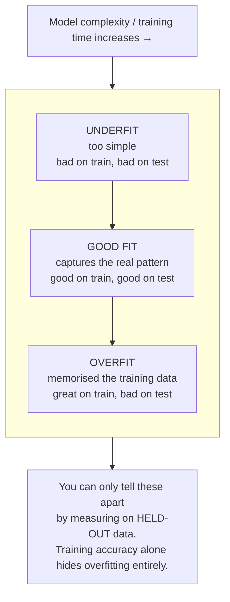
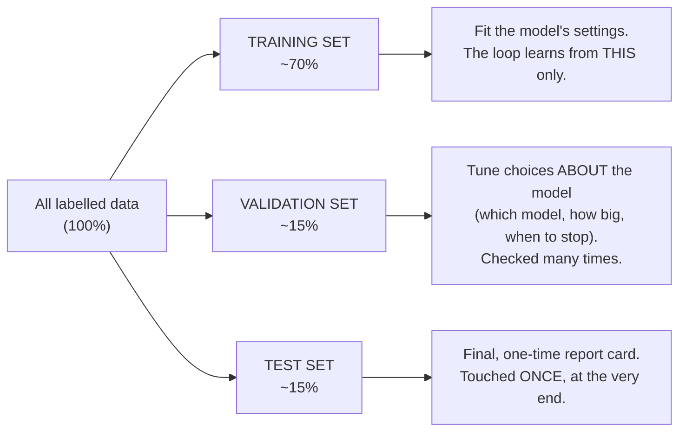

# Holding Data Back: Overfitting and the 70 / 15 / 15 Split

This is the most important file in the session. It answers a question that sounds pedantic but is the whole ballgame: **why would you deliberately throw away part of your data before trusting a model?** Get this wrong and every accuracy number you are ever shown is meaningless. Get it right and you have the single best defence against a model that looks brilliant in the demo and falls over in production — which is precisely this audience's professional concern.

## The trap: memorising the exam

Recall from file 01 that the training loop only ever optimises performance on the **training** examples. It has no incentive to generalise; it has every incentive to *memorise*. And memorising is easy — a model with enough settings can, in effect, build a lookup table of "this exact input had that exact label," scoring beautifully on the data it was trained on and learning nothing transferable.

The classic analogy is an exam:

> A student who **memorises last year's exam paper** can score 100% on that paper. It tells you nothing about whether they understand the subject. To find that out, you have to test them on questions they have **never seen** — this year's paper. Their score on *unseen* questions is the only score that predicts how they'll do in the real world.

A model is the student. The training data is last year's paper. **A model's accuracy on its own training data is not evidence it works** — it is the memorised-exam score. The only number that means anything is its accuracy on data it was **held out from during training**. This is why we split the data before we start.

This failure — great on training data, poor on unseen data — has a name you will hear constantly:

> **Overfitting:** when a model learns the training data *too* well, including its noise and accidents, and as a result performs worse on new data. The model has fit the specific examples instead of the underlying pattern.

The opposite, **underfitting**, is when the model is too simple to capture even the real pattern (bad on training *and* test data). The craft of modelling is threading between the two — and you cannot even *see* where you are without held-out data.



*Caption: as a model gets more complex or trains longer, training accuracy keeps climbing — but accuracy on unseen data rises, peaks, then falls as the model starts memorising. The gap between the two curves is the overfitting. If you only look at training accuracy, you never see the peak, and you ship the overfit model.*

## The fix: split the data three ways before you touch it

The discipline is simple and non-negotiable: **before training, partition your labelled data into three disjoint parts**, and never let the model learn from the parts you intend to judge it on. A standard split is **70 / 15 / 15**.



*Caption: the 70/15/15 split. Three sets, three jobs, strict separation. The percentages are a convention, not a law — with very large datasets the held-out fractions can be smaller; with tiny datasets you use cross-validation instead (below).*

| Set | Share | What it's for | How often the model "sees" it |
|---|---|---|---|
| **Training** | ~70% | Fit the model's **settings** (weights/biases, split thresholds) — this is where the file-01 loop runs. | Constantly, during training |
| **Validation** | ~15% | Tune the decisions *about* the model — which algorithm, how many layers, when to stop training, which threshold. Also called the "dev" set. | Repeatedly, but the model never *trains* on it |
| **Test** | ~15% | The **final, honest** estimate of real-world performance. The report card you quote to a stakeholder. | **Exactly once, at the end** |

### Why three, not two? The subtle role of validation

Splitting off a test set stops you from grading a model on its own homework. But there is a second, sneakier leak. You rarely train just one model — you try several (different algorithms, different sizes, different settings) and pick the best. If you pick the best *by looking at the test set*, you have quietly started fitting your **choices** to the test set. The test set stops being unseen; it has leaked into your decisions. After enough tweaking-to-the-test, your "final" test score is optimistic again — a slower version of the same memorisation trap.

The **validation set** absorbs that. You do all your comparing and tuning against validation, iterate as much as you like, and keep the test set sealed. When you are completely finished, you break the seal on the test set **once** and report that number. Because the model and your choices genuinely never touched it, that number is trustworthy.

The distinction maps cleanly onto a Session-2 term:

- **Training** learns the **parameters** (the settings *inside* the model).
- **Validation** guides the **hyperparameters** (the settings *about* the model — how many layers, how deep the tree, learning rate, when to stop).
- **Test** judges the finished result, uninvolved in either.

> **The golden rule, worth putting on a wall:** the test set is touched exactly once, at the very end. The moment a test result influences a modelling choice, that set is contaminated and you need a fresh one.

## The scikit-learn one-liner, and what it shows

Splitting is a single, standard function call. This is BSD-3-licensed (`scikit-learn`) and safe to reproduce.

```python
from sklearn.model_selection import train_test_split

# X = features (the input columns), y = labels (the answer column)
# First carve off the test set (15%), leaving 85% to split again.
X_temp, X_test, y_temp, y_test = train_test_split(
    X, y, test_size=0.15, random_state=42, stratify=y
)
# Then split the remaining 85% into train (~70% of total) and validation (~15%).
X_train, X_val, y_train, y_val = train_test_split(
    X_temp, y_temp, test_size=0.1765, random_state=42, stratify=y_temp
)
# 0.1765 of 85% ≈ 15% of the whole → final split ≈ 70 / 15 / 15.

print(len(X_train), len(X_val), len(X_test))
# e.g. 941 202 202   (for the 1,345-colour dataset)
```

Two details that are not decoration:

- **`random_state=42`** fixes the shuffling so the split is reproducible — the same rows land in the same sets every run. For configuration management, reproducibility of the split is part of reproducibility of the model. Change the seed, get a different split, get a different (slightly) accuracy number.
- **`stratify=y`** keeps the label proportions the same in every set. If 30% of your colours are "light," each set should be ~30% light. Without this, a random split can accidentally starve one set of a class and quietly wreck your numbers.

The pay-off is the honest comparison. A model that has overfit will show a **large gap** between training accuracy and test accuracy:

```python
# After fitting a model on the training set only:
print(model.score(X_train, y_train))   # e.g. 1.00  — perfect on data it memorised
print(model.score(X_test,  y_test))    # e.g. 0.82  — the number that actually matters
# The 1.00 vs 0.82 gap IS the overfitting, made visible. Report 0.82, never 1.00.
```

The full runnable version of this is in `exercises/lab.md`.

## When 70/15/15 isn't the right split

The percentages are a starting convention, not physics. Adjust with judgement:

- **Very large datasets** (millions of rows): 15% is more held-out data than you need for a stable estimate. People use 98/1/1 or similar — a smaller *fraction* is still a large *count*.
- **Small datasets** (a few hundred rows): a single 15% test set is too small to trust, and holding back 30% starves training. Use **k-fold cross-validation** instead: split the data into *k* parts (say 5), train on 4 and test on the 1 left out, rotate through all 5, and average. Every row gets to be test data exactly once, so you use all your data for evaluation without ever testing on data you trained on. scikit-learn's `cross_val_score` does this in one line.
- **Time-series data**: never split randomly — you must not train on the future and test on the past. Split by time (train on earlier, test on later), or the model "cheats" by seeing information it wouldn't have in production.

The principle underneath all three is constant: **the evaluation data must be data the model had no chance to learn from.** How you carve it out is a detail; that you carve it out is not optional.

## Key points

- The training loop rewards **memorising** the training data. A model's accuracy on its own training data is meaningless as evidence it works.
- **Overfitting** = great on training data, poor on unseen data. You can only detect it with **held-out** data — training accuracy hides it completely.
- Split data **70 / 15 / 15**: **train** fits the settings, **validation** tunes the choices, **test** is the one-time honest report card.
- Three sets, not two, because tuning to a test set leaks it into your choices; validation absorbs the tuning so the test set stays clean.
- **The test set is touched exactly once, at the very end.** Any test result that influences a choice contaminates it.
- The percentages flex (huge data → smaller held-out fraction; tiny data → cross-validation; time-series → split by time), but the rule "evaluate on data the model never learned from" never flexes.
