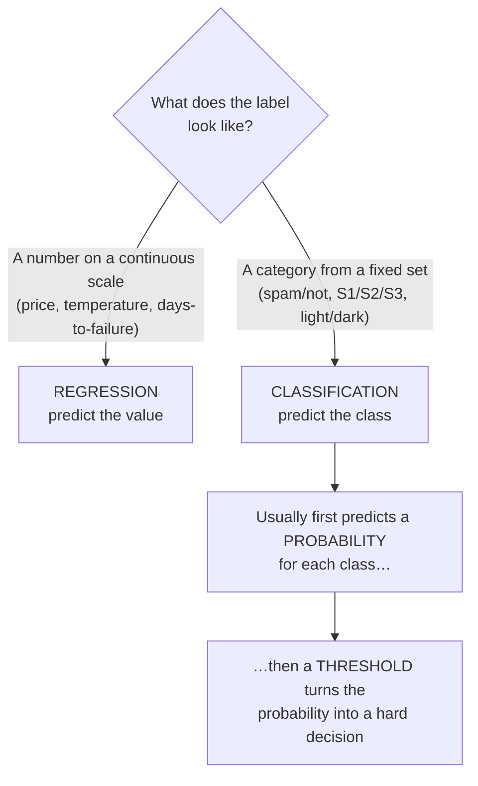
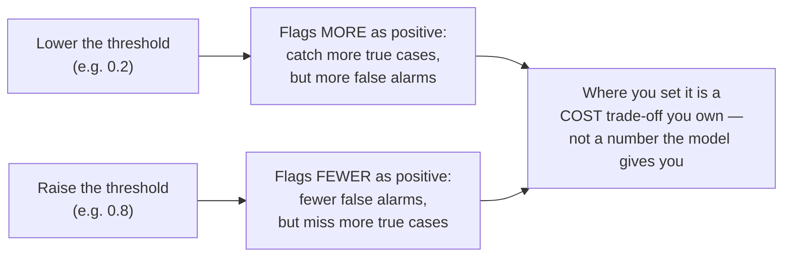

# Regression vs. Classification — and How a Probability Becomes a Decision

Supervised learning splits into two shapes depending on **what kind of answer you want out**. This file defines both, shows they are two sides of one coin, and then does the part everyone glosses over: the exact mechanism by which a model's fuzzy number — a probability like 0.73 — turns into a hard, actionable **yes/no decision**. That mechanism, the **threshold**, is where a business choice hides inside a technical output, and spotting it is one of the more valuable things this session gives a manager.

## The two shapes of supervised problem

| | **Regression** | **Classification** |
|---|---|---|
| **The label is…** | a continuous number | a category / class |
| **Question form** | "how much / how many?" | "which one / is it?" |
| **Output** | a value on a scale | a label (often via a probability) |
| **Examples** | tomorrow's temperature; inches of rainfall; a house price; time-to-failure of a component; expected incident volume next quarter | spam / not-spam; light / dark font; defect / no-defect; which of 10 digits; incident severity S1/S2/S3/S4 |
| **"Right" looks like** | close to the true number (small error) | the correct category chosen |
| **Typical error measure** | how far off, on average (e.g. mean squared error) | how often the label is correct (accuracy — but see Session 13 on why that lies) |

*Both are supervised (they need labelled examples). The only difference is whether the label you're predicting is a **number on a scale** or a **choice from a set**.*

A quick self-test, because the boundary trips people up: **"how many days until this disk fails?"** is regression (a number). **"Will this disk fail in the next 30 days?"** is classification (yes/no). Same underlying concern, two different problem shapes — and the second is often more useful precisely because it ends in a decision.

*Caption: pick the problem shape by looking at the label. Classification almost always runs through a probability before it commits to a class — and that intermediate step is where the interesting decisions live.*

## The bridge: a regression that outputs a probability *is* a classifier

Here is the elegant part, and the reason the two shapes aren't really separate. **A classifier is usually a regression underneath.** The model doesn't leap straight to "spam." It computes a **continuous probability** — a number between 0 and 1 — and *then* a decision rule converts that probability into a class.

The light/dark example makes it concrete. The network's final layer outputs a single number through a **sigmoid** function, which squeezes any input into the range 0 to 1. That number is read as **P(dark font)** — the model's estimated probability that this background needs a dark font:

- Input a very dark background → the model outputs something like **0.02** → "almost certainly light font."
- Input a very light background → **0.97** → "almost certainly dark font."
- Input an ambiguous mid-grey → **0.48** → "genuinely unsure."

So the model's raw output is a *regression* onto the 0–1 probability scale. It becomes a *classification* only when we impose a cut-off.

## How a probability becomes a decision: the threshold

To turn the probability into an action, you pick a **threshold** (also called a decision boundary or cut-off) and apply a dead-simple rule:

> If P(dark) **≥ threshold**, decide **dark**; otherwise decide **light**.

The default threshold is **0.5** — "whichever class is more likely." With a 0.5 threshold:

| Model output P(dark) | Decision at threshold 0.5 |
|---|---|
| 0.02 | light |
| 0.31 | light |
| 0.49 | light |
| 0.50 | dark |
| 0.73 | dark |
| 0.97 | dark |

*A single number and a single comparison. That is the entire mechanism by which "AI made a decision."*

### The threshold is a business choice, not a technical constant

This is the point to actually take away. **0.5 is a default, not a law.** You move the threshold to trade one kind of mistake against the other, and *which* mistake is worse is a business/risk question, not something the model can answer.

Consider a classifier that flags a configuration change as **risky (should be reviewed by a human)** vs. **safe (auto-approve)**. It outputs P(risky). Two kinds of error:

- **False negative:** a genuinely risky change gets auto-approved. A bad change ships. Potentially an incident.
- **False positive:** a genuinely safe change gets flagged for review. A human wastes ten minutes.

These are not equally bad. Shipping a bad change may cost far more than a wasted review. So you would **lower the threshold** — flag as risky at P ≥ 0.2, not 0.5 — deliberately accepting more false positives (more reviews) to catch more of the true risks (fewer bad changes slipping through). A medical-screening tool makes the same move for the same reason (missing a disease is worse than a false alarm). A spam filter moves it the *other* way (wrongly binning a real email is worse than letting one spam through, so it demands high confidence before junking).

*Caption: sliding the threshold trades false negatives against false positives. There is no "correct" threshold in the abstract — only the one that reflects which error your organisation can least afford. Session 8 (precision/recall, the confusion matrix) and Session 13 (base rates) give you the tools to choose it deliberately.*

So when a vendor or a team says "the model decides X," the sharp questions are: *"It outputs a probability first, right? What's the threshold? Who chose it, and did they weigh the cost of a false positive against a false negative?"* A surprising number of production systems ship the default 0.5 without anyone having thought about it.

## Correcting a source-deck error (so you don't inherit it)

The deep-learning source deck this session draws on contains a genuine, catchable mistake around exactly this mechanism, and a technical Qualcomm audience *will* notice it if we repeat it. On one slide the deck says the output is the "probability of predicting **dark** font, and if it's ≥ 0.5 it's dark"; a later slide says "if it is ≥ 0.5, the network is suggesting a **light** font." **Both cannot be true.** (See `../../AI_input.md` §6, error #1.)

The fix is to be explicit and consistent: **define what the probability is the probability *of*, once, and never flip it.** In this material we say: the output is **P(dark font)**; threshold 0.5; **≥ 0.5 → dark**, **< 0.5 → light**. The lesson generalises beyond this one deck: *always pin down which class the probability refers to.* A probability of 0.7 is useless until you know "0.7 of what?" — and mislabelling it is one of the most common quiet bugs in real classification systems.

## Key points

- **Regression** predicts a **number**; **classification** predicts a **category**. Look at the label to tell which you have.
- A classifier is usually a **regression underneath**: it outputs a **probability** (0–1), then a **threshold** converts that probability into a hard class.
- The default threshold is **0.5**, but it is a **business decision**, not a constant — you move it to trade **false positives against false negatives**, and which error is worse is a cost question only your organisation can answer.
- When told "the AI decided X," ask for the **probability and the threshold** behind it, and who chose the threshold.
- **Always pin down what the probability is the probability *of*** — the source deck's light/dark contradiction is exactly the bug that mislabelling causes.
