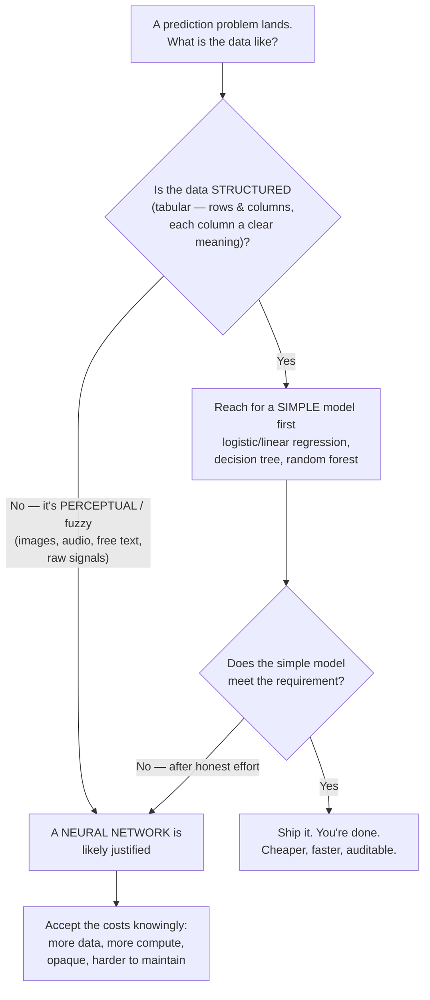
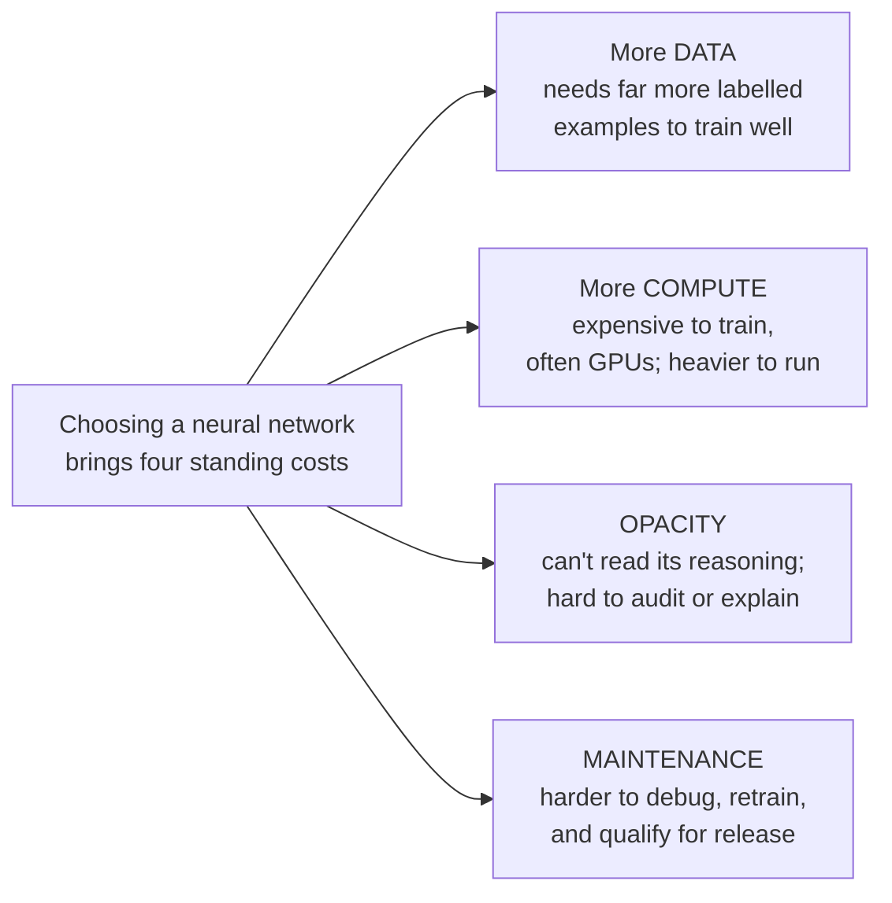

# Which Model for Which Problem — the Decision Heuristic

This is the file to remember. Everything before it was setup; this is the reusable tool. When a problem lands on your desk — or a team proposes a solution, or a vendor pitches one — you want a fast, defensible way to judge whether the *kind* of model being reached for is the right kind. The heuristic is simple, and its discipline note is the part that separates good engineering from cargo-cult AI.

## The heuristic in one picture

*Caption: the decision flowchart. Start simple, escalate only when forced. Structured data biases you toward simple models; perceptual data is where neural networks earn their cost.*

## The two axes: structured vs. perceptual

The single most useful cut is **what kind of data** the problem lives in.

| | **Structured / tabular** | **Perceptual / fuzzy** |
|---|---|---|
| **What it looks like** | Rows and columns; each column is a defined, meaningful quantity | Raw pixels, audio samples, free text, sensor streams — no pre-defined "columns" of meaning |
| **Examples** | Incident records, config parameters, build metrics, sales rows, sensor readings *already summarised into fields* | A photo ("is there a defect?"), a spoken command, a paragraph ("what's the sentiment?"), predicting the next few words being typed |
| **Where the meaning is** | Already extracted by humans into features (the columns) | Buried in raw signal; the model must discover the features itself |
| **Best-fit model family** | **Simple models** — logistic/linear regression, decision trees, random forests | **Neural networks / deep learning** |
| **Why** | The hard work (turning the world into meaningful numbers) is already done; a simple model can find the relationship | Nobody can hand-write features for "what makes this a cat"; the network *learns* the features from raw input |

The reason neural networks dominate perceptual problems is exactly that they **learn their own features**. You cannot write down the rule for "this arrangement of pixels is a stop sign" — but a deep network, given enough labelled images, builds up its own internal notion of edges, then shapes, then signs. For tabular data, that superpower is wasted: the features are *already* meaningful columns, and a simpler, cheaper, readable model usually does just as well or better.

## The discipline note: use the simplest model that works

The heuristic has a second half, and it is the part professionals actually live by:

> **Use the simplest model that meets the requirement. Reach for a neural network only when a simpler model has genuinely failed — because neural networks are expensive, data-hungry, and opaque.**

The source deck is blunt about this, and so are we. Its own author, teaching neural networks, pauses to say the toy problem "would probably be better solved with logistic regression," and quotes the carpenter's warning:

> *"When all you have is a hammer, everything starts to look like a nail."*

There is a strong pull — from hype, from CV-building, from the sense that the fancy method must be better — to reach for deep learning first. Resist it. The costs of a neural network are real and they land on *your* side of the house:

*Caption: the four recurring costs of choosing a neural network. On structured problems you often pay all four for accuracy a simple model would have given you for free.*

For a room of release, problem, and configuration managers, cost #3 — **opacity** — deserves special weight. A decision tree (Session 5) can be printed out and read: *"it flagged this change because the file count exceeded 40 and the component was in list X."* You can audit that, explain it to an auditor, and challenge it. A neural network's decision is a wash of hundreds of thousands of numbers with no readable story. When your discipline is accountability — when someone will ask *"why did the system do that?"* — a model you can read is often worth more than a slightly more accurate one you can't. Session 5 makes this concrete; keep it in mind here.

## Worked judgements

Applying the heuristic to problems this audience actually meets:

| Problem | Data shape | Heuristic verdict |
|---|---|---|
| Predict whether a config change is risky, from fields like files-changed, component, author-tenure, time-of-day | Structured (tabular fields) | **Simple model** (decision tree / random forest). Bonus: it's auditable — you can show *why* it flagged a change. |
| Predict next quarter's incident volume from historical monthly counts and release calendar | Structured (a table of numbers) | **Simple model** (regression). A neural network here is overkill and harder to trust. |
| Classify a screenshot attached to a bug report as "UI glitch" vs. "crash dialog" | Perceptual (raw image) | **Neural network** — no one can hand-write the pixel rules. This is what deep learning is *for*. |
| Route a free-text support ticket to the right team | Perceptual (natural language) | **Neural network / language model** — meaning is buried in raw text. (This is the LLM territory of Session 9.) |
| Flag anomalous login patterns from a table of counts, times, and locations | Structured | **Simple model first.** Only escalate if simple methods can't separate the anomalies. |

Notice the pattern: **most of the tabular problems that dominate release/problem/config work are simple-model problems.** The perceptual cases (images, raw language) are where you should expect — and budget for — a neural network. That expectation, set correctly, saves money and prevents a lot of over-engineered, unexplainable systems.

## How this sets up the rest of the block

The heuristic is a map of the sessions to come:

- **Session 4 — Unsupervised learning:** the "no labels at all" case (a different branch entirely — finding structure when you have features but *no* answers).
- **Session 5 — Decision trees & random forests:** the flagship **simple, structured, auditable** models — the left branch of the flowchart, and the answer to "I need to be able to explain it."
- **Session 6, 7, 8 — Deep learning:** the right branch — how neural networks work and how to build one — for when the problem is genuinely perceptual and a simple model won't do.
- **Session 9 — LLMs:** neural networks pointed at language, the ultimate perceptual/fuzzy domain.

You now have the frame to place each of them. When Session 6 shows you a neural network, the right first question isn't "how does it work" but "is this even the kind of problem that needs one" — and you'll already know how to answer.

## Key points

- **Structured / tabular data → start with a simple model** (regression, decision tree, random forest). **Perceptual / fuzzy data (images, audio, free text) → a neural network is likely justified.**
- Neural networks win on perceptual problems because they **learn their own features** from raw signal — a superpower that is wasted on tabular data whose features are already meaningful.
- **Use the simplest model that works.** Escalate to a neural network only when a simpler model has honestly failed.
- Neural networks carry four standing costs: **more data, more compute, opacity, harder maintenance.** For an accountability-driven audience, **opacity** is often the deciding one — an auditable model can beat a marginally more accurate black box.
- Most **release/problem/config** problems are **tabular → simple-model** problems. Reserve — and budget — neural networks for the genuinely perceptual cases.
