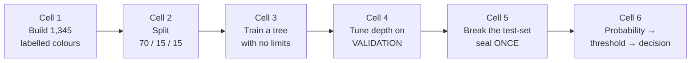

# Lab — Session 3

**This is a concept session — there is no full hands-on lab.** (The first full lab is Session 7.) What follows is a *light illustration*: about **10–15 minutes** of scikit-learn that makes the session's central claim visible on your own screen — a model that scores **100% on its training data and 85% on data it has never seen**. Seeing that gap once is worth more than reading about it three times.

Anyone can run it. You do not need to write Python to complete it; you need to read six short cells and think about two numbers.

---

## Setup (2 min)

**Colab (recommended).** Open <https://colab.research.google.com> → *New notebook*. `numpy` and `scikit-learn` are pre-installed; nothing to install, nothing to download. The dataset is generated in the notebook, so this runs offline-equivalent and identically for everyone.

**JupyterLite fallback** (if Colab is blocked): <https://jupyter.org/try-jupyter/lab/> → new Pyodide notebook, then run `%pip install scikit-learn` in the first cell. Everything below works unchanged.

**Local fallback:** `pip install numpy scikit-learn`, then run in any notebook or as a plain script.

> Licence note: all code here is standard `scikit-learn` (BSD-3-Clause) and `numpy` (BSD-3-Clause) usage — **SLIDE-SAFE**, safe to reproduce and to put on a slide with attribution (see `resources/sources.md` #1, #2).

What the six cells do:



*Caption: the lab walks the session's arc in code — data, split, overfit, tune, report, decide.*

---

## Cell 1 — Build the dataset (features and labels)

The session's running example: background colours, each labelled with whether it needs a **light** or a **dark** font. Three features (R, G, B), one label. We generate it rather than download it, so the lab is reproducible and dependency-free.

```python
import numpy as np
from sklearn.model_selection import train_test_split
from sklearn.tree import DecisionTreeClassifier

rng = np.random.default_rng(42)   # fixed seed -> everyone sees the same numbers
N = 1345

# Features: three columns R, G, B, each 0-255. One row = one background colour.
X = rng.integers(0, 256, size=(N, 3))

# Label: 1 = needs a DARK font (light background), 0 = needs a LIGHT font.
# Ground truth uses perceived luminance; then we flip 8% of the labels on purpose,
# to simulate the sloppy, inconsistent human labelling that every real dataset has.
luminance = (0.299 * X[:, 0] + 0.587 * X[:, 1] + 0.114 * X[:, 2]) / 255.0
y = (luminance > 0.5).astype(int)
noise = rng.random(N) < 0.08
y[noise] = 1 - y[noise]

print("rows, feature columns:", X.shape)
print("share of 'dark font' labels:", round(y.mean(), 3))
print("first 3 rows (R, G, B) -> label:", X[:3].tolist(), y[:3].tolist())
```

**Expected output:**

```
rows, feature columns: (1345, 3)
share of 'dark font' labels: 0.479
first 3 rows (R, G, B) -> label: [[22, 198, 167], [112, 110, 219], [22, 178, 51]] [1, 0, 0]
```

Two things to notice before moving on. The classes are close to balanced (47.9% dark), which is why plain accuracy is a fair measure *here* and often is not elsewhere (Session 13). And **8% of the labels are deliberately wrong** — that noise is not a flaw in the exercise, it is the whole point. Noise is what an over-eager model memorises.

## Cell 2 — Split the data 70 / 15 / 15

Exactly the two-step call from `content/03-train-val-test-split.md`.

```python
# Step A: carve off the test set (15%), leaving 85%.
X_temp, X_test, y_temp, y_test = train_test_split(
    X, y, test_size=0.15, random_state=42, stratify=y
)
# Step B: split the remaining 85% into train (~70% of total) and validation (~15%).
# 0.1765 of 85% is about 15% of the whole.
X_train, X_val, y_train, y_val = train_test_split(
    X_temp, y_temp, test_size=0.1765, random_state=42, stratify=y_temp
)

print("train / validation / test sizes:", len(X_train), len(X_val), len(X_test))
```

**Expected output:**

```
train / validation / test sizes: 941 202 202
```

`random_state=42` makes the split reproducible; `stratify` keeps the light/dark proportions equal across all three sets. Neither flag is decoration — drop `random_state` and your accuracy numbers move every run, which makes a model impossible to qualify.

## Cell 3 — Train a tree with no limits, and look at the gap

A decision tree with no depth limit will keep splitting until every training row is correctly classified. That is *exactly* the memorising-the-exam behaviour, so it is the cleanest way to see overfitting.

```python
deep_tree = DecisionTreeClassifier(random_state=42)   # no max_depth -> grows until pure
deep_tree.fit(X_train, y_train)                       # learns from the TRAINING set only

train_acc = deep_tree.score(X_train, y_train)
test_acc = deep_tree.score(X_test, y_test)

print("training accuracy:", round(train_acc, 3))
print("test accuracy    :", round(test_acc, 3))
print("gap (the overfitting):", round(train_acc - test_acc, 3))
print("tree depth:", deep_tree.get_depth(), "leaves:", deep_tree.get_n_leaves())
```

**Expected output:**

```
training accuracy: 1.0
test accuracy    : 0.847
gap (the overfitting): 0.153
tree depth: 15 leaves: 163
```

**Stop here and look at those numbers.** The model is *perfect* on the 941 rows it was fitted on — including the 8% whose labels are wrong, which it has faithfully memorised — and 15 points worse on the 202 rows it has never seen. 163 leaves for a problem whose real rule is a single luminance line: it has built a lookup table, not learned a pattern.

If you only ever saw `1.0`, you would report a flawless model. **That is the trap, in one cell.**

(We are peeking at the test set here for teaching purposes. In real work you would use validation for this comparison — see the next cell — and keep the test set sealed.)

## Cell 4 — Use the validation set to choose how deep the tree should be

Depth is a **hyperparameter** — a choice *about* the model. This is precisely the job the validation set exists for: compare as many candidates as you like, and never let the test set see any of it.

```python
print("depth | train | validation")
results = []
for depth in [1, 2, 3, 4, 5, 6, 8, 12, None]:
    model = DecisionTreeClassifier(max_depth=depth, random_state=42)
    model.fit(X_train, y_train)
    tr = model.score(X_train, y_train)
    va = model.score(X_val, y_val)          # judge on VALIDATION, not test
    results.append((depth, va))
    print(f"{str(depth):>5} | {tr:.3f} | {va:.3f}")

best_depth = max(results, key=lambda r: r[1])[0]
print("best depth by VALIDATION:", best_depth)
```

**Expected output:**

```
depth | train | validation
    1 | 0.802 | 0.743
    2 | 0.809 | 0.748
    3 | 0.864 | 0.797
    4 | 0.889 | 0.812
    5 | 0.905 | 0.812
    6 | 0.918 | 0.807
    8 | 0.946 | 0.807
   12 | 0.993 | 0.797
 None | 1.000 | 0.787
best depth by VALIDATION: 4
```

This table *is* the underfit / good-fit / overfit curve from `content/03`, printed as numbers:

| Depth | Train | Validation | Diagnosis |
|---|---|---|---|
| 1–2 | 0.80–0.81 | 0.74–0.75 | **Underfit** — too simple to capture even the real rule |
| 4–5 | 0.89–0.91 | **0.812** | **Good fit** — the peak on unseen data |
| 12 / None | 0.99–1.00 | 0.79 | **Overfit** — training accuracy still climbing, validation falling |

The training column rises monotonically all the way to 1.000. The validation column peaks and then declines. **Only the second column tells you anything**, and a team that reports only the first can show you a rising line forever while the model gets worse.

## Cell 5 — Break the test-set seal, once

Tuning is finished. Now, and only now, we take the single honest measurement.

```python
final_model = DecisionTreeClassifier(max_depth=best_depth, random_state=42)
final_model.fit(X_train, y_train)
print("FINAL test accuracy (the only number you quote):",
      round(final_model.score(X_test, y_test), 3))
```

**Expected output:**

```
FINAL test accuracy (the only number you quote): 0.876
```

**0.876** is the number that goes to a stakeholder. Not the 1.000 from cell 3, and not the 0.812 validation score, which was used to *make a choice* and is therefore mildly optimistic. Note the outcome: the depth-4 tree beat the unlimited tree on unseen data (0.876 vs 0.847) despite being far worse on training data. **The simpler model won.**

If you now go back and try more depths because 0.876 disappointed you, that test set is contaminated and no longer honest. That is the golden rule with teeth in it.

## Cell 6 — From probability to decision

The last link in the chain from `content/04`: the model does not output "dark", it outputs a **probability**, and a **threshold** turns it into a decision.

```python
probabilities = final_model.predict_proba(X_test[:6])[:, 1]   # column 1 = P(dark font)

print(" R    G    B   | P(dark) | decision @0.5 | true label")
for row, p, true in zip(X_test[:6], probabilities, y_test[:6]):
    decision = "dark" if p >= 0.5 else "light"
    print(f"{row[0]:>4} {row[1]:>4} {row[2]:>4} |   {p:.2f}  | {decision:^13} | "
          f"{'dark' if true == 1 else 'light'}")
```

**Expected output:**

```
 R    G    B   | P(dark) | decision @0.5 | true label
 245  236  127 |   0.93  |     dark      | dark
  14   95  244 |   0.06  |     light     | light
  22  198  167 |   0.82  |     dark      | dark
  24  188  191 |   0.48  |     light     | dark
 202  217  137 |   0.93  |     dark      | dark
 206   58  196 |   0.07  |     light     | light
```

Row 4 is the row to look at. The model said **0.48** — genuinely unsure — and the 0.5 threshold rounded that hesitation into a confident-looking wrong answer. The uncertainty was in the output all along; the threshold threw it away. This is why "the AI decided X" is always worth unpacking into *"it produced a probability, and someone chose a cut-off."*

---

## Now break it / now extend it (pick one or two, ~5 min each)

1. **Delete the seed.** Remove `random_state=42` from the two `train_test_split` calls and re-run cells 2–5 five times. How much does the final test accuracy move? That spread is the honest error bar on any single accuracy number you are ever quoted — and the reason a reproducible split matters for configuration management.
2. **Turn off the noise.** Set the flip rate to `0.0` in cell 1 and re-run. The gap in cell 3 shrinks dramatically. Conclusion: much of what an overfit model memorises is *label noise* — errors made by whoever labelled the data. Bad labels do not just lower the ceiling, they actively invite overfitting.
3. **Starve it.** Train on only the first 100 rows (`X_train[:100], y_train[:100]`). Watch the train/test gap widen. Less data, same model complexity, more memorising — this is why "we'll just use a bigger model" is usually the wrong answer to a small dataset.
4. **Move the threshold.** In cell 6, change `p >= 0.5` to `p >= 0.2`, then `p >= 0.8`, over the whole test set. Count how many "dark" calls you make each time and how many are wrong in each direction. You are now trading false positives against false negatives by hand — the exact business lever from `content/04`.
5. **Swap the model.** Replace `DecisionTreeClassifier` with `from sklearn.linear_model import LogisticRegression` (`LogisticRegression(max_iter=1000)`). On this problem — a straight luminance boundary — the simpler model does very well. That is the `content/05` heuristic paying off on your own screen.

## What to take away

- You have watched a model score **1.000** on data it memorised and **0.847** on data it had not seen. Every accuracy number you are shown from now on should trigger the question *"on which data?"*
- You have seen validation and test do **different jobs**: validation chose the depth, test reported the result, exactly once.
- You have seen a **simpler model beat a more complex one** on unseen data — the session's discipline note, demonstrated rather than asserted.
- You have seen a probability of **0.48** become a hard, wrong "light" because of a threshold nobody debated.

*Your numbers may differ in the last digit on other scikit-learn or numpy versions; the pattern — perfect train score, a large gap, a validation peak in the middle — will not.*
