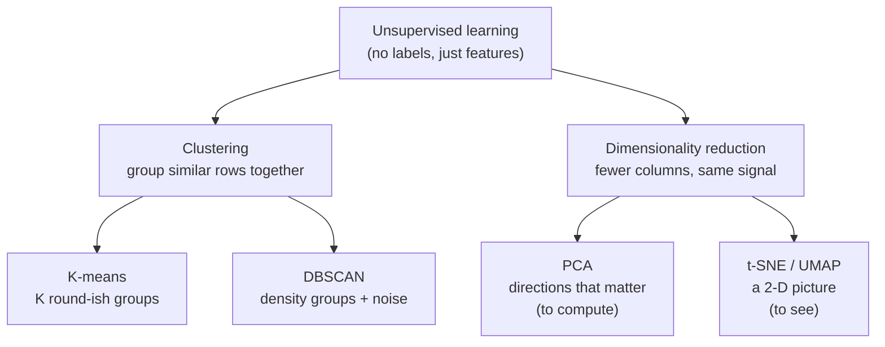

# Unsupervised Learning — Finding Structure With No Answers

This session is about what you can learn from data when **nobody has labelled it**. Session 3 gave you supervised learning: features *and* answers, model learns the mapping. Here there are no answers — just measurements — and the task is to let the data's own structure show through.

## The one-sentence version

> **Supervised learning learns a mapping you can already grade. Unsupervised learning finds structure you didn't know was there.**

There is no "right answer" column to check against, so there is no accuracy score in the usual sense. You are not predicting a known target; you are *organising*. That makes unsupervised learning powerful (you don't need the expensive labelled data) and slippery (you have to judge whether the structure it found is real and useful).

## Supervised vs. unsupervised, side by side

| | Supervised (Session 3) | Unsupervised (this session) |
|---|---|---|
| **Data has** | Features **+ labels** (the answers) | Features **only** |
| **Goal** | Predict the label for new data | Discover grouping or structure |
| **Typical question** | "Is this incident a P1 or P2?" | "How many *kinds* of incident do we even have?" |
| **How you grade it** | Accuracy, precision/recall vs. known truth | Internal scores (silhouette, SSE, explained variance) + human judgement |
| **Classic methods** | Regression, decision trees, neural nets | **K-means, DBSCAN, PCA, t-SNE/UMAP** |
| **Cost you avoid** | — | The cost and delay of labelling data |

The trade is exactly that last row: you skip the labelling bottleneck, but you take on the burden of *deciding whether the output means anything*. Keep that tension in mind — it is the honest core of the whole session.

## The two jobs

Everything in this session is one of two moves:

- **Clustering** works on the *rows*: which records belong together? (Which servers behave alike? Which incidents are really the same underlying problem?)
- **Dimensionality reduction** works on the *columns*: can I describe each record with 2–10 numbers instead of 200, without throwing away the signal? Useful for **visualising** (squash to 2-D and plot) and for **computing** (feed a smaller, denoised input into another model).

## The four named methods at a glance

| Method | Job | Core idea | You must choose | Finds odd shapes? | Handles noise? |
|---|---|---|---|---|---|
| **K-means** | Cluster | K centroids; assign each point to nearest; recentre; repeat | **K** (number of clusters) | No (assumes round blobs) | No (every point joins a cluster) |
| **DBSCAN** | Cluster | Dense regions are clusters; sparse points are noise | `eps`, `MinPts` | **Yes** | **Yes — labels it explicitly** |
| **PCA** | Reduce | New axes along directions of maximum variance | how many components to keep | — | — |
| **t-SNE / UMAP** | Reduce (to *see*) | Preserve local neighbourhoods in 2-D | perplexity / n_neighbors | — | — |

We spend this session in that order: the two clustering methods first (they are the ones you'll *use* for anomaly detection), then the two reducers, then the application that ties them together.

## Why this audience should care: anomaly detection

The reason unsupervised learning is more than an academic curiosity for release / problem / configuration work is this pattern:

> **Cluster what "normal" looks like. The thing that won't join a cluster is your anomaly.**

- **Configuration management:** cluster the fleet's configs. A host whose config sits far from every cluster is drifted or misconfigured — flag it before it causes an incident.
- **Problem management:** cluster historical incidents by their features (service, time-to-detect, error signature, blast radius). A new incident that lands in no known cluster is *novel* — it may need a different playbook.
- **Release management:** cluster build/telemetry fingerprints of healthy releases; a release whose fingerprint is an outlier is worth a second look before it ships.

You don't need labelled "bad" examples to do this — which is the whole point, because the genuinely dangerous incidents are the ones you've never seen and could never have labelled in advance. Session 4's `content/04-anomaly-detection.md` builds this out with runnable code.

## A discipline note, up front

Unsupervised learning will *always* return an answer. Ask K-means for 5 clusters and it gives you 5 clusters — even in pure noise. A t-SNE plot will *always* look like it has interesting structure. The skill this session is really teaching is **skepticism**: how to check whether the structure is real (silhouette, elbow, explained variance, and a human looking at examples) rather than an artefact of the parameters you happened to pick. We flag every place a method will happily mislead you.

## Where this sits in the series

- **Builds on:** Session 3 (supervised learning, feature scaling, the model idea).
- **Sets up:** Session 5 (decision trees & random forests — the *interpretable* supervised contrast); Session 13 (why a metric can lie — the same skepticism, applied to evaluation).
- **Companion read:** every claim traces to `resources/sources.md`; the slide-safe backbone is scikit-learn's own documentation (BSD-3).

Read the topic files in order: `01` K-means → `02` DBSCAN → `03` dimensionality reduction → `04` anomaly detection → `99` takeaways.
