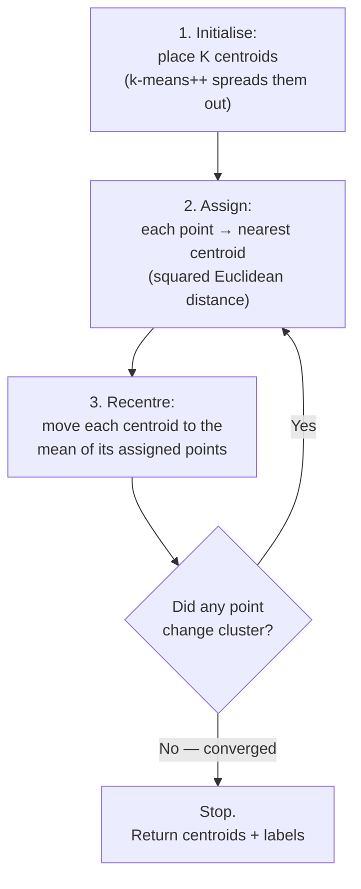
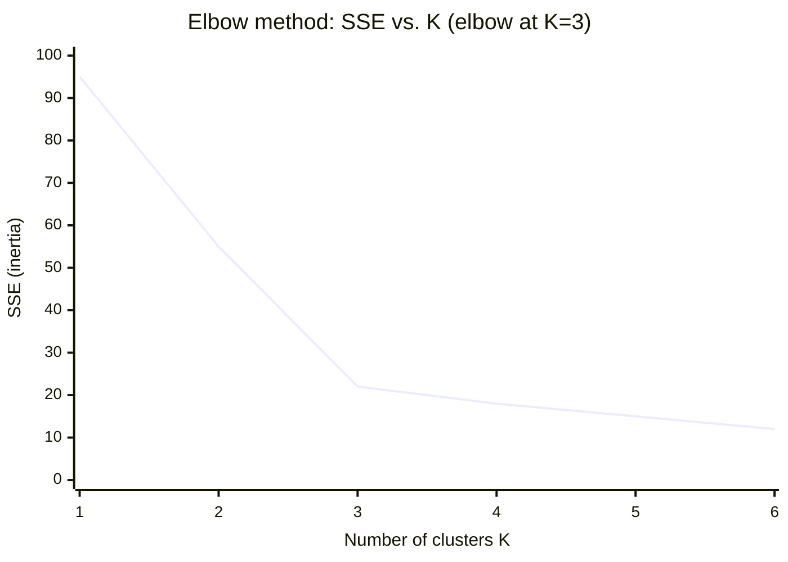

# K-means — The Centroids Loop

K-means is the "hello world" of clustering: fast, simple, and everywhere. You tell it **how many groups (K)** you want; it finds K representative points (**centroids**) and assigns every data point to its nearest one. This file walks the loop by hand, shows how to *choose* K (the elbow method and silhouette), and is honest about the three ways it bites you. Everything here is built from scikit-learn's User Guide (BSD-3; see `resources/sources.md` #1).

## The intuition

Imagine dropping K flags on a scatter plot. Each point pledges allegiance to its nearest flag. Then each flag walks to the centre of its own followers. Points re-pledge (some switch flags), flags re-centre, and you repeat until nobody switches. Where the flags come to rest are your clusters.

## The algorithm — four steps in a loop



That's the whole thing:

1. **Initialise** K centroids. Modern default is **k-means++**, which picks starting centroids that are spread apart, so the algorithm converges to a good answer more reliably than random placement.
2. **Assign** each point to the nearest centroid (by squared Euclidean distance — so *scaling your features matters*, see the pitfalls).
3. **Recentre** each centroid to the average position of the points assigned to it.
4. **Repeat** 2–3 until assignments stop changing (convergence), or a max-iteration cap is hit.

K-means is minimising one quantity: the total squared distance from each point to its centroid. That quantity has a name.

## SSE / inertia — the number K-means shrinks

The **within-cluster sum of squared errors (SSE)**, called **inertia** in scikit-learn, is:

> SSE = Σ (distance from each point to its own centroid)²

Every iteration of the loop can only keep SSE the same or lower — that's why it converges. Lower SSE = tighter clusters. But SSE has a catch that leads directly to the elbow method: **more clusters always means lower SSE.** With K = number-of-points, every point is its own centroid and SSE = 0. So you can't just "minimise SSE" to pick K; you'd pick a useless K. You need the elbow.

## A worked example by hand

Six 1-D points (kept 1-D so the arithmetic is visible): **`[1, 2, 3, 10, 11, 12]`**. Ask for **K = 2**.

**Initialise** centroids (say k-means++ lands on) c1 = 2, c2 = 11.

**Iteration 1 — assign** (nearest centroid):

| Point | dist to c1=2 | dist to c2=11 | → cluster |
|---|---|---|---|
| 1 | 1 | 10 | c1 |
| 2 | 0 | 9 | c1 |
| 3 | 1 | 8 | c1 |
| 10 | 8 | 1 | c2 |
| 11 | 9 | 0 | c2 |
| 12 | 10 | 1 | c2 |

**Recentre:** c1 = mean(1,2,3) = **2.0**; c2 = mean(10,11,12) = **11.0**.

**Iteration 2 — assign:** nothing changes (same table). **Converged** in one step. Final clusters: `{1,2,3}` and `{10,11,12}`. SSE = (1²+0²+1²) + (1²+0²+1²) = **4**.

Now try the same data with a *bad* start, c1 = 1, c2 = 2, to see initialisation matter: point 3 and everything ≥10 all go to c2 (nearest of the two low centroids), c2 recentres to mean(3,10,11,12)=9, c1 to mean(1,2)=1.5, and the next round pulls it back toward the natural split — but on messier data a bad start can leave you in a worse local optimum. **This is why k-means++ and `n_init` (multiple restarts, keep the best SSE) exist.**

## Choosing K — the elbow method

Run K-means for K = 1, 2, 3, … and plot SSE against K. SSE always falls, but it falls *fast* while you're still splitting genuinely separate groups, then *slowly* once you're just cutting real clusters into arbitrary pieces. The **elbow** — where the curve bends from steep to shallow — is a good K.



The big drops are 1→2 and 2→3; after 3 the curve flattens (18, 15, 12 — diminishing returns). Pick **K = 3**. The elbow is a judgement call, not a formula — sometimes it's ambiguous, which is why we cross-check with silhouette.

## Choosing K — the silhouette score

The **silhouette** scores how well each point fits its cluster, from **−1 to +1**:

- For a point, let **a** = its average distance to points *in its own cluster*, and **b** = its average distance to points in the *nearest other* cluster.
- silhouette = **(b − a) / max(a, b)**.
- **≈ +1:** deep inside its cluster, far from others (good). **≈ 0:** on a boundary. **< 0:** probably in the wrong cluster.

Average the silhouette over all points; the K with the highest average is a strong candidate. Silhouette and the elbow usually agree; when they don't, look at actual cluster members and decide. (scikit-learn's `silhouette_score` and its silhouette-analysis example, BSD-3, do this for you — `resources/sources.md` #1, #6.)

## Runnable demo — K-means + the elbow

```python
# K-means on a small 2-D dataset, with the elbow method.
# pip install scikit-learn matplotlib
import numpy as np
from sklearn.datasets import make_blobs
from sklearn.preprocessing import StandardScaler
from sklearn.cluster import KMeans
from sklearn.metrics import silhouette_score

# 1) Make 3 well-separated blobs (the "truth" we pretend not to know).
X, _ = make_blobs(n_samples=300, centers=3, cluster_std=0.70, random_state=42)

# 2) ALWAYS scale before a distance-based method (see pitfalls).
X = StandardScaler().fit_transform(X)

# 3) Elbow: SSE (inertia) for K = 1..8
sse = []
for k in range(1, 9):
    km = KMeans(n_clusters=k, init="k-means++", n_init=10, random_state=42)
    km.fit(X)
    sse.append(km.inertia_)
print("SSE by K:", [round(s) for s in sse])
# SSE by K: [600, 260, 47, 39, 33, 28, 24, 21]
#            ^K=1  ^K=2  ^K=3  <-- big drop stops after 3 => elbow at K=3

# 4) Silhouette cross-check for K = 2..6 (silhouette needs >=2 clusters)
for k in range(2, 7):
    km = KMeans(n_clusters=k, n_init=10, random_state=42).fit(X)
    print(f"K={k}  silhouette={silhouette_score(X, km.labels_):.3f}")
# K=2  silhouette=0.581
# K=3  silhouette=0.840   <-- highest => confirms K=3
# K=4  silhouette=0.663
# K=5  silhouette=0.552
# K=6  silhouette=0.470

# 5) Fit the chosen model and read the labels + centroids.
km = KMeans(n_clusters=3, n_init=10, random_state=42).fit(X)
print("cluster sizes:", np.bincount(km.labels_))   # cluster sizes: [100 100 100]
print("centroids:\n", km.cluster_centers_.round(2))
```

Both signals point to K = 3, which matches how the data was built — a satisfying case. Real data is rarely this clean; that's the point of *having two signals plus your own eyes*.

## The three ways K-means bites you

| Pitfall | What goes wrong | Fix / mitigation |
|---|---|---|
| **You must pick K** | The algorithm can't tell you how many groups exist; ask for 5 and you get 5, even in noise. | Elbow + silhouette; domain knowledge; or use DBSCAN (next file), which infers the count. |
| **Assumes round, similar-size blobs** | K-means draws straight-line boundaries and favours equal-radius spheres. It mangles crescents, rings, and elongated or very different-sized clusters. | Use DBSCAN for odd shapes; or transform features first. |
| **Scale- and outlier-sensitive** | A feature measured in bytes will dominate one measured in 0–1. One wild outlier drags a centroid. | **Scale every feature** (`StandardScaler`) before clustering; consider removing gross outliers; use `k-means++` and `n_init>1`. |

Add one more honest caveat: K-means gives you a **hard** assignment — every point belongs to exactly one cluster, with no notion of "this point is 60% cluster A, 40% cluster B." And there is *no* built-in "this point belongs to none of them" — which is exactly the gap DBSCAN fills, and why DBSCAN is the better fit for anomaly detection.

## When to reach for K-means

- You have a rough idea of how many groups you want, and the groups are roughly round and similar-sized.
- You need it **fast** and **scalable** (K-means handles millions of points; it's near-linear in the number of points).
- You want a **centroid** as a summary of each group (e.g. "the typical config of cluster 2").

If those don't hold — odd shapes, unknown K, or you want noise flagged rather than absorbed — read the next file.
