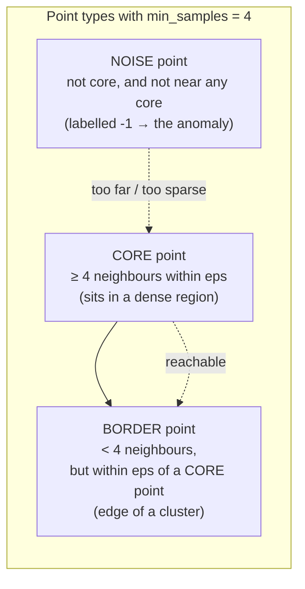
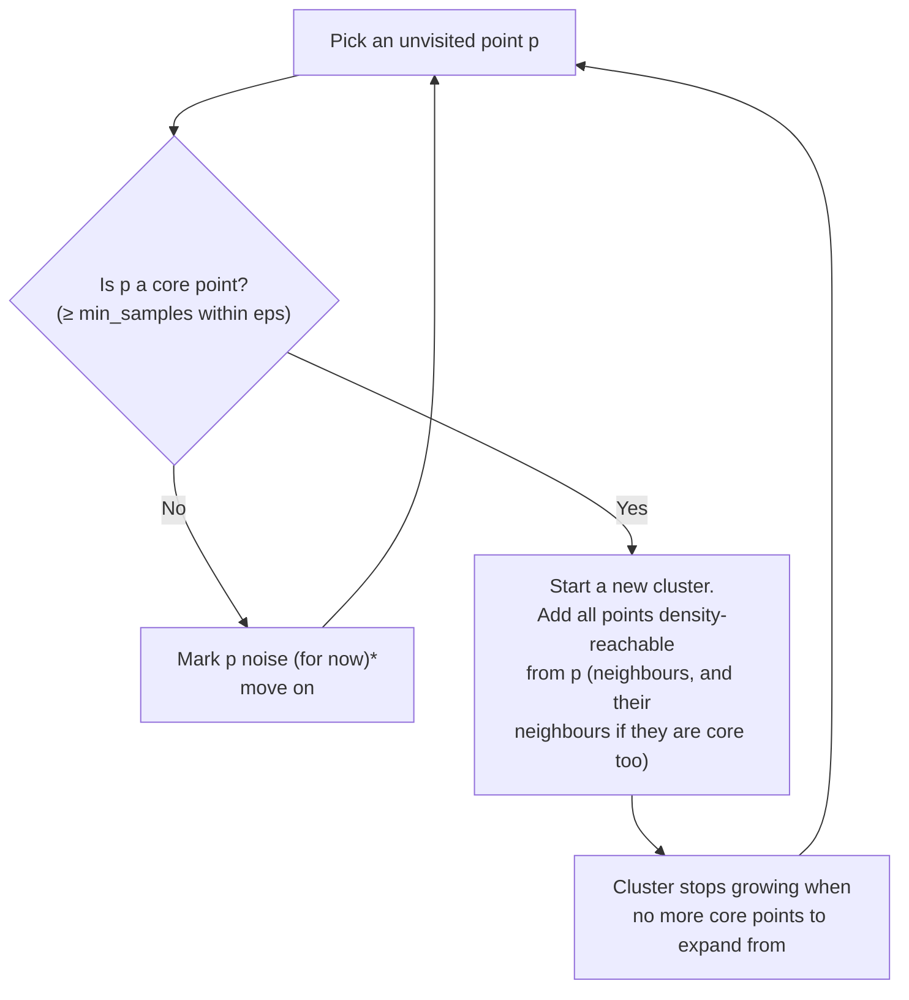

# DBSCAN — Clustering by Density, and Labelling the Noise

DBSCAN (Density-Based Spatial Clustering of Applications with Noise) takes a completely different stance from K-means. Instead of "here are K centres, everyone pick one," it asks: **where is the data dense?** Dense regions become clusters; the sparse stragglers in between are labelled **noise** — and *that noise label is the anomaly-detection hook this whole session is aiming at.* Built from scikit-learn's User Guide and DBSCAN example (BSD-3; `resources/sources.md` #1, #7).

## Why a second clustering method at all

K-means has two limits that matter constantly in real work: you must know K in advance, and it only finds round blobs. DBSCAN removes both:

| | K-means | DBSCAN |
|---|---|---|
| **Number of clusters** | You specify K | **Discovered** from the data |
| **Cluster shape** | Round-ish blobs only | **Arbitrary shapes** (crescents, rings, snakes) |
| **Outliers / noise** | Forced into a cluster | **Labelled as noise (−1)** |
| **You choose** | K | `eps` (neighbourhood radius), `min_samples` (MinPts) |
| **Sensitive to** | Scale, init | Scale, **`eps`** (the hard one to set) |

## The two knobs

DBSCAN has exactly two parameters:

- **`eps` (ε):** the radius of a point's neighbourhood — how close is "close."
- **`min_samples` (MinPts):** how many points must be within `eps` of a point (including itself) for the neighbourhood to count as **dense**.

From those two, every point falls into one of three types.

## Core, border, and noise points



- **Core point:** has at least `min_samples` points within radius `eps`. It's in the thick of a cluster.
- **Border point:** doesn't have enough neighbours to be core itself, but it's within `eps` of a core point — so it gets pulled into that cluster as its fringe.
- **Noise point:** neither core nor within reach of a core. DBSCAN gives it label **`-1`**. In K-means this point would have been forced into the nearest cluster and quietly corrupted it; DBSCAN says "this one doesn't belong to anything."

## How the algorithm grows clusters



\*A point first seen as noise can later be reclassified as a **border** point if a nearby core reaches it. Clusters spread outward from core points like ink through blotting paper, stopping where density drops below the `eps`/`min_samples` threshold. Because growth follows density rather than distance-to-a-centre, DBSCAN traces **arbitrary shapes** — the classic demo is two interleaving crescents that K-means slices in half but DBSCAN separates cleanly.

## Choosing the parameters

- **`min_samples` (MinPts):** rule of thumb, start at **≈ 2 × number of features** (so ~4 for 2-D data). Larger values demand denser regions and tag more points as noise; smaller values are more permissive.
- **`eps`:** the sensitive one. The standard trick is the **k-distance plot**: for each point compute the distance to its k-th nearest neighbour (k = `min_samples`), sort those distances ascending, and plot them. The curve stays low and flat for points inside clusters, then bends sharply upward for the sparse noise points. **Set `eps` at that "knee"** — same elbow logic as K-means, reused. (scikit-learn documents this; `NearestNeighbors` computes the distances.)

```python
# k-distance plot to choose eps (min_samples = 4 -> look at the 4th neighbour)
from sklearn.neighbors import NearestNeighbors
import numpy as np
nbrs = NearestNeighbors(n_neighbors=4).fit(X)          # X already scaled
dist, _ = nbrs.kneighbors(X)
kth = np.sort(dist[:, -1])                              # distance to 4th neighbour, sorted
# Plot kth vs. index; the "knee" (sharp upturn) is a good eps.
# For the two-moons demo below, the knee sits around eps ≈ 0.20–0.25.
```

**Scale first, always.** Like K-means, DBSCAN is distance-based, so an unscaled feature will dominate `eps`. Run `StandardScaler` before fitting.

DBSCAN's real weakness: a **single global `eps`** struggles when clusters have very different densities — one `eps` can't be right for a tight cluster and a loose one at the same time. (HDBSCAN, a variant, addresses this; it's a reasonable "further reading" pointer, available in `scikit-learn` as `HDBSCAN`.)

## Runnable demo — DBSCAN finds shapes and flags noise

```python
# DBSCAN on two interleaving crescents that K-means cannot separate.
# pip install scikit-learn
import numpy as np
from sklearn.datasets import make_moons
from sklearn.preprocessing import StandardScaler
from sklearn.cluster import DBSCAN, KMeans

# Two crescents + a little noise: the shape K-means gets wrong.
X, _ = make_moons(n_samples=300, noise=0.06, random_state=42)
X = StandardScaler().fit_transform(X)

# K-means with K=2 slices both crescents in half (wrong).
km = KMeans(n_clusters=2, n_init=10, random_state=42).fit(X)

# DBSCAN follows the density and traces each crescent.
db = DBSCAN(eps=0.20, min_samples=5).fit(X)
labels = db.labels_

n_clusters = len(set(labels)) - (1 if -1 in labels else 0)
n_noise = list(labels).count(-1)
print("DBSCAN clusters found:", n_clusters)   # DBSCAN clusters found: 2
print("noise points (label -1):", n_noise)    # noise points (label -1): 7
# -> DBSCAN discovered "2" on its own AND set aside 7 outliers as noise.
#    K-means would have forced those 7 into a crescent, corrupting it.
```

Two things just happened that K-means cannot do: DBSCAN **discovered the number of clusters** (we never told it there were 2), and it **isolated 7 noise points** instead of forcing them into a cluster. Hold onto that second one.

## The anomaly-detection hook

> **`label == -1` is your anomaly flag.**

Cluster the "normal" population (configs, incidents, telemetry fingerprints) with DBSCAN. The points that land in a real cluster are business-as-usual. The points DBSCAN refuses to cluster — the noise — are, by construction, the ones that don't resemble the crowd. You did not need a single labelled "bad" example to find them. `content/04-anomaly-detection.md` builds this into a config/incident detector.

## When to reach for DBSCAN

- You **don't know** how many clusters there are.
- Clusters may be **oddly shaped** or of **similar density**.
- You explicitly **want outliers/noise flagged**, not absorbed (anomaly detection).
- Your data isn't enormous (classic DBSCAN scales worse than K-means on very large, high-dimensional data).

**Avoid DBSCAN when** clusters have wildly different densities (one global `eps` fails — try HDBSCAN), or the data is very high-dimensional (distances blur — reduce dimensions first, which is exactly what the next file is about).
