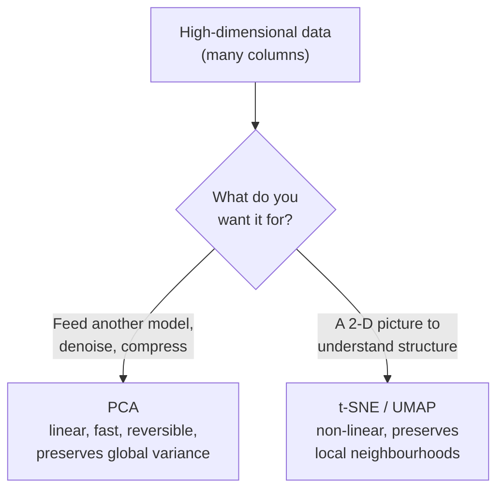
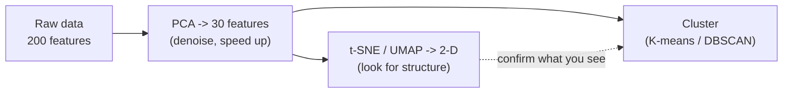

# Dimensionality Reduction — PCA, t-SNE, and UMAP

Clustering works on rows; dimensionality reduction works on **columns**. When each record has dozens or hundreds of features, you can neither plot it nor cluster it reliably. Dimensionality reduction compresses many columns into a few that still carry the signal — either to **compute** with (PCA) or to **see** (t-SNE / UMAP). Built from scikit-learn's User Guide (BSD-3), Distill's t-SNE article (CC-BY 2.0), and PAIR's UMAP article (Apache-2.0); see `resources/sources.md` #1, #3, #4.

## First: why high dimensions are a problem — the curse of dimensionality

As you add features (dimensions), the space balloons and your data gets **sparse**: every point becomes roughly equidistant from every other point, so "nearest neighbour" and "distance" — the machinery K-means and DBSCAN rely on — lose their meaning. A dataset that's dense and clusterable in 3-D can be hopeless in 300-D. Fewer, well-chosen dimensions make distance meaningful again, cut compute, reduce noise, and — squashed to 2-D — let you actually *look* at your data.

## Two very different goals



This split is the rule of thumb to memorise:

> **t-SNE (and UMAP) to *see*. PCA to *compute*.**

## PCA — Principal Component Analysis

**The idea:** find new axes — **principal components** — pointing along the directions where the data varies the most. The 1st component is the single direction of greatest spread; the 2nd is the direction of greatest *remaining* spread at right angles to the first; and so on. Keep the first few components and you keep most of the information in far fewer numbers.

**The "press the object" intuition:** picture a 3-D cloud of points shaped like a flattened, tilted pancake. PCA finds the pancake's two long axes (lots of spread) and its thin axis (almost no spread). Drop the thin axis — flatten the pancake onto its own plane — and you've gone 3-D → 2-D while losing almost nothing, because there was barely any information in the thickness. PCA does this in any number of dimensions. (setosa.io's PCA visual, MIT-licensed, is the slide-safe interactive for this; `resources/sources.md` #5.)

**How much did you keep? The explained variance ratio.** Each component reports what fraction of the total variance it captures. Add them up as you include more components and you get a curve that tells you where to stop.

```python
# PCA: reduce and read how much variance each component keeps.
# pip install scikit-learn
import numpy as np
from sklearn.datasets import load_digits
from sklearn.preprocessing import StandardScaler
from sklearn.decomposition import PCA

X = load_digits().data                 # 1797 samples, 64 features (8x8 pixel images)
X = StandardScaler().fit_transform(X)  # scale before PCA — it's variance-based

pca = PCA(n_components=10).fit(X)
evr = pca.explained_variance_ratio_
print("per-component variance:", evr.round(3))
# per-component variance: [0.12  0.096 0.084 0.065 0.049 0.042 0.039 0.034 0.03  0.029]
print("cumulative:", np.cumsum(evr).round(3))
# cumulative: [0.12 0.216 0.3 0.365 0.414 0.456 0.495 0.529 0.559 0.588]
# -> 10 of the original 64 features already carry ~59% of the variance.

# Common usage: keep enough components to reach a target, e.g. 95%.
pca95 = PCA(n_components=0.95).fit(X)   # "keep 95% of variance"
print("components needed for 95%:", pca95.n_components_)   # components needed for 95%: 40
```

**PCA's properties, honestly:**

- **Linear:** it can only rotate and project; it can't unroll a curved (non-linear) structure like a Swiss roll. For that you need the manifold methods below.
- **Fast, deterministic, reversible:** same answer every run; you can approximately reconstruct the original from the components (this is what powers **PCA reconstruction-error anomaly detection** in the next file).
- **Global:** it preserves large-scale variance, which makes it a great *pre-processing* step — reduce 300 columns to 30 with PCA, *then* run t-SNE or clustering on the result. This is standard practice.
- **Scale-sensitive:** always `StandardScaler` first, or your biggest-unit feature hijacks component 1.

## t-SNE and UMAP — reducers built to *see*

PCA keeps the big picture but can smear fine cluster structure. **t-SNE** (t-distributed Stochastic Neighbour Embedding) and **UMAP** (Uniform Manifold Approximation and Projection) are **non-linear** methods designed for one job: produce a 2-D (or 3-D) picture in which points that were **neighbours in high-dimensional space stay neighbours** on the page. They are superb for eyeballing whether your data has clusters at all.

```python
# t-SNE for visualisation: 64-D digits -> 2-D you can scatter-plot.
from sklearn.manifold import TSNE
X2 = TSNE(n_components=2, perplexity=30, init="pca", random_state=42).fit_transform(X)
print(X2.shape)   # (1797, 2)  -> now plottable; the 10 digit classes separate visibly.
# In practice: reduce 64 -> ~30 with PCA first, THEN t-SNE, for speed and stability.
```

### The traps — how t-SNE/UMAP pictures mislead (read this before you trust one)

Distill's "How to Use t-SNE Effectively" (CC-BY 2.0; `resources/sources.md` #3) exists precisely because these plots are so easy to over-read. The same cautions apply to UMAP:

| Trap | Reality |
|---|---|
| **Cluster *sizes* mean something** | No. t-SNE expands dense clusters and shrinks sparse ones; a blob's on-screen area tells you nothing about how many points or how spread out they were. |
| **Distances *between* clusters mean something** | Mostly no. Two clusters far apart on the plot are not necessarily more different than two that are close. t-SNE preserves *local* neighbourhoods, not *global* geometry. |
| **The shape is stable** | It isn't — change **perplexity** (t-SNE) or **n_neighbors** (UMAP) and the picture changes. Always look at several settings before concluding anything. |
| **Random-looking = no clusters** | Sometimes true, but a bad perplexity can also scramble real structure. Try a few values. |

The one-line discipline: **a t-SNE/UMAP plot is a hypothesis generator, not a measurement.** Use it to spot candidate clusters and outliers, then confirm with a method that has a defensible metric (clustering + silhouette, or PCA + explained variance).

## PCA vs. t-SNE vs. UMAP — the comparison table

| | **PCA** | **t-SNE** | **UMAP** |
|---|---|---|---|
| **Type** | Linear projection | Non-linear manifold | Non-linear manifold |
| **Primary use** | **Compute** / pre-process / compress | **See** (visualise) | **See** (visualise), sometimes pre-process |
| **Preserves** | Global variance | Local neighbourhoods | Local **and** some global structure |
| **Speed** | Fast | Slow (worst on big data) | **Faster than t-SNE**, scales better |
| **Deterministic?** | Yes | No (random init) | No (but more stable than t-SNE) |
| **Reversible (reconstruct input)?** | **Yes** (enables anomaly detection) | No | No |
| **Reduce to many dims (e.g. 50)?** | Yes | Really only 2–3 | 2–3 typical; can do more |
| **Key knob** | # components / % variance | perplexity | n_neighbors, min_dist |
| **Cluster sizes/distances trustworthy?** | Sizes-ish yes | **No** | **No** |
| **License of our source** | scikit-learn BSD-3 | Distill CC-BY 2.0 | PAIR Apache-2.0 |

**UMAP vs. t-SNE in one line** (per PAIR, `resources/sources.md` #4): UMAP usually runs faster, scales to more points, and tends to preserve a bit more of the *global* layout, while t-SNE remains the better-known default for pure local structure. Both are visualisation-first; neither gives you trustworthy distances.

## How they fit together in practice



A common, robust pipeline: **PCA to shrink and denoise → cluster on the PCA output → t-SNE/UMAP the same PCA output to eyeball whether the clusters make sense.** PCA to compute, t-SNE to see — used together.

## Takeaways for this file

- **Curse of dimensionality:** too many columns break distance; reduce before you cluster.
- **PCA** = linear, fast, reversible; keeps global variance; the workhorse for *computing* and for anomaly-detection reconstruction error. Choose components via the explained-variance curve.
- **t-SNE / UMAP** = non-linear; keep local neighbourhoods; the workhorses for *seeing*. **Never read cluster sizes or between-cluster distances off them**, and always try more than one setting.
- The rule that survives everything else: **t-SNE to see, PCA to compute.**
