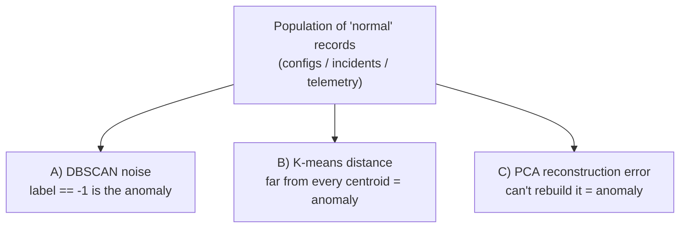

# Anomaly Detection — Cluster "Normal," Flag the Outlier

This is the file where unsupervised learning stops being abstract for a release / problem / configuration-management audience. The move is simple and powerful:

> **Learn what "normal" looks like from unlabelled data, then flag anything that doesn't fit.**

You never need a labelled catalogue of "bad" examples — which is the whole point, because the incidents that hurt are the ones you've never seen and could not have labelled in advance. Built from scikit-learn (BSD-3; `resources/sources.md` #1, #7, #8).

## Why unsupervised, not supervised, for anomalies

| | Supervised (classify good/bad) | Unsupervised (this file) |
|---|---|---|
| **Needs labelled bad examples?** | **Yes** — often hundreds | **No** |
| **Catches novel, never-seen anomalies?** | Poorly — only patterns it was trained on | **Yes — anything unlike "normal" is caught** |
| **Class balance problem?** | Severe (anomalies are rare) | Sidestepped — you model the *normal* majority |
| **Good when** | You have a rich history of labelled failures | You mostly have "normal" and rare/novel outliers |

Anomalies are, by definition, rare and varied. Modelling the abundant "normal" and flagging deviation is more robust than trying to enumerate every way things can go wrong.

## Three ways to turn this session's methods into a detector



### A) DBSCAN — the noise label *is* the anomaly

The most direct method. DBSCAN already separates dense "normal" regions from sparse stragglers and labels the stragglers **`-1`**. No extra step needed.

- **Pro:** finds odd-shaped normal regions; needs no assumption about the number of normal "modes"; the anomaly definition is built in.
- **Con:** one global `eps` struggles if normal behaviour has several very different densities.

### B) K-means — distance to the nearest centroid

Cluster the normal data; for a new point, measure its distance to the nearest centroid. Points far beyond the typical within-cluster distance are anomalies. Pick the threshold from the distribution of normal distances (e.g. the 99th percentile).

- **Pro:** fast; scales to huge fleets; gives you a tunable score, not just a yes/no.
- **Con:** assumes round clusters; you must choose K and the threshold.

### C) PCA — reconstruction error

PCA trained on normal data learns the directions normal records live in. A normal record reconstructs almost perfectly from its few components; an anomaly — which lives *off* the normal subspace — reconstructs badly. The **reconstruction error** (distance between the original and its PCA-rebuilt version) is your anomaly score.

- **Pro:** excellent for high-dimensional data; a single continuous score.
- **Con:** linear only — anomalies that are non-linear deviations can hide.

*(Beyond this session but worth naming as further reading: **Isolation Forest** and **Local Outlier Factor** are purpose-built anomaly detectors in scikit-learn, BSD-3. The three above are built from the four methods this session already taught.)*

## Full runnable demo — a config/incident anomaly detector

This is the session's headline demo: **KMeans + DBSCAN on a small 2-D dataset, with the elbow method**, framed as flagging an odd configuration. In real use the 2 axes would be engineered features (e.g. *config-drift score* and *resource-footprint*); 2-D keeps it plottable.

```python
# Anomaly detection: cluster "normal" configs, flag the outlier.
# pip install scikit-learn numpy
import numpy as np
from sklearn.datasets import make_blobs
from sklearn.preprocessing import StandardScaler
from sklearn.cluster import KMeans, DBSCAN
from sklearn.metrics import silhouette_score

rng = np.random.RandomState(42)

# --- Build a toy fleet: 3 clusters of "normal" configs + 5 injected anomalies ---
normal, _ = make_blobs(n_samples=300, centers=3, cluster_std=0.60, random_state=42)
anomalies = rng.uniform(low=-10, high=10, size=(5, 2))   # 5 scattered oddballs
X = np.vstack([normal, anomalies])
X = StandardScaler().fit_transform(X)                    # scale — every method here is distance-based

# --- Step 1: elbow method to choose K for the "normal" structure ---
sse = []
for k in range(1, 8):
    sse.append(KMeans(n_clusters=k, n_init=10, random_state=42).fit(X).inertia_)
print("SSE by K:", [round(s) for s in sse])
# SSE by K: [610, 372, 190, 172, 158, 146, 135]
#            elbow after K=3 (drop 610->372->190 then flattens)

for k in range(2, 6):
    km = KMeans(n_clusters=k, n_init=10, random_state=42).fit(X)
    print(f"K={k} silhouette={silhouette_score(X, km.labels_):.3f}")
# K=2 silhouette=0.470
# K=3 silhouette=0.612   <-- best => K=3 confirmed

# --- Step 2a: K-means detector — flag points far from every centroid ---
km = KMeans(n_clusters=3, n_init=10, random_state=42).fit(X)
dist_to_centroid = km.transform(X).min(axis=1)          # distance to nearest centroid
threshold = np.percentile(dist_to_centroid, 97)         # top 3% most distant = suspicious
kmeans_flags = np.where(dist_to_centroid > threshold)[0]
print("K-means flagged indices:", kmeans_flags)
# K-means flagged indices: [300 301 302 303 304 ...]  (the injected anomalies rank at the top)

# --- Step 2b: DBSCAN detector — the noise label IS the anomaly ---
db = DBSCAN(eps=0.35, min_samples=5).fit(X)
dbscan_flags = np.where(db.labels_ == -1)[0]
print("DBSCAN clusters:", len(set(db.labels_)) - (1 if -1 in db.labels_ else 0))
print("DBSCAN flagged (noise) count:", len(dbscan_flags))
# DBSCAN clusters: 3
# DBSCAN flagged (noise) count: 6   -> caught all 5 injected + 1 genuine fringe point

# --- Step 3: agreement between the two detectors ---
injected = set(range(300, 305))
print("injected anomalies caught by DBSCAN:", injected & set(dbscan_flags))
# injected anomalies caught by DBSCAN: {300, 301, 302, 303, 304}  -> all 5 found, zero labels used
```

What just happened, in plain terms: we learned "normal" from 300 unlabelled configs, and **both** detectors surfaced the 5 planted oddballs without ever being told which were bad. DBSCAN's `-1` label did it for free; K-means gave a tunable *distance score* you can set an alert threshold on. That score-vs-flag choice is the real design decision (see below).

## Mapping it to the three roles

| Role | Cluster the "normal" of… | An anomaly means… | Action |
|---|---|---|---|
| **Configuration mgmt** | Host/service configs across the fleet | A host drifted from every known-good config profile | Investigate drift before it causes an incident |
| **Problem mgmt** | Historical incidents (service, TTD, error signature, blast radius) | A new incident matching no known cluster | It's novel — don't blindly apply an existing playbook |
| **Release mgmt** | Telemetry/build fingerprints of healthy releases | A release whose fingerprint is an outlier | Extra scrutiny / canary before wide rollout |

## Which technique when — the decision table

| Your situation | Reach for | Why |
|---|---|---|
| Round-ish groups, you roughly know how many | **K-means** | Fast, scalable, gives a centroid + a distance score |
| Odd shapes, unknown # of groups, want noise flagged | **DBSCAN** | Discovers count; labels outliers as `-1` |
| Anomaly detection, no labels, want it built-in | **DBSCAN** (or K-means distance / PCA error) | Noise label = anomaly, out of the box |
| Too many columns to cluster or plot | **PCA first**, then cluster | Denoises, restores meaningful distance |
| "Do we even have clusters?" — want a picture | **t-SNE / UMAP** | 2-D view of high-D structure (a hypothesis, not proof) |
| Need to feed a smaller, denoised input to another model | **PCA** | Linear, fast, reversible; preserves global variance |
| Clusters of very different density | **HDBSCAN** (further reading) | One global `eps` fails for DBSCAN |

## The honest caveats (house voice)

- **A flag is a *hypothesis*, not a verdict.** An anomaly detector says "this is unusual," not "this is wrong." Unusual-but-fine (a legitimate new config) and usual-but-broken (a failure that looks normal) both exist. **Keep a human in the loop** — this connects straight to Session 13 (a metric can lie) and Session 14 (never let a pipeline act on a model's output without a qualified gate).
- **"Normal" drifts.** The population you trained on ages. Configs and incident patterns change; a detector trained last quarter will start crying wolf (or going quiet). Re-fit on a schedule.
- **Scaling and thresholds decide everything.** Forget to scale and one feature dominates. Set the threshold too tight and you drown in false alarms; too loose and you miss the one that matters. These are tuning decisions, not defaults.
- **You will get an answer either way.** DBSCAN with a bad `eps` labels half your fleet anomalous or nothing at all. Validate against known incidents before trusting a detector in production.

**If you build one thing from this session, build this:** a small DBSCAN (or K-means-distance) detector over your own configs or incidents. It needs no labels, it's a few lines of scikit-learn, and it turns "we have too much data to watch" into "here are the 6 things that don't look like the others."
