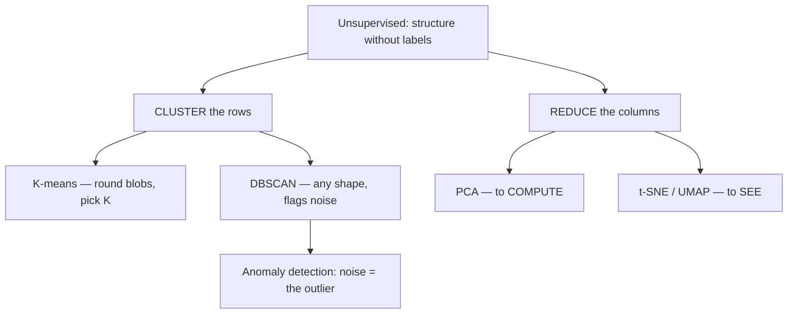

# Key Takeaways — Session 4

A tight recap of unsupervised learning: two jobs, four methods, one application.

## The shape of it

## The essentials

- **Unsupervised = no labels.** You organise data (cluster) or compress it (reduce); there's no accuracy against a known answer, so you judge quality with internal scores *and* your own eyes.
- **K-means:** initialise K centroids → assign to nearest → recentre → repeat. Minimises **SSE (inertia)**. You must pick **K** — use the **elbow** (SSE vs. K, find the bend) and the **silhouette** (−1 to +1, higher = better fit). Assumes round, similar-sized blobs; **scale features first**; use `k-means++` and `n_init>1`.
- **DBSCAN:** density-based. Two knobs — **`eps`** (radius) and **`min_samples`** (MinPts). Points are **core / border / noise**. It **discovers the number of clusters**, finds **odd shapes**, and **labels noise as `-1`** — no need to pick K.
- **PCA:** linear, fast, reversible; new axes along directions of maximum variance; pick components via the **explained-variance** curve (e.g. keep 95%). The workhorse for *computing* and pre-processing.
- **t-SNE / UMAP:** non-linear; preserve **local neighbourhoods** for a 2-D picture. **Never trust cluster sizes or between-cluster distances** off them; always try more than one perplexity / n_neighbors. A hypothesis generator, not a measurement.
- **The rule of thumb:** **t-SNE to see, PCA to compute.**
- **Anomaly detection** is the landing: cluster "normal," flag what won't fit. **DBSCAN's `-1`**, **K-means distance-to-centroid**, or **PCA reconstruction error** — all give you an outlier flag *without a single labelled bad example*. Directly a config / problem / release-management tool.

## The skeptic's footnotes (don't skip)

- Unsupervised methods **always return an answer** — even on noise. Validate structure (elbow, silhouette, explained variance, examples) before believing it.
- **A t-SNE plot always looks structured.** Over-reading one is the classic mistake.
- **An anomaly flag is a hypothesis, not a verdict** — keep a human in the loop. "Normal" drifts, so **re-fit** on a schedule.
- **Scale your features.** Every method here is distance-based; skipping scaling is the most common silent failure.

## If you remember one thing

> **Cluster what "normal" looks like, and the thing that won't join a cluster is the one worth your attention — and you found it without labelling a single example.**
