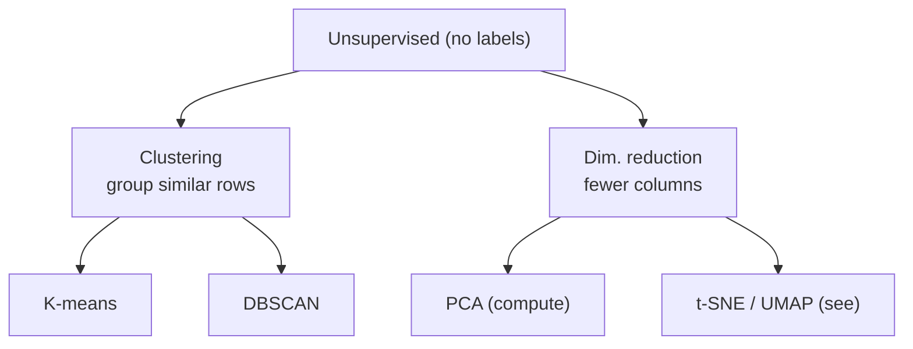

# Slides — Session 4: Methods II, Unsupervised Learning

Slide-by-slide spec for the deck-builder. Build per `../../powerpoint_instructions.md` (layout, palette, type, a11y, footer/source tags). **Target: 16 content slides** + title + agenda + Q&A + resources = 20 slides, ~45 min.

House rules recap: one idea per slide; headline is a *claim*; ≤6 bullets, ≤6 words each; a slide is a visual *or* a list, rarely both; every derived visual carries a source tag; speaker notes carry the narration. **Licence discipline: build only from scikit-learn (BSD-3), Distill (CC-BY), PAIR (Apache-2.0), setosa.io (MIT). StatQuest / r2d3 / Naftali Harris = live-demo/link only — do NOT embed.**

---

### Slide 1 — Title
- **On-slide:** "Methods II: Unsupervised Learning" · Session 4 · Block: Methods · AI Training Series.
- **Speaker notes:** Third of the four "methods" sessions. Last time, labelled data. Today, no labels — and the pay-off is a tool you can point at your own configs and incidents.
- **Visual:** Series title layout.
- **Source/licence:** —

### Slide 2 — Agenda
- **On-slide:** The map · K-means · DBSCAN · PCA & t-SNE/UMAP · Anomaly detection · Q&A. Minute budget mirrors README.
- **Speaker notes:** Four methods in 45 minutes — intuition plus one worked example each, not exhaustive. Depth is in the reading.
- **Visual:** Agenda table from README.
- **Source/licence:** —

### Slide 3 — Hook: 10,000 configs, no labels
- **On-slide (headline):** "Which config pages you at 3 a.m.? You have no labels."
- **Bullets:** 10,000 hosts · nobody labelled "bad" · the dangerous one is novel · labels can't exist yet.
- **Speaker notes:** Set the problem the audience actually has. The genuinely dangerous incident is the one you've never seen — so you can't have a labelled example of it. That's why we need learning that works *without* answers. Park the answer (anomaly detection) — we'll earn it in 40 minutes.
- **Visual:** A scatter of look-alike points with one lone outlier circled (generate in-palette).
- **Source/licence:** original.

### Slide 4 — Supervised vs. unsupervised
- **On-slide (headline):** "Unsupervised learning finds structure you didn't know was there."
- **Bullets:** Supervised: features + answers · Unsupervised: features only · No accuracy score · You skip labelling · You take on judgement.
- **Speaker notes:** Walk the contrast table. The trade is real: you avoid the labelling bottleneck but you inherit the burden of deciding whether the structure means anything. Keep that tension — it's the honest core of today.
- **Visual:** Two-column supervised/unsupervised comparison table (`content/00`).
- **Source/licence:** original framing.

### Slide 5 — The two jobs
- **On-slide (headline):** "Two moves: group the rows, or shrink the columns."
- **Bullets:** Clustering → rows · Dim. reduction → columns · K-means / DBSCAN · PCA / t-SNE / UMAP.
- **Speaker notes:** The whole session is one of two moves. Clustering: which records belong together. Dimensionality reduction: describe each record in fewer numbers. Everything named today hangs off this tree.
- **Visual (Mermaid):**

- **Source/licence:** original (concept map).

### Slide 6 — K-means: the loop
- **On-slide (headline):** "K-means: place centres, assign, recentre, repeat."
- **Bullets:** Pick K centroids · assign to nearest · move to the mean · repeat to convergence.
- **Speaker notes:** The flag analogy — drop K flags, each point pledges to its nearest, flags walk to the centre of their followers, repeat until nobody switches. Then run the Naftali Harris K-means visualiser live (link-only) so they *watch* it converge.
- **Visual (Mermaid):** the four-step loop flowchart from `content/01`.
- **Live demo (link-only — do NOT embed):** naftaliharris.com K-means visualiser.
- **Source/licence:** scikit-learn User Guide, BSD-3 (diagram redrawn in-palette).

### Slide 7 — K-means worked example
- **On-slide (headline):** "One pass splits [1,2,3,10,11,12] into two clean groups."
- **Bullets:** Start c1=2, c2=11 · assign by distance · recentre 2.0 / 11.0 · converged · SSE = 4.
- **Speaker notes:** Do the arithmetic live from the assignment table. Then flip to a bad start (c1=1,c2=2) to show initialisation can trap you in a worse answer — which is why k-means++ and n_init exist.
- **Visual:** the assignment table from `content/01`.
- **Source/licence:** scikit-learn, BSD-3.

### Slide 8 — Choosing K: the elbow
- **On-slide (headline):** "More clusters always lower SSE — so use the elbow, not the minimum."
- **Bullets:** SSE = Σ dist-to-centroid² · falls fast then flat · elbow = the bend · here K=3.
- **Speaker notes:** Key trap: minimising SSE picks a useless K (one point per cluster, SSE=0). Plot SSE vs. K and take the bend. It's a judgement call — that's why we cross-check with silhouette next.
- **Visual (Mermaid xychart):**
```mermaid
xychart-beta
    title "SSE vs. K — elbow at K=3"
    x-axis "K" [1, 2, 3, 4, 5, 6]
    y-axis "SSE" 0 --> 100
    line [95, 55, 22, 18, 15, 12]
```
- **Source/licence:** scikit-learn, BSD-3.

### Slide 9 — Choosing K: silhouette
- **On-slide (headline):** "Silhouette scores fit from −1 to +1 — pick the peak."
- **Bullets:** a = own-cluster dist · b = nearest-other dist · (b−a)/max(a,b) · +1 good, 0 edge, <0 wrong.
- **Speaker notes:** Second opinion on K. Show the demo output: silhouette peaks at K=3 (0.84), agreeing with the elbow. When elbow and silhouette disagree, look at actual cluster members and decide.
- **Visual:** silhouette-by-K table from the `content/01` demo output.
- **Source/licence:** scikit-learn silhouette example, BSD-3.

### Slide 10 — K-means: the three bites
- **On-slide (headline):** "K-means makes three assumptions that will bite you."
- **Bullets:** You must pick K · round equal blobs only · scale/outlier sensitive · hard assignment · no "belongs to none."
- **Speaker notes:** Honest limits. It can't tell you how many groups exist; it mangles crescents and rings; an unscaled feature hijacks it. And crucially there's no "none of the above" — every point joins a cluster. That last gap is exactly what DBSCAN fills.
- **Visual:** the three-pitfalls table from `content/01`.
- **Source/licence:** scikit-learn, BSD-3.

### Slide 11 — DBSCAN: density, not centres
- **On-slide (headline):** "DBSCAN finds clusters by density — and it labels the noise."
- **Bullets:** No K to pick · any shape · two knobs: eps, MinPts · outliers → label −1.
- **Speaker notes:** Different stance entirely: where is the data dense? Dense = cluster, sparse stragglers = noise. It discovers the number of clusters and, critically, sets aside outliers instead of absorbing them. Run the Naftali Harris DBSCAN visualiser live — drag eps and MinPts.
- **Visual:** K-means vs. DBSCAN comparison table from `content/02`.
- **Live demo (link-only — do NOT embed):** naftaliharris.com DBSCAN visualiser.
- **Source/licence:** scikit-learn User Guide, BSD-3.

### Slide 12 — DBSCAN: core, border, noise
- **On-slide (headline):** "Every point is core, border, or noise."
- **Bullets:** Core: ≥ MinPts within eps · Border: near a core · Noise: neither → −1.
- **Speaker notes:** Define the three types with MinPts=4. Core points are the thick of a cluster; borders are the fringe; noise is what belongs to nothing. Clusters grow outward from cores like ink through blotting paper, so DBSCAN traces arbitrary shapes.
- **Visual (Mermaid):** the core/border/noise point-type diagram from `content/02`.
- **Source/licence:** scikit-learn, BSD-3.

### Slide 13 — DBSCAN separates crescents K-means can't
- **On-slide (headline):** "Two crescents: K-means slices them; DBSCAN traces them."
- **Bullets:** make_moons demo · DBSCAN found 2 clusters unasked · isolated 7 noise points · K-means forced them in.
- **Speaker notes:** Show the demo output. Two wins K-means cannot get: DBSCAN discovered "2" on its own, and set aside outliers as noise rather than corrupting a cluster. Tuning eps: the k-distance "knee" plot — same elbow logic reused.
- **Visual:** two-moons scatter coloured by DBSCAN label (generate from `content/02` code, BSD-3).
- **Source/licence:** scikit-learn DBSCAN example, BSD-3.

### Slide 14 — Why reduce dimensions
- **On-slide (headline):** "In high dimensions, every point is equally far — distance breaks."
- **Bullets:** Curse of dimensionality · data goes sparse · distance loses meaning · reduce to restore it.
- **Speaker notes:** Clustering relies on distance, and distance dies in high dimensions — every pair becomes roughly equidistant. Fewer, well-chosen dimensions restore meaning, cut compute, denoise, and let you actually plot the data.
- **Visual:** simple concept graphic: dense 2-D cloud → sparse "cloud" in high-D (in-palette).
- **Source/licence:** original.

### Slide 15 — PCA: the directions that matter
- **On-slide (headline):** "PCA keeps the directions where the data actually varies."
- **Bullets:** New axes = max variance · drop the thin directions · explained-variance curve · keep e.g. 95%.
- **Speaker notes:** The pancake intuition: find the two long axes of a flattened tilted cloud, drop the thin one, lose almost nothing. Read how much you kept off the explained-variance ratio; keep enough components to hit your target. Linear, fast, reversible — which powers reconstruction-error anomaly detection later. Optionally show setosa.io PCA (MIT — embeddable) live.
- **Visual:** setosa.io PCA screenshot (MIT — SLIDE-SAFE) *or* a redrawn pancake-projection diagram.
- **Source/licence:** setosa.io `explained-visually`, MIT.

### Slide 16 — t-SNE / UMAP: to *see*
- **On-slide (headline):** "t-SNE and UMAP are for seeing, not measuring."
- **Bullets:** Non-linear · keep local neighbourhoods · 64-D digits → 2-D picture · UMAP faster than t-SNE.
- **Speaker notes:** These exist to make a 2-D picture where high-D neighbours stay neighbours. Great for "do we even have clusters?" Standard pipeline: PCA to ~30 dims first, then t-SNE. UMAP is faster, scales better, keeps a little more global structure (per PAIR).
- **Visual:** digits t-SNE 2-D scatter (generate from `content/03`, BSD-3) or Distill figure (CC-BY).
- **Source/licence:** scikit-learn manifold example, BSD-3 / Distill CC-BY 2.0.

### Slide 17 — The t-SNE trap
- **On-slide (headline):** "A t-SNE plot always looks structured — don't over-read it."
- **Bullets:** Cluster sizes ✗ meaningless · between-distances ✗ unreliable · shape changes with perplexity · try several.
- **Speaker notes:** This is the single most important caution in the reduction half. Blob area and gaps between blobs carry almost no information; change perplexity/n_neighbors and the picture changes. A t-SNE plot is a hypothesis generator, not a measurement — confirm with clustering + silhouette. Frame after Distill, "How to Use t-SNE Effectively."
- **Visual:** the four-traps table from `content/03`.
- **Source/licence:** Distill, CC-BY 2.0.

### Slide 18 — PCA vs t-SNE vs UMAP
- **On-slide (headline):** "t-SNE to see, PCA to compute."
- **Bullets:** PCA: linear, fast, reversible · t-SNE/UMAP: non-linear, local · sizes/distances untrustworthy · UMAP scales better.
- **Speaker notes:** Land the rule of thumb. Read the comparison table across the two axes that matter: what they preserve, and what they're for. PCA reduces to compute and pre-process; t-SNE/UMAP reduce to look.
- **Visual:** the PCA/t-SNE/UMAP comparison table from `content/03`.
- **Source/licence:** scikit-learn BSD-3 + Distill CC-BY + PAIR Apache-2.0 (composite — attribute all three).

### Slide 19 — The landing: anomaly detection
- **On-slide (headline):** "Cluster 'normal.' The point that won't fit is your anomaly."
- **Bullets:** No labelled 'bad' needed · DBSCAN −1 = anomaly · or K-means distance · or PCA reconstruction error · human verifies.
- **Speaker notes:** The pay-off promised in slide 3. Model the abundant normal, flag deviation — catches novel anomalies a supervised model never could, with zero labels. Show the config/incident detector demo output: both detectors surfaced the 5 planted oddballs. Map to the three roles (config drift / novel incident / risky release). Caveat hard: a flag is a hypothesis, not a verdict; "normal" drifts, so re-fit.
- **Visual (Mermaid):** the three-detectors flowchart from `content/04`.
- **Source/licence:** scikit-learn, BSD-3 + original role mapping.

### Slide 20 — Which technique when
- **On-slide (headline):** "Pick the method from the question, not the fashion."
- **Bullets:** Round + known count → K-means · odd/unknown/noise → DBSCAN · too many columns → PCA first · "see it?" → t-SNE/UMAP.
- **Speaker notes:** The decision table is the one artefact to screenshot and keep. Walk the top rows. Close on the honest four: always scale; methods always answer; validate before trusting; keep the human in the loop.
- **Visual:** the "which technique when" decision table from `content/04`.
- **Source/licence:** original (synthesised from scikit-learn guidance).

### Slide 21 — Q&A / discussion
- **On-slide:** 2–3 discussion prompts (from `exercises/discussion.md`).
- **Speaker notes:** Steer toward their own data: what would you cluster? where would a false anomaly alert hurt?
- **Visual:** discussion/poll layout.
- **Source/licence:** —

### Slide 22 — Resources & credits
- **On-slide:** scikit-learn (BSD-3) · Distill t-SNE (CC-BY 2.0) · PAIR UMAP (Apache-2.0) · setosa.io PCA (MIT). Live-demo links: Naftali Harris K-means/DBSCAN, StatQuest, r2d3 (link-only).
- **Speaker notes:** Everything on the slides came from the four SLIDE-SAFE sources. The visualisers and StatQuest are worth their time but were shown live / assigned, never copied — say so.
- **Visual:** resources/credits layout with licence tags.
- **Source/licence:** full attributions from `resources/sources.md`.

---

**Deck-builder checklist for this session:** figures for slides 13, 15, 16 can be generated straight from the scikit-learn code in `content/` (BSD-3 — attribute in the footer). Slides 6, 11 carry **live-demo cues only** — the Naftali Harris visualisers must not be screenshotted onto a slide (no open licence). Every Mermaid block above is ready to render in-palette with alt text.
