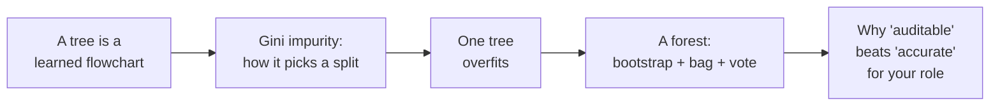

# Overview — The Model You Can Read

Every other method in this series ends in a number you have to trust. A neural network gives you a probability; an LLM gives you a sentence; neither can hand you an honest, complete account of *why*. This session covers the exception: **decision trees**, and the **random forests** built from them — the most **interpretable** mainstream family of machine-learning models.

That word, *interpretable*, is the whole reason this session sits where it does. The rest of the course spends a lot of energy on the fact that modern AI is a black box you have to verify from the outside. A decision tree is the opposite. It is a flowchart of yes/no questions that the machine *learns* from data, and you can walk any single prediction from the root to the answer and read the reason at every fork. For a room whose job is change review, root-cause analysis, and configuration audit, that property is not a nice-to-have. It is sometimes the whole point.

## The arc of this session

1. **A tree is a learned flowchart.** We build the classic *"will this customer buy a computer?"* example by hand and read a prediction off it. (`01`)
2. **Gini impurity is how the tree chooses each question.** We compute it by hand and see it is the *same* "cost / distance" idea from regression and classification, pointed at probabilities. (`02`)
3. **One tree overfits.** Left to grow, a tree memorises its training data — perfect on what it has seen, brittle on what it hasn't. (`03`)
4. **A random forest fixes it.** Many deliberately-different trees, each trained on resampled data, voting together — with a free error estimate (out-of-bag) as a bonus. (`03`)
5. **Why it matters to you.** An auditable model you can read is often worth more than a more accurate one you can't. We make "explainability" concrete in release/problem/config terms. (`04`)
6. **The runnable demo** ties it together in scikit-learn. (`05`)

## Where this fits in the four methods

| Session | Method | Learns from | Signature strength | Signature weakness |
|---|---|---|---|---|
| 4 | Unsupervised (K-means, PCA…) | unlabelled data | finds structure you didn't specify | no ground truth to check against |
| **5 (this one)** | **Trees & forests** | **labelled tabular data** | **you can read the reasoning** | **a single tree overfits; a forest trades away readability** |
| 6 | Deep learning | labelled data, often perceptual | learns features itself | opaque; data- and compute-hungry |
| 9 | LLMs | huge text corpora | fluent language over anything | black box; no built-in ground truth |

## The one recurring idea to watch for

This course has a spine: **cost / distance**. Regression measures how wrong a line is with squared error (MSE). Classification measures how wrong a probability is with log-loss. Reinforcement learning measures value with Bellman equations. Neural networks measure error and push it backwards. In this session the same idea appears as **Gini impurity** — a measure of how "mixed", and therefore how costly, a group of examples is. A tree simply asks, at every step: *which question makes my groups least mixed?* Same concept, new costume. You have seen this before, and you will see it again.

## What to hold onto

If you remember one sentence from this session, make it this: **a decision tree shows its work, and that is a feature, not a limitation.** Everything else — Gini, bootstrap, bagging, OOB, voting — is machinery in service of getting that readable reasoning to also be *reliable*.
