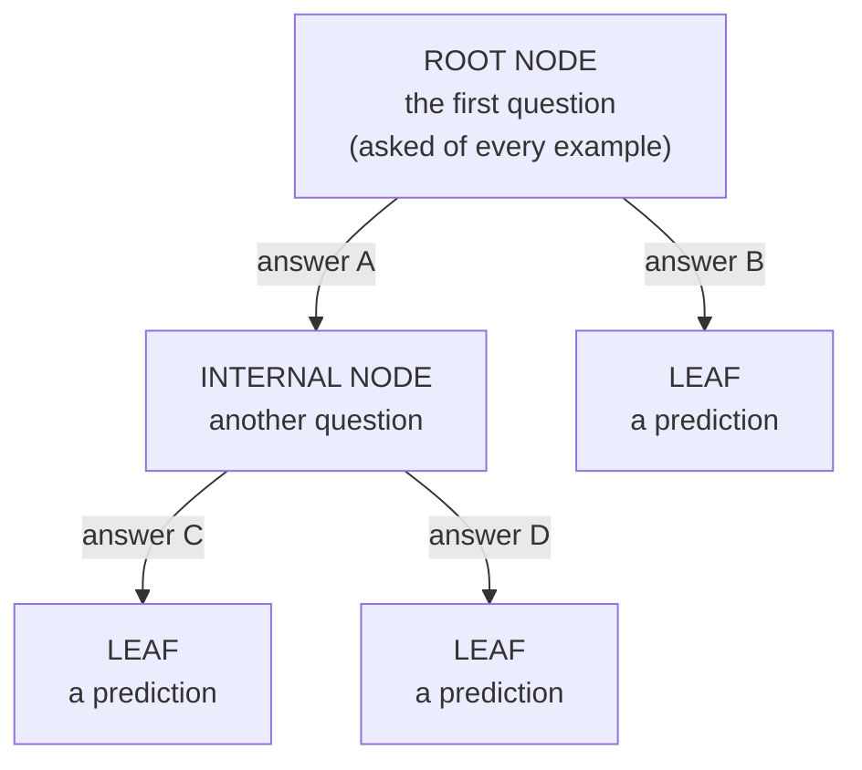
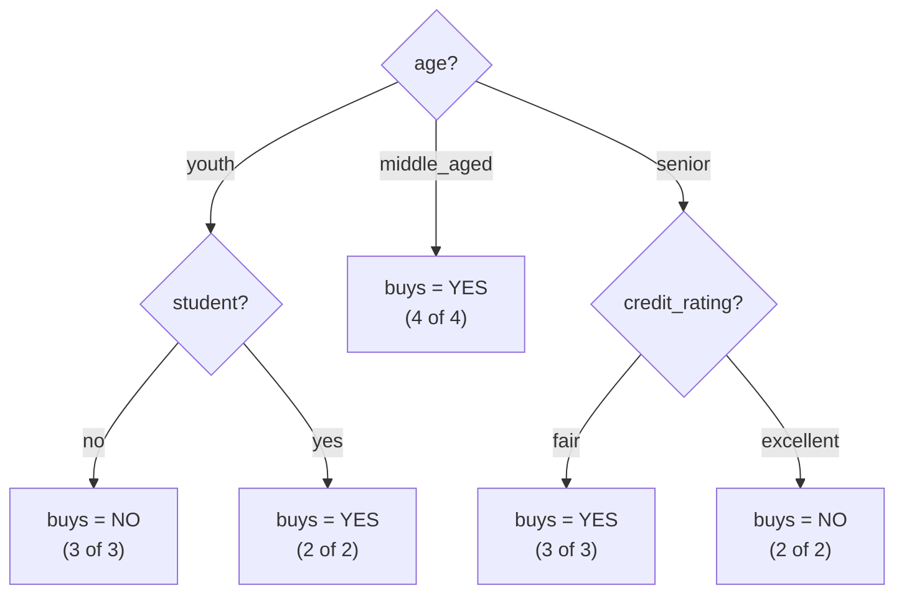
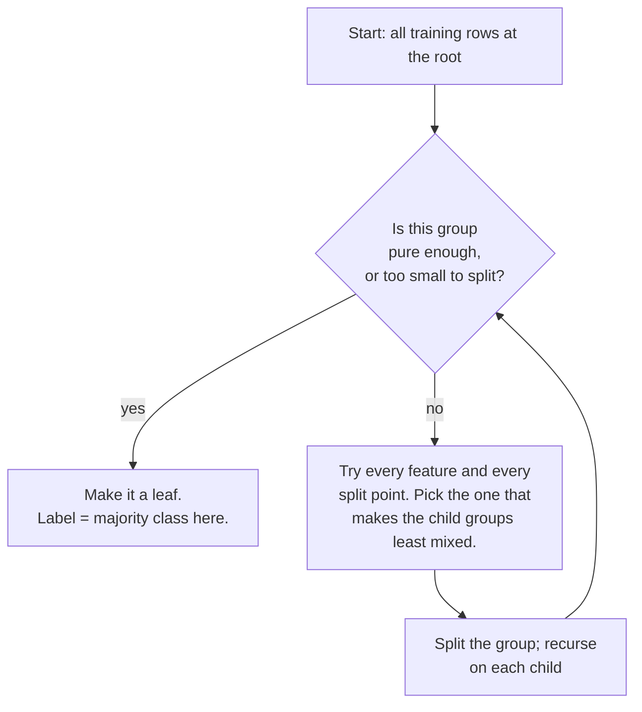

# A Decision Tree Is a Flowchart the Machine Learns

A decision tree is the most familiar structure in all of machine learning, because you already use one every time you follow a troubleshooting runbook. It is a chain of questions, each answer narrowing things down, ending in a decision. The only new idea here is that **the machine writes the flowchart itself, from data** — you do not hand it the questions or their order; it discovers them.

## Anatomy

| Term | What it is | In plain terms |
|---|---|---|
| **Root node** | the first split, applied to all data | the question you always ask first |
| **Internal (decision) node** | a further split on a subset | a follow-up question |
| **Branch / edge** | an answer to a node's question | "yes" / "no" / a value range |
| **Leaf (terminal node)** | a node that makes a prediction | the runbook's final instruction |
| **Depth** | longest root-to-leaf path | how many questions in the worst case |

A prediction is just a walk: start at the root, answer each question using the example's feature values, follow the matching branch, and when you reach a leaf, that leaf's label is your answer. No arithmetic at prediction time — just following signs.

## The worked example: "will this customer buy a computer?"

This is the canonical teaching dataset for decision trees (from Han, Kamber & Pei's *Data Mining* textbook — reproduced here as a small table so we can compute on it in the next file). Fourteen past customers, four features each, and whether they bought.

| # | age | income | student | credit_rating | **buys_computer** |
|---|---|---|---|---|---|
| 1 | youth | high | no | fair | **no** |
| 2 | youth | high | no | excellent | **no** |
| 3 | middle_aged | high | no | fair | **yes** |
| 4 | senior | medium | no | fair | **yes** |
| 5 | senior | low | yes | fair | **yes** |
| 6 | senior | low | yes | excellent | **no** |
| 7 | middle_aged | low | yes | excellent | **yes** |
| 8 | youth | medium | no | fair | **no** |
| 9 | youth | low | yes | fair | **yes** |
| 10 | senior | medium | yes | fair | **yes** |
| 11 | youth | medium | yes | excellent | **yes** |
| 12 | middle_aged | medium | no | excellent | **yes** |
| 13 | middle_aged | high | yes | fair | **yes** |
| 14 | senior | medium | no | excellent | **no** |

Nine bought, five did not. The learning task: turn these fourteen rows into a flowchart that predicts *buys_computer* for a customer we have never seen.

## The tree the machine learns

If we let the algorithm choose splits to make each group as "unmixed" as possible (the *how* is the whole of file `02`), it produces this tree. Every fork below is a question the machine chose; nobody told it to start with age.

Read it as English:

- **Middle-aged customers always bought** (4 out of 4). The tree learned this and stops asking — no follow-up question needed.
- **For youth, it comes down to whether they are a student.** Student youths bought; non-student youths did not.
- **For seniors, it comes down to credit rating.** Fair-credit seniors bought; excellent-credit seniors did not (a genuinely counter-intuitive pattern the tree found in the data — worth a skeptical eyebrow, and exactly the kind of thing you can *see* only because the model is readable).

### Reading a single prediction

A new customer walks in: **senior, medium income, not a student, fair credit rating.** Walk the tree:

1. Root: *age?* → **senior** → go right.
2. *credit_rating?* → **fair** → leaf.
3. Prediction: **buys = yes.**

Notice what we can hand to an auditor: *"Predicted yes because the customer is a senior with fair credit, and every senior with fair credit in our data bought."* That is a complete, checkable justification. Hold that thought — it is the entire argument of file `04`.

Notice also what the tree *ignored* for this customer: income and student status never came up on this path. A tree only asks the questions it needs for the branch you are on. Different customers get different questions — that is what makes it a flowchart and not a fixed checklist.

## How the machine grows the tree (the recipe, before the mechanism)

The algorithm is greedy and recursive — the same shape as a divide-and-conquer function:

In words:

1. **Start** with all the training rows in one group at the root.
2. **Consider every possible question** — every feature, and for numeric features every threshold — and score how "unmixed" the resulting child groups would be.
3. **Take the best question**, split the group by it, and **repeat** on each child group.
4. **Stop** a branch when the group is pure (all one class), too small to be worth splitting, or a depth limit is hit. That node becomes a leaf and predicts the majority class of whatever rows landed in it.

Step 2 hides the one real idea in this whole topic: *how do you score how "unmixed" a group is?* That score is **Gini impurity**, and it is next.

## Two honest notes before we go on

- **Textbook trees split many ways; scikit-learn splits in two.** The tree above splits *age* three ways at once (youth / middle_aged / senior) because that reads cleanly. Real scikit-learn trees (the CART algorithm) always split **binary** — one yes/no question per node — and need categorical features encoded as numbers first. The *logic* is identical; the drawn shape differs. The lab (`exercises/lab.md`) shows the real binary tree so you can compare.
- **Trees are greedy, not optimal.** "Pick the best split right now, then recurse" does not guarantee the best possible *whole* tree — only a good one, fast. Finding the provably-smallest tree is computationally hard, so every practical tree learner is greedy. This is worth knowing when someone claims a tree is "the" explanation: it is *an* explanation the greedy search happened to find.
