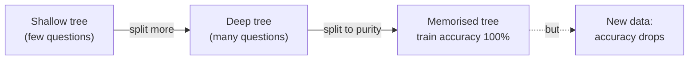
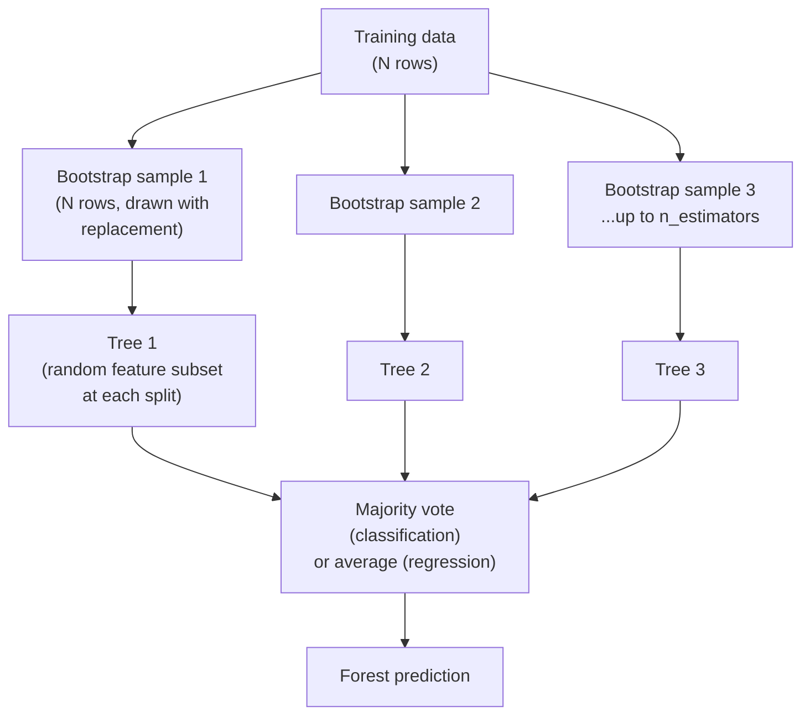
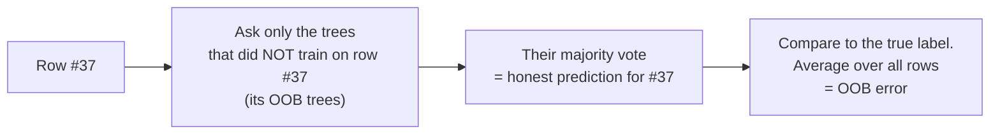

# One Tree Overfits — A Random Forest Fixes It

The tree we built reads beautifully. It also has a dangerous habit: left to grow, it will keep splitting until every leaf is pure — until it has, in effect, **memorised** the training data. This file is about that failure and the standard fix, the **random forest**.

## Why one tree overfits

Nothing in the growing recipe (`01`) stops a tree early. It splits, and splits, and splits, carving the data into ever-smaller groups until each leaf holds a handful of examples — or one — all of the same class. At that point the tree is *perfect on the training set* and has learned not just the real pattern but every accident and typo in the data.



This is the **bias–variance** trade-off, in concrete terms:

| Tree | Bias (systematic error) | Variance (sensitivity to the exact data) | Symptom |
|---|---|---|---|
| Very shallow (1–2 questions) | **High** — too simple to capture the pattern | Low | underfits: mediocre on train *and* test |
| Very deep (grown to purity) | Low — fits every wrinkle | **High** — redraw the data slightly and the tree changes wildly | **overfits: perfect on train, poor on test** |

The tell-tale sign a problem/release audience will recognise: **a model that scores 100% in the lab and falls over in production.** A fully-grown single tree is the archetype. Two customers swapped in the training set can flip a whole branch — it is a low-bias, *high-variance* model, and high variance is what overfitting looks like from the outside.

You can rein a single tree in with `max_depth`, `min_samples_leaf`, and pruning — and you should — but there is a more powerful idea: instead of fighting one tree's variance, **average many trees' variance away.**

## The insight: average many noisy models

If you have many models that are each roughly right but noisy in *different* ways, averaging their predictions cancels the noise while keeping the signal. This only works if the models make **different mistakes** — if they all err identically, averaging does nothing. So the whole trick of a random forest is to grow many trees that are individually good but **deliberately different from each other**, then let them vote.

Two independent tricks create that diversity: **bootstrap sampling** (different data per tree) and **feature randomness** (different questions available per tree).



## Trick 1 — Bootstrap: give each tree its own data

A **bootstrap sample** is a new dataset of the same size N, drawn from the original **with replacement**. Some rows get picked several times; some not at all. Each tree trains on its own bootstrap sample, so no two trees see quite the same data.

Here is the fact that makes the next section free money. When you draw N rows with replacement from N rows, the probability any particular row is *never* picked is:

```
(1 − 1/N)^N  →  1/e  ≈  0.368   as N grows
```

So on average each tree trains on about **63%** of the distinct rows, and roughly **37% are left out** of that tree entirely. Those left-out rows have a name: **out-of-bag (OOB)**.

## Trick 2 — Feature randomness: give each tree a different vocabulary

Bootstrap alone still tends to produce similar trees, because one or two strong features get chosen as the root almost every time. So a random forest adds a second dose of randomness: **at each split, the tree may only consider a random subset of the features** (a common default is √(number of features) for classification). This forces different trees to build around different features and *decorrelates* them — the single most important reason a forest beats plain bagged trees.

"**Bagging**" = **B**ootstrap **AGG**regat**ING**: the general recipe of training models on bootstrap samples and aggregating them. A random forest is bagging applied to decision trees, plus the per-split feature randomness.

## Aggregation — how the forest answers

- **Classification:** each tree votes for a class; the forest returns the **majority vote**. (buys / doesn't buy: if 70 of 100 trees say "buys", the forest says "buys", with 0.70 as a confidence.)
- **Regression:** each tree outputs a number; the forest returns the **average**.

Because the trees make different mistakes, the wrong votes tend to cancel and the right votes reinforce. The forest keeps the low bias of deep trees while shedding most of their variance — the best of both rows of that bias–variance table.

## Out-of-bag error — a validation set you get for free

Here is the payoff of that 37%. For any given row, roughly a third of the trees never saw it during training. To score a row honestly, ask **only the trees that did *not* train on it** to vote — that is an out-of-sample prediction. Do this for every row and you have an **out-of-bag (OOB) error estimate**: an unbiased estimate of how the forest generalises, computed from the training data itself, with **no separate holdout set required.**



In scikit-learn this is one flag, `oob_score=True`, and it reads out as `forest.oob_score_`. It usually tracks a proper held-out test score closely, which makes it a cheap sanity check. (Caveat: with very few trees the OOB estimate is noisy, because some rows may have too few OOB trees to vote — use a proper test set for the number you report.)

## Tree vs. forest — the trade you are making

| | Single decision tree | Random forest |
|---|---|---|
| **Accuracy** | modest; overfits easily | usually markedly higher and steadier |
| **Variance** | high — unstable to data changes | low — averaged away |
| **Interpretability** | **excellent — read the whole flowchart** | **poor — you can't read 100 trees** |
| **Per-prediction explanation** | full path, human-readable | only aggregate feature importances |
| **Validation cost** | needs a holdout set | OOB comes free |
| **Compute** | cheap | ~n_estimators× the trees (but trivially parallel) |
| **Tuning** | `max_depth`, `min_samples_leaf` | `n_estimators`, `max_features`, plus tree limits |

That interpretability row is the whole tension of this session and the subject of file `04`. **A forest buys accuracy and stability with the very readability that made a single tree special.** You do not always want to make that trade — and knowing when not to is the skill.

## What survives the forest: feature importances

You lose the readable flowchart, but not everything. A forest can still tell you **which features mattered most**, by adding up, across every split in every tree, how much impurity (Gini) each feature removed — the **mean decrease in impurity (MDI)**, exposed as `feature_importances_`. It is a genuinely useful, model-level explanation ("credit rating and age drove most of the decisions").

Two honest caveats, because this number is routinely over-trusted:

- **MDI is biased toward high-cardinality features** — features with many distinct values (like a continuous measurement or an ID) get more chances to split and can look important even when they are not.
- **Prefer permutation importance for anything load-bearing.** Shuffle one feature's values and measure how much the score drops; that measures the feature's real contribution to *predictions on held-out data*, and is harder to fool. scikit-learn provides `permutation_importance`. Use MDI for a quick look, permutation importance for a claim you will defend.

## The bottom line

A single tree is readable but unstable. A random forest stabilises it by growing many deliberately-different trees on resampled data and voting — throwing in a free OOB error estimate — at the cost of the readable per-prediction reasoning. You keep a feature-importance ranking, with caveats. The next file is about when that trade is worth making for *your* work, and when it is not.
