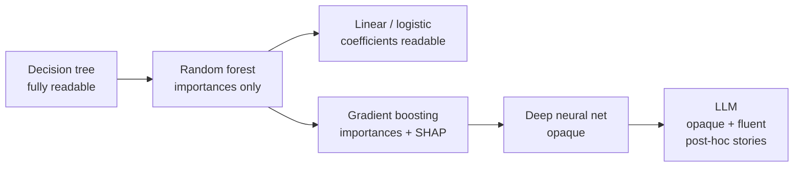
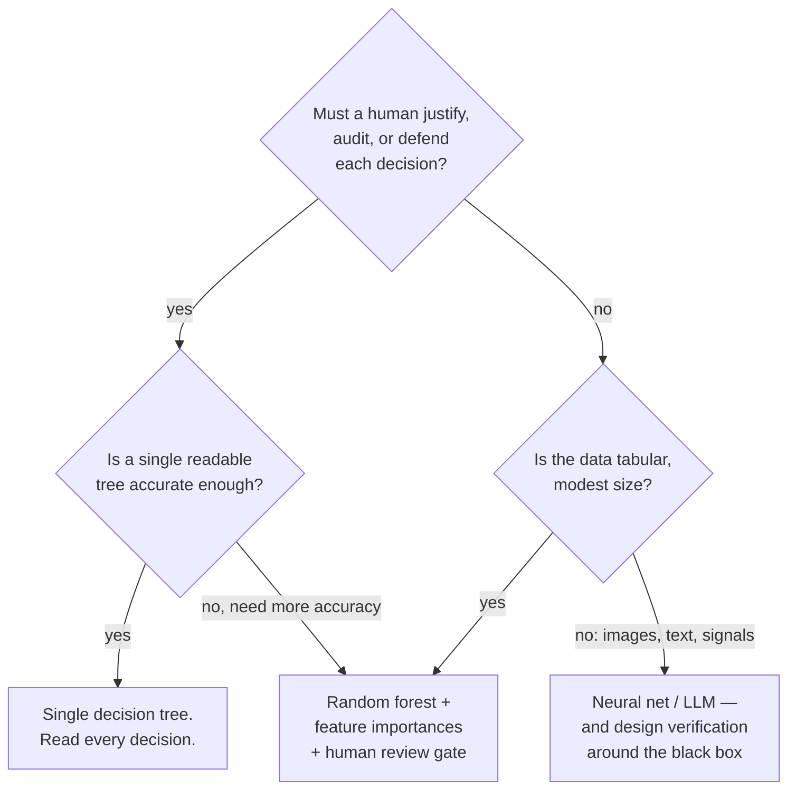

# Why an Auditable Model Beats an Accurate One — For Your Role

This is the file the whole session exists for. Trees and forests are worth a session not because they are the most accurate models — they are not — but because a single tree is the clearest example in mainstream ML of a model that **shows its reasoning**. For release, problem, and configuration management, that property is often worth more than a few points of accuracy.

## The spectrum of "can you read it?"

| Model | Can you read *why* one prediction happened? | What you get instead |
|---|---|---|
| **Single decision tree** | **Yes — the exact path, in plain language** | a complete, checkable justification |
| Logistic regression | Partly — signed weights per feature | direction and rough size of each effect |
| **Random forest** | No per-prediction path | feature-importance ranking (model-level) |
| Deep neural network | No | saliency maps, probes — approximate, contested |
| **LLM** | **No** | a fluent explanation it *generated*, which may not be the real reason |

That last row is the trap this whole course keeps returning to. An LLM will happily give you a confident, well-written "explanation" for its answer — but that text is another generated output, not a readout of the actual computation. It can sound like a reason and be a rationalisation. A decision tree cannot do that: its explanation *is* its mechanism. When it says "senior with fair credit → yes," that is literally what it computed, not a story about it.

## What "interpretable" buys you, concretely

**"Interpretable"** is not an academic virtue. For this audience it converts directly into things you already have to produce:

| You need to… | With a tree you can… | With a black box you must… |
|---|---|---|
| Justify a change/decision in review | show the exact rule path that led to it | argue from aggregate metrics and hope |
| Do root-cause analysis on a bad call | walk the path, find the wrong split, fix the data or the rule | treat the model as a suspect you can't interrogate |
| Satisfy an auditor or a regulator | hand over the rules as documentation | commission an explainability study |
| Catch a spurious pattern *before* production | *see* it in the tree (e.g. an ID column used as a predictor) | discover it after it fails |
| Get a domain expert to sanity-check the model | let them read the flowchart and object | ask them to trust a number |

The senior/fair-credit branch from `01`–`02` is a live example of the fourth row. That branch says seniors with *excellent* credit did **not** buy — counter-intuitive. Because the model is readable, a human can see that rule, question whether it is real signal or an artefact of 14 tiny rows, and decide. You cannot have that conversation with a model you cannot read.

## The honest counter-argument

Interpretability is not free, and pretending otherwise would break this course's voice. Three honest points:

1. **A single tree is often less accurate.** On many real problems a forest, gradient-boosted trees, or a neural net will beat one tree by a meaningful margin. If the cost of an error is high and the decision does not need to be explained (e.g. an internal ranking that a human re-checks anyway), the more accurate model may be right.
2. **A forest already sacrifices most of the readability.** The moment you go from one tree to a hundred for accuracy, you are back to feature-importances only — an aggregate story, not a per-prediction path. Do not sell a random forest as "interpretable" the way a single tree is; it is *more* interpretable than a neural net, not *as* interpretable as one tree.
3. **"Interpretable" is not the same as "correct" or "fair."** A readable rule can still be a biased or wrong rule — readability lets you *find* the problem, it does not prevent it. Interpretability is a tool for oversight, not a guarantee of good behaviour.

## The decision, framed for this room

A serviceable rule of thumb for release/problem/config work:

> **Reach for a decision tree first when the decision has to be defensible and the data is tabular.** Move to a random forest when you need the accuracy and can live with model-level (not per-decision) explanations behind a human review gate. Reach for a neural network or LLM only when the problem is genuinely perceptual or linguistic — and then assume you are verifying a black box from the outside, which is the rest of this course.

## Where this connects

- **Back to Session 3:** "use the simplest model that works." A tree is often that model for tabular operational data, and it comes with readability as a bonus.
- **Forward to Sessions 13–13 (risk):** everything hard about deploying AI safely comes from *not* being able to read the model. Trees are the counter-example that makes the difficulty of the black-box case vivid — they show you what you are giving up every time you choose an opaque model for a few more points of accuracy.
- **The one-liner for the room:** *an explanation you can check beats an answer you have to trust — and a decision tree is the rare model that hands you the first.*
