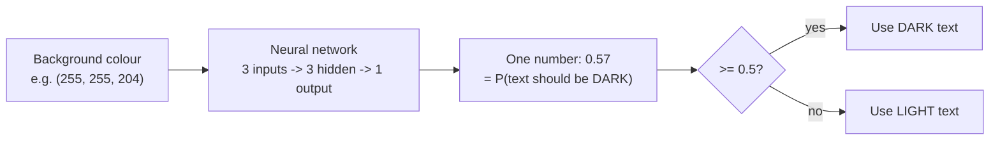
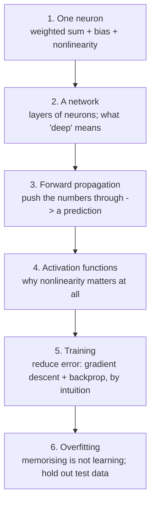

# Deep Learning, Conceptually — Overview

This session opens the black box. A neural network can feel like a magic word, but the machinery is genuinely simple to *understand* even though it is fiddly to *derive*. Our job here is understanding, not derivation. By the end you should be able to explain, to a colleague, what happens inside the network when it makes a prediction, and roughly what happens when it learns.

## The one example that carries the whole session

We use a single toy problem, start to finish: **given a background colour, should the text on it be light or dark?** A colour is three numbers — red, green, blue, each 0–255. The network takes those three numbers in and produces **one number out: the probability that the text should be dark.** That's it. Everything else is detail hung on this frame.

> **A note we are honest about up front.** A hand-written rule (compute the colour's luminance, threshold it) solves this problem perfectly well, and a logistic regression would too. We are using a neural network on a problem that does *not* need one — deliberately — because it is small enough to trace by hand while still exercising every part of the machinery. Real neural networks earn their keep on *perceptual* problems (images, audio, language) where no one can write the rule. Keep that honesty: the technique is powerful and often overkill.

## The arc of the session

The reading files follow this order:

| File | Topic | The one thing to take from it |
|---|---|---|
| `01-a-neuron.md` | What a single neuron computes | A neuron is a linear function wearing a nonlinearity. |
| `02-network-of-layers.md` | Layers, and what "deep" means | Stack neurons into layers; "deep" = more than one hidden layer. |
| `03-forward-propagation.md` | Making a prediction | Forward propagation is just "push the numbers through." |
| `04-activation-functions.md` | Why nonlinearity | Without a nonlinearity, a deep network collapses into a single line. |
| `05-training-gradient-descent-backprop.md` | How it learns | Training = nudge the weights to shrink the error. Flashlight in the mountains. |
| `06-overfitting-and-test-data.md` | Not fooling yourself | A model that memorises scores well and generalises badly; hold out a test set. |
| `99-key-takeaways.md` | Recap | The whole session in one page. |

## What this session is *not*

- **Not a from-scratch build.** The source course derives all of this in NumPy with hand-worked calculus. We deliberately drop that. The math is **shown, not derived** — you will see the shapes of the ideas (a slope, a step, error flowing backward) without a single derivative on the page. If you *want* the derivations, the source course and 3Blue1Brown's series (pre-reading) have them.
- **Not the lab.** Session 7 is where you actually build and train this network in Keras and watch the accuracy climb. This session exists so that when you get there, nothing is a mystery.
- **Not about transformers or LLMs yet.** Those are Session 9. A large language model is (loosely) a very large, very specialised neural network — but you need *this* foundation first.
