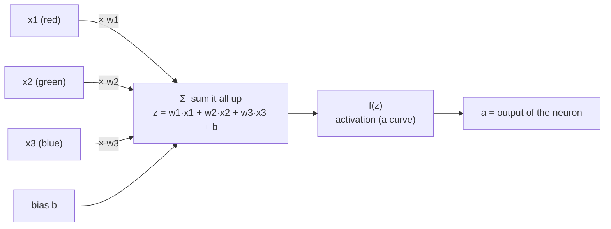

# A Neuron: A Weighted Sum, Then a Nonlinearity

Everything in a neural network is built from one small unit. If you understand this unit, the rest is just copies of it wired together. So let's be precise about what a single **neuron** (also called a node or unit) actually does.

## The two steps inside a neuron

A neuron takes some input numbers and produces one output number, in two steps.

**Step 1 — the weighted sum (a linear step).** Each incoming number is multiplied by its own **weight**, the results are added up, and one more number — the **bias** — is added on the end.

For a neuron with three inputs $x_1, x_2, x_3$:

$$z = w_1 x_1 + w_2 x_2 + w_3 x_3 + b$$

If you have seen the line equation $y = mx + b$, this is the same idea with several inputs: each weight $w$ is a *slope* and the bias $b$ is an *intercept*. **A neuron, up to this point, is just a linear function.** Nothing mysterious.

**Step 2 — the activation (a nonlinear step).** That raw sum $z$ is then passed through an **activation function** $f$ — a simple, fixed, nonlinear curve — to give the neuron's actual output $a$:

$$a = f(z)$$

The activation is what makes a neuron more than a line. Which curve you use (ReLU, sigmoid, tanh…) is covered in `04-activation-functions.md`; *why* you need one at all is the single most important idea in this file, and we return to it below.

*Caption: one neuron. Left half is a weighted sum (linear); the box on the right is the activation (nonlinear).*

## A worked number

Say a neuron looks at a scaled colour where red = 1.0, green = 1.0, blue = 0.8 (we scale the 0–255 channels down to 0–1; see `03-forward-propagation.md`). Suppose this neuron has learned weights $w = (0.5, -0.4, 0.2)$ and bias $b = 0.1$, and uses the **ReLU** activation (which simply replaces any negative number with 0).

| Step | Calculation | Result |
|---|---|---|
| Weighted sum | $0.5(1.0) + (-0.4)(1.0) + 0.2(0.8) + 0.1$ | $z = 0.36$ |
| Activation (ReLU) | $\max(0,\ 0.36)$ | $a = 0.36$ |

The neuron outputs **0.36**. Had the sum come out negative — say $z = -0.7$ — ReLU would have clamped it to **0**. That clamp is the neuron's only act of nonlinearity, and it turns out to be enough.

## What the weights and bias *mean*

- A **weight** says how much this neuron cares about one input, and in which direction. A large positive weight on "red" means "the redder it is, the more this neuron fires." A negative weight means the opposite. A weight near zero means "I ignore this input."
- The **bias** shifts the whole thing up or down — it sets how easily the neuron fires before any input arrives. It is the neuron's default lean.
- **These are the numbers the network learns.** Inputs come from the data; the activation function is fixed by us; the weights and biases are the knobs that training turns. A network "knowing" something *is* its particular settings of thousands (or billions) of these numbers.

At the start of training they are **random** — which is exactly why an untrained network is useless (see `05-training-gradient-descent-backprop.md`).

## Why the nonlinearity is not optional (the headline)

It is tempting to think the activation is a cosmetic detail. It is not. Here is the argument in one line, developed fully in `04-activation-functions.md`:

> **If every neuron were purely linear (no activation), then stacking layers of them would gain you nothing — a chain of linear functions is itself just one linear function.** A hundred-layer network with no nonlinearity can only ever draw a straight line. The activation is what lets layers build on each other to represent curves, corners, and combinations. Without it, "deep learning" would be an elaborate way to compute a single linear regression.

This is the reason the two-step structure exists. The linear step lets a neuron combine its inputs; the nonlinear step lets combinations of neurons express something a line cannot. Hold that thought — it is what makes the whole edifice worth building.

## The biological caveat

Neural networks are *loosely* inspired by biological neurons — inputs arriving, a threshold, a signal out — but they are **not a model of the brain**. The word "neuron" is a historical analogy, not a claim. It is safer to think of a neuron as a tiny tunable function than as a brain cell. The source course makes this point twice; it is worth repeating whenever someone in the room starts anthropomorphising the machine.

---

**In one sentence:** a neuron multiplies each input by a weight, adds a bias, and bends the result through a nonlinear curve — a linear function wearing a nonlinearity, with the weights and bias being the parts that get learned.
