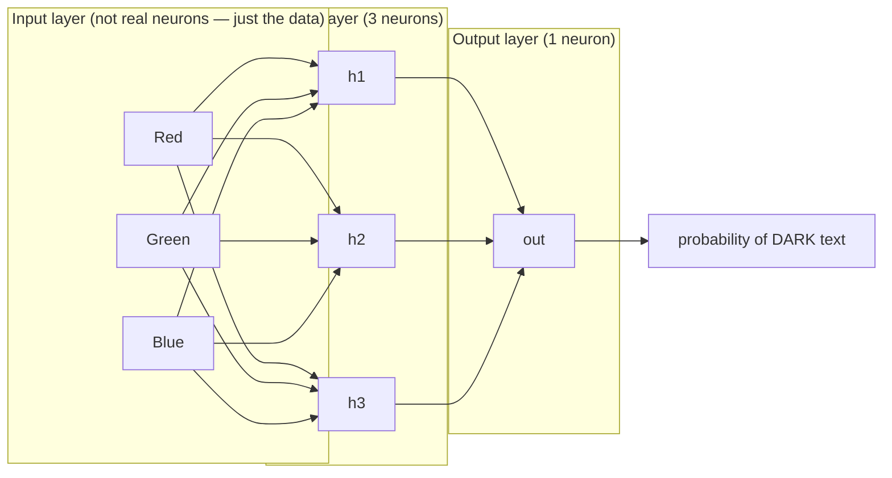
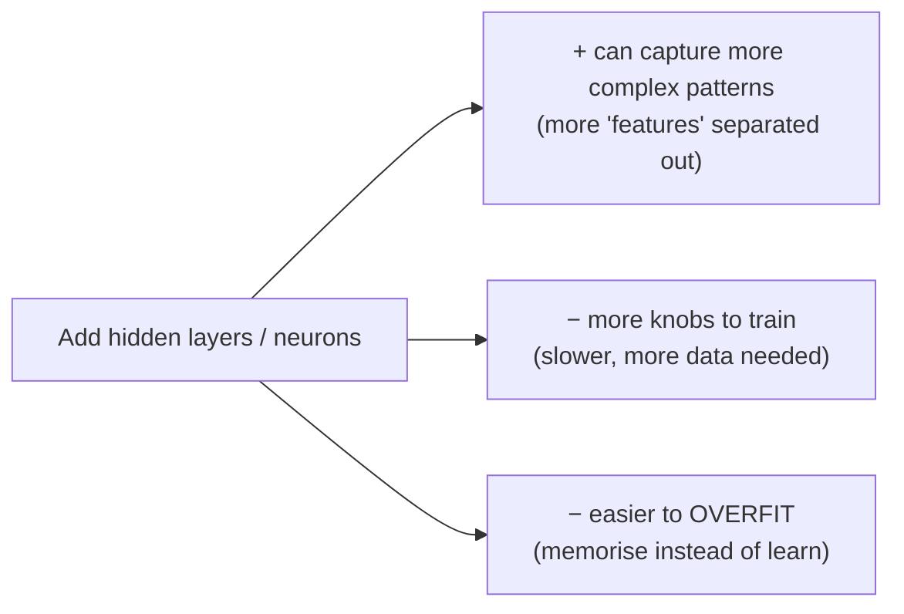

# A Network Is Layers of Neurons

One neuron computes one number. To do anything interesting we wire many neurons together in **layers**, where each layer's outputs become the next layer's inputs. That is the whole architectural idea. This file introduces the three kinds of layer, defines "deep" precisely, and pins down the concrete network we use for the rest of the session.

## Three kinds of layer

*Caption: the 3→3→1 network we use throughout. Every arrow carries one weight; every hidden and output neuron also has a bias.*

- **Input layer** — one slot per input feature. Here: red, green, blue. These are not really neurons; they just hold the incoming numbers. Our input layer has **3** slots.
- **Hidden layer(s)** — the working neurons in the middle. "Hidden" only means "not the input or the output" — there is nothing secret about them. Each hidden neuron does the weighted-sum-plus-activation from `01-a-neuron.md`, looking at *all* the inputs. Our network has **one hidden layer of 3 neurons**.
- **Output layer** — produces the final answer. Our output layer is **1 neuron**, and its job is to emit a single probability.

Because every neuron in a layer connects to every neuron in the next, this arrangement is called **fully connected** (or *dense* — which is exactly the name Keras uses for it, `Dense`, as you will see in Session 7).

## Counting the knobs

Even this tiny network has more tunable numbers than you might guess. Every arrow is a weight; every hidden and output neuron adds one bias.

| Connection | Weights | Biases | Subtotal |
|---|---|---|---|
| 3 inputs → 3 hidden neurons | 3 × 3 = 9 | 3 | 12 |
| 3 hidden → 1 output neuron | 3 × 1 = 3 | 1 | 4 |
| **Total** | **12** | **4** | **16 learnable numbers** |

Sixteen knobs, all set randomly at the start, all nudged by training. Hold this number in mind: a *large* language model has on the order of **hundreds of billions** of exactly these same knobs. The mechanism does not change — only the count.

## What "deep" means (and an honest admission)

Here is the precise definition, and it is less grand than the marketing:

> **"Deep learning" means a neural network with more than one hidden layer.** That's the whole definition. Two or more hidden layers = deep. One hidden layer = a plain (shallow) neural network.

Which forces an admission we make openly, because hiding it would be dishonest:

> ⚠️ **Our own example network has exactly one hidden layer — so, strictly, it is not deep learning.** It is a neural network, and everything we learn from it transfers directly to deep networks. But by the textbook definition, our 3→3→1 model does not qualify. (This is a real inconsistency in the source course, which teaches "deep learning" using a non-deep network. We call it out rather than paper over it — see `resources/sources.md`, error #13.)

Why not just add layers, then? Because more layers is not free:

More layers give the network the *capacity* to discern subtler patterns, but that same capacity makes it slower to train, hungrier for data, and more prone to **overfitting** (memorising the training data instead of learning the general rule — see `06-overfitting-and-test-data.md`). There is no formula for the right number of layers or neurons; practitioners find it by **experiment**. This is what "hyperparameter tuning" means, and it is a running theme of Sessions 7–8.

## Depth vs. width — two ways to make a network bigger

| | What it means | Rough intuition |
|---|---|---|
| **Wider** | More neurons in a layer | More patterns detected *at the same level of abstraction* |
| **Deeper** | More layers | Patterns *built on top of* patterns — edges → shapes → objects |

The famous power of deep learning comes mostly from **depth**: early layers learn simple features, later layers combine them into complex ones. On an image task, layer 1 might find edges, layer 2 corners and textures, layer 3 eyes and wheels, and so on. Our colour problem is far too simple to need this — but it is the reason depth matters when the problem is hard.

## When to reach for a neural network at all

Since Session 3 through 5 covered simpler methods, it is worth being clear about when this heavier machinery is warranted:

| Problem shape | Prefer | Why |
|---|---|---|
| **Structured / tabular** data (rows and columns, clear features) | Simpler models: logistic regression, decision trees, random forests | Faster, cheaper, explainable, usually just as accurate |
| **Perceptual / fuzzy** data (images, audio, raw text) | Neural networks / deep learning | No one can hand-write the rules; the network learns the features |

> *"When all you have is a hammer, everything starts to look like a nail."* Our colour problem is tabular and would be better served by logistic regression. We use a network anyway, purely because it is small enough to see through. In real work, reach for the simpler model first and escalate to a network only when the problem is genuinely perceptual.

---

**In one sentence:** a network is neurons wired into an input layer, one or more hidden layers, and an output layer; "deep" means more than one hidden layer; and even our 16-knob toy has the exact same mechanism as a model a billion times its size.
