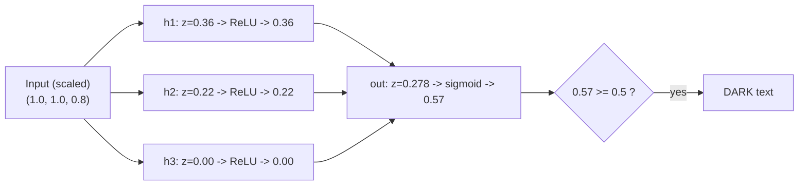

# Forward Propagation: Push the Numbers Through

**Forward propagation** is the grand name for a simple act: feed an input into the network and let it flow, layer by layer, until a prediction comes out the far end. There is no learning here — the weights just sit still and the numbers pass through. If you can do arithmetic, you can do forward propagation. Let's push one real colour all the way through the 3→3→1 network by hand.

## Step 0 — prepare the input

Take a real colour: **salmon pink, RGB (255, 255, 204).** The channels run 0–255, but networks train more smoothly when inputs are small and comparable in size, so we **scale each channel down by 255** to land in the 0–1 range. (This rescaling is a routine preprocessing step, not part of the network itself.)

$$x = \left(\tfrac{255}{255},\ \tfrac{255}{255},\ \tfrac{204}{255}\right) = (1.0,\ 1.0,\ 0.8)$$

## Step 1 — through the hidden layer

Each of the 3 hidden neurons does its own weighted sum over all three inputs, adds its bias, and applies **ReLU** (negatives become 0). Here are the weights this network has (pretend it is already trained), and the arithmetic:

| Hidden neuron | Weights (r, g, b) | Bias | Weighted sum $z$ | After ReLU $a$ |
|---|---|---|---|---|
| $h_1$ | (0.5, −0.4, 0.2) | 0.1 | $0.5(1.0) - 0.4(1.0) + 0.2(0.8) + 0.1 = 0.36$ | **0.36** |
| $h_2$ | (−0.6, 0.3, 0.9) | −0.2 | $-0.6(1.0) + 0.3(1.0) + 0.9(0.8) - 0.2 = 0.22$ | **0.22** |
| $h_3$ | (0.2, 0.2, −0.5) | 0.0 | $0.2(1.0) + 0.2(1.0) - 0.5(0.8) + 0.0 = 0.00$ | **0.00** |

The hidden layer's output is the vector $(0.36,\ 0.22,\ 0.00)$. Notice $h_3$ landed exactly at 0 — ReLU would have clamped it there anyway had it gone negative. These three numbers are the network's internal, learned "features" of the colour; they have no tidy human name, and that is normal.

## Step 2 — through the output layer

The single output neuron takes those three hidden outputs as *its* inputs, does one more weighted sum with its own weights and bias, and then applies the **sigmoid** activation — which squashes any number into the 0–1 range so we can read it as a probability.

| Output neuron | Weights (h1, h2, h3) | Bias | Weighted sum $z$ | After sigmoid $a$ |
|---|---|---|---|---|
| out | (0.8, −0.5, 0.6) | 0.1 | $0.8(0.36) - 0.5(0.22) + 0.6(0.00) + 0.1 = 0.278$ | **≈ 0.57** |

The sigmoid of 0.278 is $\dfrac{1}{1 + e^{-0.278}} \approx 0.57$.

## Step 3 — read the answer

The network outputs **0.57**. We defined this number, from the very start, as **the probability that the text should be DARK**. The decision rule:

> **If the output is ≥ 0.5 → use DARK text. If it is < 0.5 → use LIGHT text.**

0.57 ≥ 0.5, so on salmon pink the network says: **dark text.** (Which is the sensible answer for a pale background — a small sanity check that the machinery is doing something reasonable.)

> ⚠️ **A correction to the source material.** The source course states this threshold *two different ways* on two different slides — one says ≥.5 → dark, the other says ≥.5 → light. They contradict. We resolve it in favour of **≥.5 → DARK**, because that is the only reading consistent with the output being defined as "the probability of predicting a dark font." Pick one direction and hold it everywhere; we hold DARK. (See `resources/sources.md`, error #1.)

## The whole flow on one diagram



*Caption: forward propagation for salmon pink. Each box is a weighted sum followed by an activation. Nothing here learns — the weights are fixed while the numbers flow left to right.*

## The same thing, expressed compactly

Everything above is four operations, alternating "sum" and "squash." Written as formulas, with $Z$ meaning a raw weighted sum and $A$ meaning the activated result:

$$Z_1 = W_{\text{hidden}}\, x + b_{\text{hidden}} \qquad A_1 = \text{ReLU}(Z_1)$$
$$Z_2 = W_{\text{output}}\, A_1 + b_{\text{output}} \qquad A_2 = \text{sigmoid}(Z_2)$$

$A_2$ is the final probability. That is *all* forward propagation is: two rounds of "multiply-add, then bend." A network with 96 layers (like a large transformer) just repeats this 96 times instead of twice.

## A tiny illustrative snippet (you will run the real one in Session 7)

You do **not** need to run anything this session. But it is reassuring to see how little code the whole flow takes. In real work nobody writes the matrix math by hand — a library does it — but here is the essence, so the concept and the code line up:

```python
import numpy as np

# The two activation functions used above.
relu    = lambda v: np.maximum(v, 0)          # negatives -> 0
sigmoid = lambda v: 1 / (1 + np.exp(-v))      # squash to 0..1

# Learned parameters (rows = neurons). These would come from training.
W_hidden = np.array([[ 0.5, -0.4, 0.2],
                     [-0.6,  0.3, 0.9],
                     [ 0.2,  0.2, -0.5]])
b_hidden = np.array([0.1, -0.2, 0.0])
W_output = np.array([0.8, -0.5, 0.6])
b_output = 0.1

def forward(x):
    z1 = W_hidden @ x + b_hidden      # weighted sums, hidden layer
    a1 = relu(z1)                     # activate
    z2 = W_output @ a1 + b_output     # weighted sum, output neuron
    a2 = sigmoid(z2)                  # activate -> probability
    return a2

x = np.array([1.0, 1.0, 0.8])         # salmon pink, scaled
print(round(float(forward(x)), 2))    # -> 0.57  => 0.57 >= 0.5 => DARK
```

The point of showing this is *not* to teach NumPy — Session 7 does everything in five lines of Keras instead. It is to make concrete that "push the numbers through" is a literal, mechanical, and short computation. There is no magic step hiding in the middle.

---

**In one sentence:** forward propagation feeds an input through the fixed weights — sum, activate, sum, activate — and reads a single probability off the end, which a ≥0.5 threshold turns into a light/dark decision.
