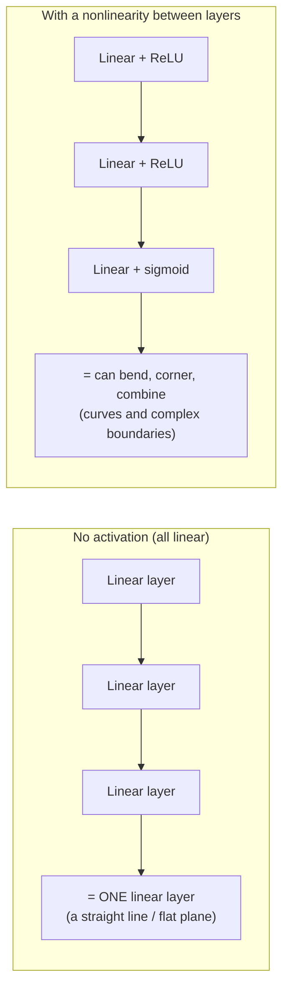
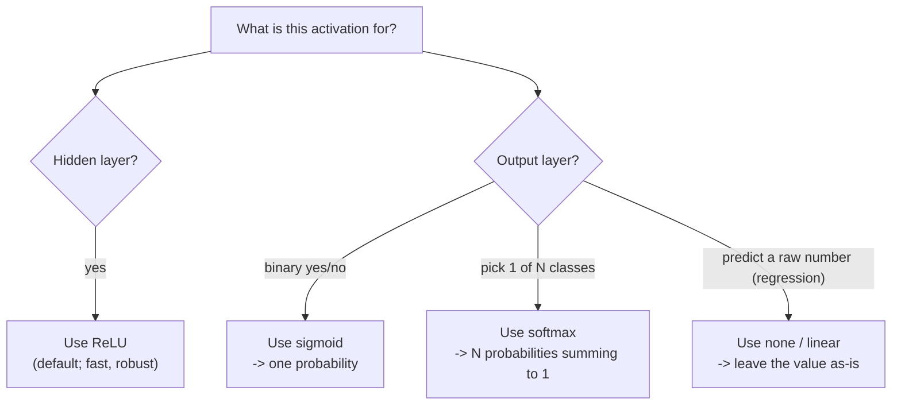

# Activation Functions: Why Nonlinearity Matters at All

We have used two activation functions already — ReLU in the hidden layer, sigmoid at the output — without justifying why they need to be there. This file makes the case. The headline is worth stating before the details: **the activation function is the single ingredient that makes a "deep" network more powerful than a shallow one. Remove it and the whole tower collapses into a straight line.**

## The collapse argument (the reason activations exist)

Suppose we got lazy and used *no* activation — every neuron just outputs its raw weighted sum. Stack two such layers. Layer 1 computes some linear combination of the inputs; layer 2 computes a linear combination of *those*. But a linear combination of linear combinations is **still just a linear combination**. Algebraically, two linear layers back-to-back can always be rewritten as a single linear layer with different weights.

So a network of any depth, with no activations, can only ever represent what a *single* linear model can — you would have spent millions of parameters to reinvent linear regression. The nonlinearity between layers is what breaks this collapse. Each bend lets the next layer build on a genuinely new shape rather than a rescaled copy of the last one. That is the entire reason activation functions are in the design.

The source course puts it crisply: without the nonlinear step, *"the neural network would be no better than a linear model."* Every subsequent capability — recognising a face, separating classes that aren't linearly separable, learning a curved decision boundary — depends on it.

## The four you will meet

Different activations suit different jobs. You mostly need to recognise them and know where each belongs.

| Function | Shape | Output range | Where it's used | Why / notes |
|---|---|---|---|---|
| **ReLU** (rectified linear unit) | Flat at 0 for negatives, straight line for positives | 0 to ∞ | Hidden layers (the default) | Cheap, fast, and avoids the "vanishing gradient" problem. The modern go-to for hidden layers. |
| **Sigmoid** (logistic) | Smooth "S" curve | 0 to 1 | Output, for **binary** classification | Squashes anything to a 0–1 probability — exactly what we want for "probability of dark." |
| **Tanh** | Smooth "S" curve, centred at 0 | −1 to 1 | Hidden layers (older designs) | Like sigmoid but centred on 0, which can help training; largely superseded by ReLU. |
| **Softmax** | Normalises a whole layer | 0 to 1, summing to **1.0** across nodes | Output, for **multi-class** classification | Turns several output scores into a set of probabilities that add up to 1 — e.g. "which of 10 digits is this?" |

*Caption: a rough decision guide. Hidden layers almost always ReLU; the output activation is chosen to match the kind of answer you want.*

## ReLU in a little more depth

ReLU is almost insultingly simple: $\text{ReLU}(z) = \max(0, z)$. If the weighted sum is positive, pass it through unchanged; if negative, output 0. That's it. Two reasons it dominates hidden layers:

- **It's cheap.** A single comparison, no exponentials. At billions of neurons, that speed compounds.
- **It mitigates the "vanishing gradient" problem.** During training, the network passes correction signals backward (see `05-training-gradient-descent-backprop.md`). With the older S-shaped curves, those signals can shrink toward zero as they pass through many layers, and training stalls. ReLU's straight-line-for-positives shape keeps the signal alive. You don't need the mechanism for this session — just the fact that ReLU is the safe default.

## Sigmoid at the output

Our output neuron uses sigmoid, $\text{sigmoid}(z) = \dfrac{1}{1 + e^{-z}}$, for one reason: it takes the output neuron's raw weighted sum — which could be any number, positive or negative — and squashes it neatly into the 0–1 range, so we can honestly read it as **a probability**. That is what let us say "0.57 = a 57% lean toward dark" in the previous file. For a *multi-class* problem (say, classifying a colour into one of eight named shades) you would swap sigmoid for **softmax** and have one output neuron per class.

> **A licence-and-honesty footnote for the curious.** Our source course pairs a sigmoid/softmax output with a *mean-squared-error* loss (see `05`). In practice, classification almost always pairs those outputs with **cross-entropy** loss instead — it trains better and is the convention you'll meet everywhere, including Keras in Session 7. The source uses MSE deliberately, to keep a single loss function across its whole course; we flag it here so the choice doesn't surprise you later. Nothing conceptual in this session depends on which one you pick.

## Try it live (optional)

The activation curves are worth *seeing* wiggle. The Desmos activation-function graph lets you drag parameters and watch ReLU, sigmoid, tanh, and softmax respond in real time — a good 60-second live demo. It is a tool, shown live; we link it rather than screenshot it (see `resources/sources.md`).

---

**In one sentence:** activation functions are the nonlinear bends that stop a deep network from collapsing into a single line — ReLU for hidden layers, sigmoid for a binary output, softmax for a multi-class output — and they are the reason depth buys you anything at all.
