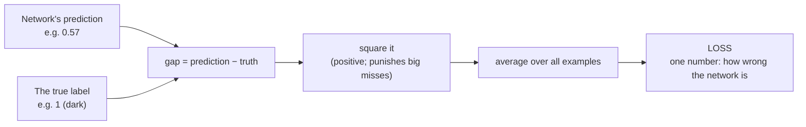
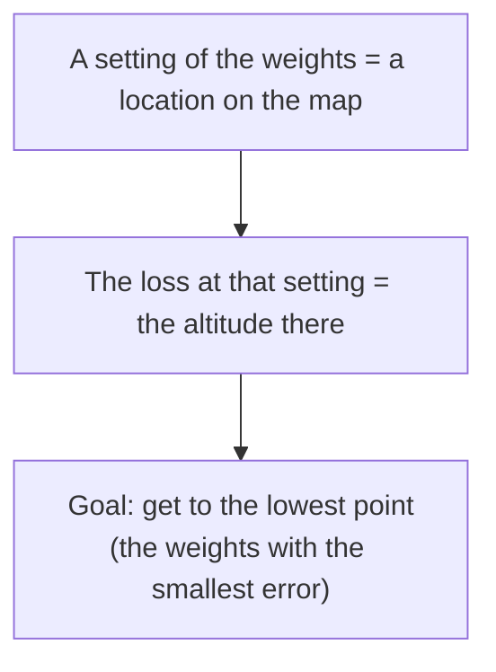
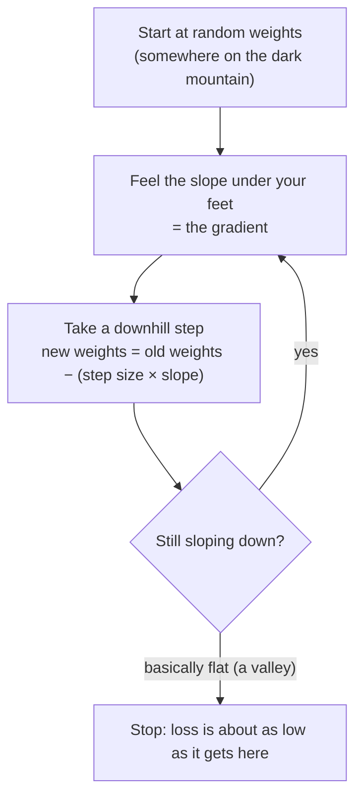
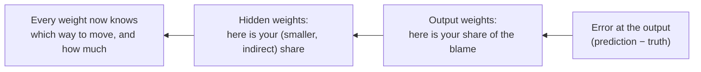
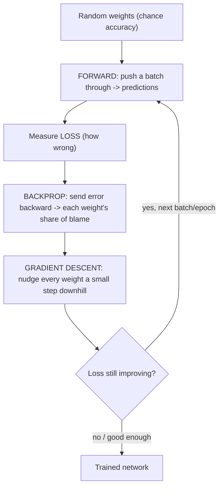

# Training: How the Network Goes From Useless to Good

This is the heart of the session. So far the network has *had* its weights — we pretended it was already trained. Now we ask the real question: **where do those 16 numbers come from?** The answer is training, and we will explain it entirely by intuition. There is not one derivative in this file. The math is real, but for understanding the *idea* you need a flashlight and a mountain, not calculus.

## Start: random weights, chance accuracy

A fresh network has its weights and biases set to **random numbers**. Ask a random network to predict light-vs-dark and it is essentially guessing — on our two-way problem it lands near **50% accuracy**, no better than a coin. This is not a bug; it is the honest starting line. (In Session 7 you will *see* this: run the untrained network, get ~chance accuracy, then train it and watch the number climb. Seeing the "before" is what makes the "after" mean something.)

So training is the process that turns 16 random numbers into 16 *good* numbers.

## Step 1 — measure how wrong we are: loss

You cannot improve what you cannot measure. So first we put a number on the network's wrongness, called the **loss** (or cost, or error). The idea, which you have already met in Sessions 3–5, is the same "cost/distance we minimise" that runs through every method in this course:

- For one colour, the network predicts a probability (say 0.57) and the truth is a label (say 1 = dark). The gap between them is that example's error.
- We don't just add up the raw gaps — positive and negative gaps would cancel out. Instead we **square** each gap (which makes everything positive *and* punishes big misses harder than small ones) and average over the data. This is the **mean squared error**.

*Caption: loss compresses the network's total wrongness into a single number. Training's only goal is to make this number small.*

Low loss = good predictions. **The entire job of training is to find the weights that make the loss as small as possible.** Everything below is machinery for doing exactly that.

## Step 2 — the loss landscape

Here is the mental picture that makes the rest click. Imagine the loss as a **landscape**. The horizontal directions are the settings of the weights (imagine turning all 16 knobs); the height at any point is the loss you'd get with those settings. High ground = bad (high error); valleys = good (low error).

Training is a search for the **lowest valley** in that landscape.

There is a catch we come back to: for a neural network this landscape is **bumpy** — many valleys, not one clean bowl. Hold that thought.

## Step 3 — gradient descent: the flashlight in the mountains

You are standing somewhere on this landscape (your current random weights) and you want to get down to a valley. But it is **night** and you have only a **flashlight** — you can see the ground immediately around your feet, but not the whole map. What do you do?

> **You feel which way the ground slopes downhill, and you take a step that way. Then you do it again. And again. Steeper slope → bigger step; gentle slope → smaller step. Eventually you reach the bottom of a valley.**

That is **gradient descent**, in full. The "gradient" is just the fancy word for "which way is downhill, and how steep" at your current spot. "Descent" is the repeated downhill stepping.

*Caption: gradient descent. Each loop is one small improvement to the weights. Real training runs this loop thousands of times (each full pass over the data is an "epoch").*

Two pieces of vocabulary fall straight out of the metaphor:

| Term | Metaphor | What it controls |
|---|---|---|
| **Learning rate** | The size of your steps | How far you move the weights each iteration |
| **Epoch** | How many times you repeat the loop over all the data | How long you keep walking |

### The learning rate: a giant vs. an ant

Step size matters more than any other single knob, and the metaphor makes the danger obvious:

- **Learning rate too large — you're a giant.** Your strides are so long you leap right over the valley floor and never settle at the bottom; you may even bounce further uphill. Training becomes unstable or diverges.
- **Learning rate too small — you're an ant.** You inch downhill correctly but agonisingly slowly; it takes an enormous number of steps (epochs) to arrive, if you get there at all in the time you have.
- **The craft is choosing a step size between the two.** There is no formula — it is tuned by experiment, which is exactly the kind of knob-turning Session 8 is about.

## Step 4 — backpropagation: distributing the blame

Gradient descent needs to know, at each step, *which way is downhill for every one of the 16 weights.* The output neuron's weights are easy — they touch the final answer directly. But how do you know whether a weight buried back in the hidden layer should go up or down, when it only affects the answer *indirectly*, through everything in front of it?

**Backpropagation** is the answer, and its intuition is simple even though its arithmetic (the chain rule) is not:

> Take the error at the output — the network's mistake on this example — and **push it backward through the network, handing each weight its share of the blame.** A weight that contributed a lot to the mistake gets a big correction; a weight that barely mattered gets a small one. Once every weight knows its share of the blame, gradient descent knows which way to nudge it.

*Caption: backpropagation sends the error backward (right to left), splitting responsibility among the weights. "Forward propagation makes the prediction; backpropagation assigns the blame."*

The name says it all: forward propagation pushes *data* forward to get a prediction; back propagation pushes *error* backward to get corrections. They alternate: predict, measure error, distribute blame, nudge the weights — then predict again. Repeat thousands of times and the random 16 numbers slowly become good ones. The loss drops; the accuracy climbs; the network has learned.

## Step 5 — one wrinkle: the landscape is bumpy

We said the loss landscape for a network is not a single clean bowl but a range with **many valleys** (this is what "non-convex" means). A pure downhill walker can get **stuck in the first valley it finds**, even if a deeper one lies just over the next ridge.

Two ideas rescue this, and you only need them by name:

- **Randomness helps.** Instead of computing the slope from the *entire* dataset every step, we compute it from a small **random sample** each time (this is *stochastic* / *mini-batch* gradient descent). The jitter that introduces is a feature, not a bug — it shakes the walker out of shallow valleys, the way a bit of noise can bounce a ball out of a small dip. It is also far cheaper per step.
- **The best valley isn't even the goal.** Surprisingly, we usually do **not** want the single deepest valley (the "global minimum"). A "good enough" valley that predicts well on *new* data is the real prize — chasing the absolute lowest point on the *training* data tends to cause overfitting, which is the subject of the next file. (This is a known result about neural-network loss surfaces; see `resources/sources.md`.)

## Putting the whole loop together

*Caption: the training loop. Forward to predict, loss to measure, backprop to assign blame, gradient descent to improve — repeated until the network is good. This single loop, at enormous scale, is how every neural network you have heard of was trained.*

---

**In one sentence:** training starts from random weights and repeatedly (1) predicts, (2) measures the error as a loss, (3) uses backpropagation to give each weight its share of the blame, and (4) uses gradient descent — a flashlight-guided downhill walk — to nudge every weight toward less error, until the network is good.
