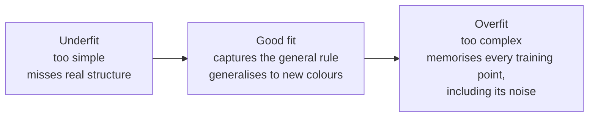
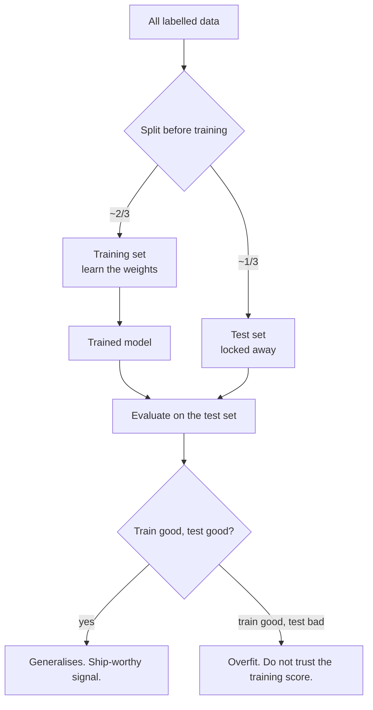
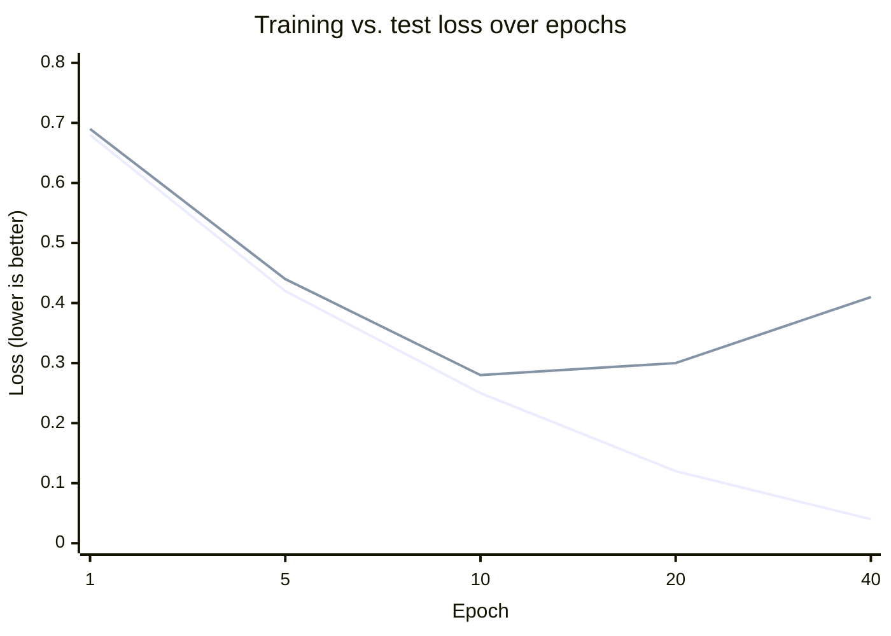

# Overfitting: Memorising Is Not Learning

We just saw that training drives the loss down. Here is the trap: **you can drive the training loss all the way to near-zero and still have a useless model.** A network with enough capacity can *memorise* its training examples instead of learning the general rule behind them — and memorising looks fantastic right up until the model meets data it has never seen. This is **overfitting**, and guarding against it is why every honest ML workflow holds out a test set.

## The idea in one picture

Imagine fitting a boundary between "use light text" and "use dark text" colours:

*Caption: the same data, three fits. The overfit model contorts itself to pass through every training point exactly — including the flukes — so it nails the training data and stumbles on anything new.*

A student analogy lands this fast: a student who **understands** the material answers new exam questions well. A student who **memorised last year's answer key** aces that exact paper and fails the moment the questions change. Overfitting is a model that memorised the answer key.

## How you catch it: train vs. test

You cannot spot overfitting by looking at training performance — an overfit model looks *best* there. You catch it by checking performance on data the model **never saw during training**. So before training, we split the data:

| Split | Typical share | Role |
|---|---|---|
| **Training set** | ~2/3 | The model learns its weights from this. |
| **Test set** | ~1/3 | Held out, untouched during training. Used *once*, at the end, to estimate real-world performance. |

The test set is a stand-in for "the future" — colours the model will meet in production but has never been shown. **If the model does well on training but poorly on the held-out test set, it overfit.** That gap is the single most important diagnostic in applied machine learning.

*Caption: the train/test discipline. The test set is only meaningful because the model never learned from it. Peeking — training on the test data, even indirectly — quietly destroys its value.*

## The tell: two curves diverging

If you watch loss (or accuracy) as training proceeds, overfitting has a signature shape. Training loss keeps falling; test loss falls for a while, then **turns and rises**. The moment they diverge is the moment the model stops learning the general rule and starts memorising noise.

Approximate loss over training epochs (lower is better):

| Epoch | Training loss | Test loss | What's happening |
|---|---|---|---|
| 1 | 0.68 | 0.69 | Both high — still random-ish. |
| 5 | 0.42 | 0.44 | Both falling — genuine learning. |
| 10 | 0.25 | 0.28 | Still healthy; the sweet spot is near here. |
| 20 | 0.12 | 0.30 | Training keeps dropping; **test has turned up**. |
| 40 | 0.04 | 0.41 | Training near-perfect; test clearly worse. **Overfitting.** |

*Caption: the classic overfitting signature. Read the two lines together — the point where the test line bottoms out and turns up is where you'd ideally stop training. The best model is not the one with the lowest training loss.*

This is also why, back in `05`, we said we do *not* actually want the global minimum of the training loss: pushing training loss to its absolute floor is exactly what drives the test loss back up.

## What you do about it (a preview of Session 8)

You don't need the how-to this session — just to know that overfitting is *manageable*, with a standard toolkit:

| Lever | Idea |
|---|---|
| **More data** | Harder to memorise a large, varied dataset than a small one. Usually the best fix. |
| **Early stopping** | Stop training at the point the test loss bottoms out, before it turns up. |
| **A simpler network** | Fewer layers/neurons = less capacity to memorise noise. |
| **Regularisation / dropout** | Techniques that deliberately handicap the network during training so it can't over-rely on any one path. |

Session 8 ("Make It Better") makes each of these concrete on the actual colour model — you will *watch* the two curves diverge and then pull them back together.

## Why this matters beyond the toy

For a release, problem, or configuration audience, the lesson generalises past neural networks entirely: **a model's score on the data it was built from is not evidence it will work in the field.** A vendor demo, a benchmark, an internal proof-of-concept — all can be the "memorised answer key." The only honest evidence is performance on data the model has never seen. That principle is the through-line into Session 13 ("When AI Is Confidently Wrong"), where a great-looking accuracy number turns out to be lying.

---

**In one sentence:** overfitting is memorising the training data instead of learning the rule; you catch it by holding out a test set the model never trained on, watching for training performance that outruns test performance — and the model you want is the one that generalises, not the one with the lowest training loss.
