# Slides Outline — Session 6: Deep Learning, Conceptually

Slide-by-slide spec for the deck-builder. Build per `../../powerpoint_instructions.md` (layout, palette, type, accessibility, licence footers). Speaker notes go in the Notes pane, never on the slide. Mermaid sources are provided in the **Visual** field for the builder to render in-palette; render them with alt text.

**Deck size:** 1 title + 1 agenda + 15 content + 1 discussion + 1 resources = **19 slides.** Target 45 min.

**Licence note for this whole deck:** all concepts are re-authored from LINK-ONLY source decks (Nield, *Deep Learning for Beginners* Days 1–2, O'Reilly). Nothing is reproduced from them, so **no source-derived visual on these slides needs a licence footer** — every diagram is our own. The only external artefacts referenced (3Blue1Brown, Desmos) are link/live-demo only and appear on the resources slide, never embedded. Keras snippet follows the Apache-2.0 Keras API pattern.

---

## Slide 1 — Title

- **On-slide text:** "Methods IV: Deep Learning, Conceptually" · Session 6 · Methods block · AI Training Series. Subtitle: *"Understand the network — no calculus required."*
- **Speaker notes:** This is the demystifying session. We open the black box of a neural network so that the hands-on sessions coming next feel earned, not hand-waved. We teach the ideas; we deliberately skip the from-scratch calculus.
- **Visual:** Series title layout.
- **Source/licence:** none (original).

## Slide 2 — Agenda

- **On-slide text:** One neuron → a network of layers → forward propagation → activation functions → training → overfitting. "45 min + 15 min Q&A."
- **Speaker notes:** Walk the arc in 20 seconds. Flag that the middle (training) is the heart, and that nobody has to run code today — Session 7 is the lab.
- **Visual:** Agenda table mirroring the README minute-budget.
- **Source/licence:** none.

## Slide 3 — The problem we'll trace all session

- **On-slide text (headline is a claim):** "One tiny problem carries the whole idea." Bullets: background colour in (R,G,B); one probability out; ≥0.5 → dark text, else light.
- **Speaker notes:** Introduce the running example: pick readable text for any background. Honesty up front — a plain rule or a logistic regression solves this; we use a network only because it's small enough to see through. Real networks earn their keep on images/audio/language.
- **Visual:**
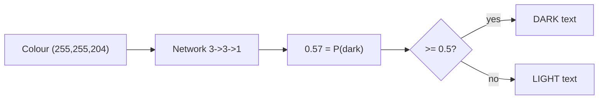
- **Source/licence:** original (concept re-pitched from Nield DL Day 1, not reproduced).

## Slide 4 — A neuron: weighted sum + a bend

- **On-slide text:** "A neuron is a linear function wearing a nonlinearity." Bullets: multiply each input by a weight; add a bias; pass through an activation. Weights + bias = the learned parts.
- **Speaker notes:** Two steps: a weighted sum (this is just y = mx + b with several inputs), then a nonlinear activation. Weights say how much the neuron cares about each input; the bias is its default lean. These are the numbers training will set — everything else is fixed.
- **Visual:**
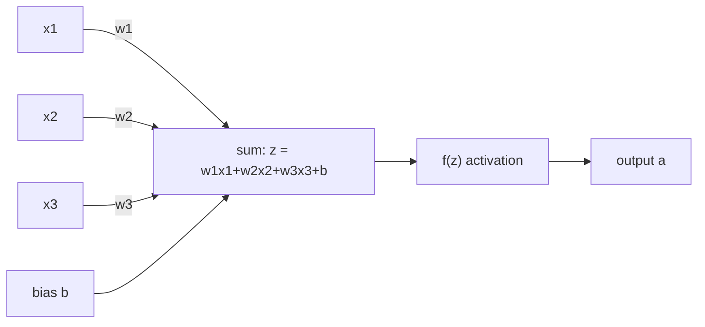
- **Source/licence:** original.

## Slide 5 — A neuron, with a real number

- **On-slide text:** "The whole neuron is one line of arithmetic." Show: inputs (1.0, 1.0, 0.8); weights (0.5, −0.4, 0.2); bias 0.1 → z = 0.36 → ReLU → 0.36.
- **Speaker notes:** Walk the arithmetic once, slowly. Point out ReLU here just passed 0.36 through unchanged; had z been negative, ReLU would clamp it to 0. That clamp is the neuron's only nonlinearity — and it's enough.
- **Visual:** A two-row table (Weighted sum | Activation) with the numbers. Keep it large.
- **Source/licence:** original.

## Slide 6 — A network is layers of neurons

- **On-slide text:** "Wire neurons into layers; each layer feeds the next." Bullets: input layer (the data); hidden layer (the workers); output layer (the answer); fully connected = Keras `Dense`.
- **Speaker notes:** Introduce the 3→3→1 architecture we use the rest of the session. Hidden only means "not input or output" — nothing secret. Every arrow is a weight; every hidden/output neuron adds a bias.
- **Visual:**
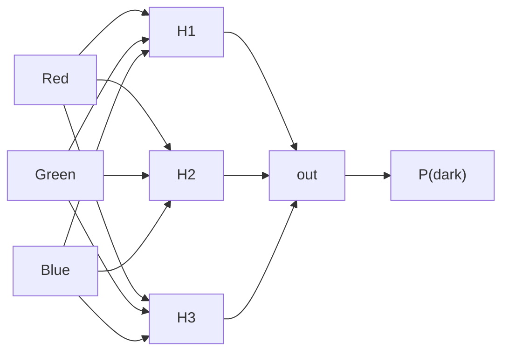
- **Source/licence:** original.

## Slide 7 — 16 knobs here; billions in an LLM

- **On-slide text:** "Same mechanism, only the count changes." Table: inputs→hidden 9 weights + 3 biases; hidden→output 3 + 1; total 16 learnable numbers. Footnote: an LLM has ~hundreds of billions of these.
- **Speaker notes:** Land the scaling point. Our toy has 16 knobs, all random at the start, all nudged by training. A large model is this exact structure with a hundred billion knobs. Nothing about the mechanism changes — a reassuring anchor for Session 9.
- **Visual:** The knob-count table from `content/02`.
- **Source/licence:** original.

## Slide 8 — What "deep" means (and our honest admission)

- **On-slide text:** "'Deep' = more than one hidden layer. Ours has one — so it isn't deep." Bullets: 2+ hidden layers = deep; ours is a (shallow) neural network; everything still transfers.
- **Speaker notes:** Give the precise definition, then the admission — the source course teaches "deep learning" with a non-deep network. We call it out rather than hide it (source error #13). More layers = more capacity but slower, more data-hungry, easier to overfit. No formula for how many; it's experiment.
- **Visual:**
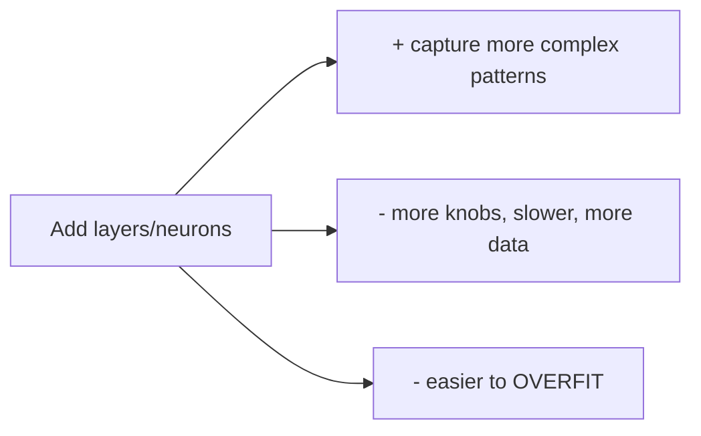
- **Source/licence:** original; correction of source error #13.

## Slide 9 — Forward propagation: push the numbers through

- **On-slide text:** "Making a prediction is just arithmetic, twice." Bullets: scale RGB by 255; hidden layer → (0.36, 0.22, 0.00); output → 0.278 → sigmoid → 0.57.
- **Speaker notes:** Walk salmon pink all the way through. Two rounds of "multiply-add, then bend." The three hidden numbers are the network's internal features — no human name, and that's normal. Emphasise: no magic step is hiding in the middle.
- **Visual:**
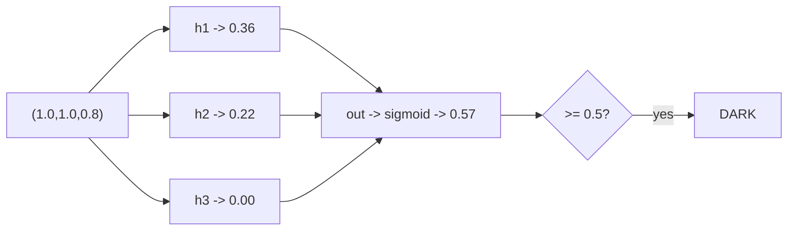
- **Source/licence:** original.

## Slide 10 — Read the answer: ≥0.5 → DARK

- **On-slide text:** "0.57 ≥ 0.5 → dark text on salmon pink." Bullets: output = probability of dark; the threshold rule; a sensible answer for a pale background.
- **Speaker notes:** State the decision rule cleanly and note the correction: the source deck contradicts itself (one slide says ≥.5 → light). We hold ≥.5 → DARK because the output is defined as the probability of *dark*. Pick one direction and keep it everywhere.
- **Visual:** Large callout: "0.57 → DARK" with the swatch. Optionally a small "⚠ source contradiction resolved" tag.
- **Source/licence:** original; correction of source error #1.

## Slide 11 — Why the nonlinearity is not optional

- **On-slide text:** "Remove the activations and a deep network collapses into a line." Bullets: linear ∘ linear = linear; depth buys nothing without a bend; the activation is the whole point.
- **Speaker notes:** The key idea of the session's first half. Stack linear layers and algebra collapses them into one linear layer — you'd spend millions of parameters to reinvent linear regression. The nonlinearity between layers is what lets each layer build a genuinely new shape.
- **Visual:**
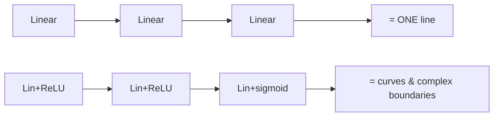
- **Source/licence:** original.

## Slide 12 — The activation toolkit

- **On-slide text:** "Pick the activation to match the job." Compact table: ReLU (hidden, default), sigmoid (binary output), tanh (older hidden), softmax (multi-class output).
- **Speaker notes:** Recognition-level only. ReLU almost always for hidden layers (cheap; avoids vanishing gradients). Output activation matches the answer: sigmoid for one probability, softmax for one-of-N. Optionally show the Desmos graphs live (link only). Footnote the MSE-vs-cross-entropy simplification if asked.
- **Visual:** The activation comparison table from `content/04` (Function | Range | Where used | Why). Do NOT screenshot Desmos — live demo only.
- **Source/licence:** original; Desmos = live-demo/link only.

## Slide 13 — Training starts useless

- **On-slide text:** "Random weights = coin-flip accuracy. That's the honest starting line." Bullets: 16 random numbers; ~50% on a two-way problem; training turns random into good.
- **Speaker notes:** Set up the emotional beat of Session 7 — you'll see the untrained model flail before it learns. Training's whole job: turn 16 random numbers into 16 good ones. How? Next three slides.
- **Visual:** Simple before/after: "random weights → ~50%" arrow to "trained → high accuracy (Session 7)."
- **Source/licence:** original.

## Slide 14 — Step 1: measure wrongness (loss)

- **On-slide text:** "You can't improve what you can't measure." Bullets: gap = prediction − truth; square it (positive + punishes big misses); average = loss; training minimises this one number.
- **Speaker notes:** Loss is the same "cost/distance we minimise" spine from Sessions 3–5, returning as *loss*. Squaring stops positives and negatives cancelling and punishes big misses. Low loss = good predictions. Everything else is machinery to shrink it.
- **Visual:**
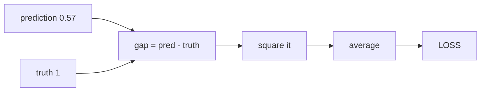
- **Source/licence:** original.

## Slide 15 — Step 2: gradient descent = flashlight in the mountains

- **On-slide text:** "Feel which way is downhill, step, repeat." Bullets: loss = a landscape; weights = your location; height = error; flashlight = the local slope; learning rate = step size.
- **Speaker notes:** The load-bearing metaphor. Night, mountains, a flashlight — you see only the ground at your feet, so you step downhill and repeat. Steeper slope → bigger step. Learning rate too big = a giant leaping over the valley; too small = an ant taking forever. No formula; tuned by experiment (Session 8).
- **Visual:**
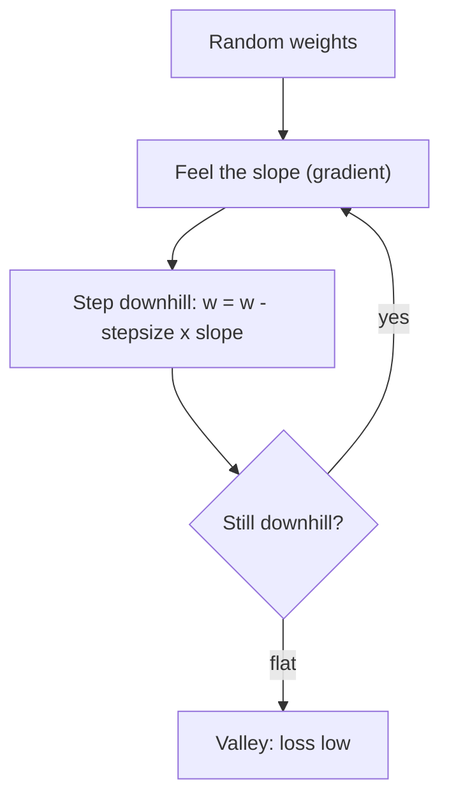
- **Source/licence:** original (flashlight metaphor after Nield; re-authored).

## Slide 16 — Step 3: backpropagation = distribute the blame

- **On-slide text:** "Forward makes the prediction; back assigns the blame." Bullets: take the output error; push it backward; each weight gets its share; big contributor → big correction.
- **Speaker notes:** Gradient descent needs to know which way is downhill for *every* weight, including hidden ones that only affect the answer indirectly. Backprop pushes the error backward and hands each weight its share of the blame. The arithmetic (chain rule) is real but we skip it — the intuition is "split the blame backward."
- **Visual:**
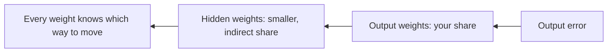
- **Source/licence:** original.

## Slide 17 — The training loop, whole

- **On-slide text:** "Predict → measure → blame → nudge. Thousands of times." Bullets: forward; loss; backprop; gradient-descent step; repeat until good.
- **Speaker notes:** Assemble the loop. This single loop, at enormous scale, trained every model you've heard of. Mention the two wrinkles by name only: randomness (mini-batch / stochastic) shakes us out of shallow valleys and is cheaper; and we want a "good enough" valley, not the deepest — chasing the deepest overfits, which is the next slide.
- **Visual:**
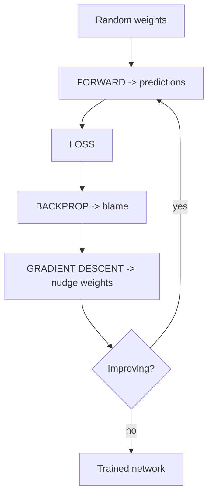
- **Source/licence:** original.

## Slide 18 — Overfitting: memorising isn't learning

- **On-slide text:** "A perfect training score can mean a useless model." Bullets: overfit = memorised the answer key; catch it with a held-out test set (~2/3 train, ~1/3 test); the tell = train loss falls while test loss turns up.
- **Speaker notes:** The student who memorised last year's paper aces it and fails new questions. You can't spot overfitting from training performance — an overfit model looks best there. Hold out a test set (the model never learns from it) as a stand-in for the future. When the two loss curves diverge, you've started memorising noise. Fixes (Session 8): more data, early stopping, simpler net, dropout. Ties to Session 13: a good score is not proof it works.
- **Visual:**
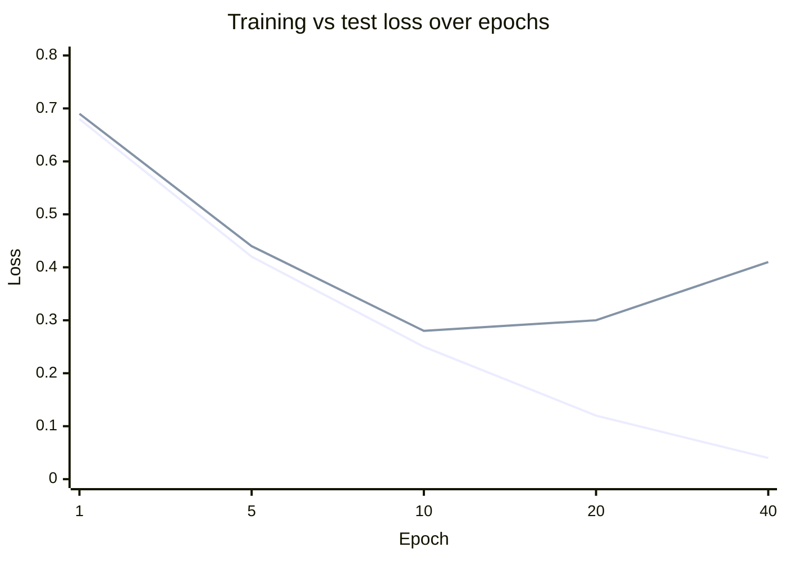
- **Source/licence:** original.

## Slide 19 — Discussion / Q&A

- **On-slide text:** "Questions & discussion." 2–3 seed prompts (see `exercises/discussion.md`): Where in your work would a held-out test set have caught a bad decision? Why not just always use a neural network? Would you trust a vendor's accuracy number now?
- **Speaker notes:** Run the 15-minute Q&A. Use the seed prompts if the room is quiet. Bridge forward: Session 7 turns all of this into 5 lines of Keras you'll run yourself.
- **Visual:** Discussion/poll layout.
- **Source/licence:** none.

## Resources slide (credits — last)

- **On-slide text:** Pre-reading and tools, with licences. 3Blue1Brown *Neural Networks* (link-only pre-reading); Desmos activation grapher (live demo); Keras/TensorFlow docs (Apache-2.0); source course credited as background (not reproduced).
- **Speaker notes:** Point people at the 3Blue1Brown series as the single best visual companion to today. Everything on this deck is our own drawing; nothing was lifted from the source.
- **Visual:** Resources & credits layout; pull entries from `resources/sources.md`.
- **Source/licence:** attributions per `resources/sources.md`.

---

## Build checklist (this deck)

- [ ] 15 content slides (3–18); every headline a claim, ≤6 bullets each.
- [ ] Every Mermaid rendered in-palette with alt text; the two "≥0.5 → DARK" resolutions visible.
- [ ] No red/green-only distinctions on the loss-curve chart — label the lines and/or use dash vs. solid.
- [ ] Speaker notes on every content slide.
- [ ] Discussion slide present; resources slide lists 3Blue1Brown + Desmos as link/demo-only.
- [ ] No LINK-ONLY material embedded (no 3B1B frames, no Desmos screenshots).
- [ ] Rehearses in ~45 min (pre-draw the forward-pass numbers; don't compute live).
