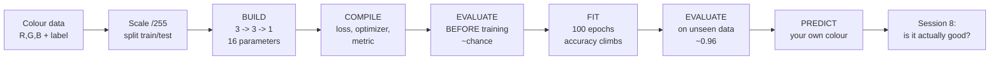

# Session 7 Overview — The Session Where You Actually Train One

Session 6 opened the black box and explained the machinery: a neuron is a weighted sum plus a bend, a network is layers of those, training is walking downhill on an error landscape. All of it true, none of it yet *yours*. This session closes the gap between understanding a thing and having done it.

The promise is narrow and absolute: **nobody leaves this session without having trained a neural network.** Not watched one train — trained one, on their own machine, from a notebook they keep.

## The arc

*Caption: the session's spine. Note the deliberate detour at E — we score the model before training it, so the improvement at G is something the room witnesses rather than something the presenter asserts.*

## What each part is for

| Part | File | The question it answers |
|---|---|---|
| The lab environment | `01-the-lab-environment.md` | Where does this run, why Colab, and what do I do if Colab is blocked? |
| The data and the `/255` | `02-the-data-and-scaling.md` | What is this dataset, why divide by 255, and why hold a third of it back? |
| Building the network | `03-building-the-network.md` | What does each of the five lines of Keras actually declare? |
| Compiling it | `04-compiling-the-model.md` | Loss, optimizer, metric — three arguments, three different jobs. |
| The honest moment | `05-the-honest-moment.md` | What does an untrained network do, and what does that teach? |
| `fit()` and watching it learn | `06-fit-and-watching-it-learn.md` | What are epochs and batches, and how do I read the training log? |
| Knobs you can turn | `07-knobs-you-can-turn.md` | Which numbers can I change, which way, and what breaks at each extreme? |
| Key takeaways | `99-key-takeaways.md` | If I remember one thing… |

## Why this matters to your role

**Developers.** You will write these lines many times. The value of this session is not the syntax — you could have read the Keras quickstart — it is the *discipline*: check your label direction before trusting a metric, score the model before you train it so you know what "no skill" looks like, change exactly one thing between runs. Those habits are what separate people who get models working from people who get models producing numbers.

**Release / problem / configuration managers.** You are unlikely to write this code in anger. What you take away is **calibration**. When a vendor or an internal team says "we built a model", you now know, from having done it, that the building is fifteen lines and twenty-five minutes. That is not a criticism of them — it is the correct baseline. It relocates your scepticism to where it belongs: the data, the labels, the held-out evaluation, and the operational judgement afterwards. A demo of a model that trains proves almost nothing, and after this session you will know that from experience rather than from being told.

## The honest framing

Three things this session is careful about, because it would be easy to leave the room over-impressed.

**Our problem does not need a neural network.** Deciding whether a background wants light or dark text is essentially a brightness calculation. A three-line rule solves it; a logistic regression solves it. The source course that originated this example says so explicitly, and we repeat the admission rather than bury it. We use a network here because it is *small enough to see through* — 16 parameters you can print and read. Reach for the simplest model that works when it is real.

**Our network is not, strictly, deep learning.** "Deep" conventionally means more than one hidden layer. Ours has one. We say so.

**Training a model is the easy part.** Everything genuinely difficult — is the data any good, are the labels right, does the score mean anything, what happens when the world shifts, who is accountable when it is wrong — lives outside `fit()`. This session is the on-ramp, not the destination. Session 8 begins the destination.

> **Source honesty.** The colour example and the Keras build come from Thomas Nield's *Deep Learning for Beginners*, Day 1 (O'Reilly) — all rights reserved, so we **link it and do not copy it**. That deck's exercise slides are title-only, so this lab is written from scratch. Two of its documented defects are corrected here rather than repeated: the `≥ .5` threshold contradiction (we hold **≥ 0.5 → DARK** everywhere) and the claim that weights initialise "between −1 and 1" while the accompanying code produces 0 to 1. See `resources/sources.md`.
