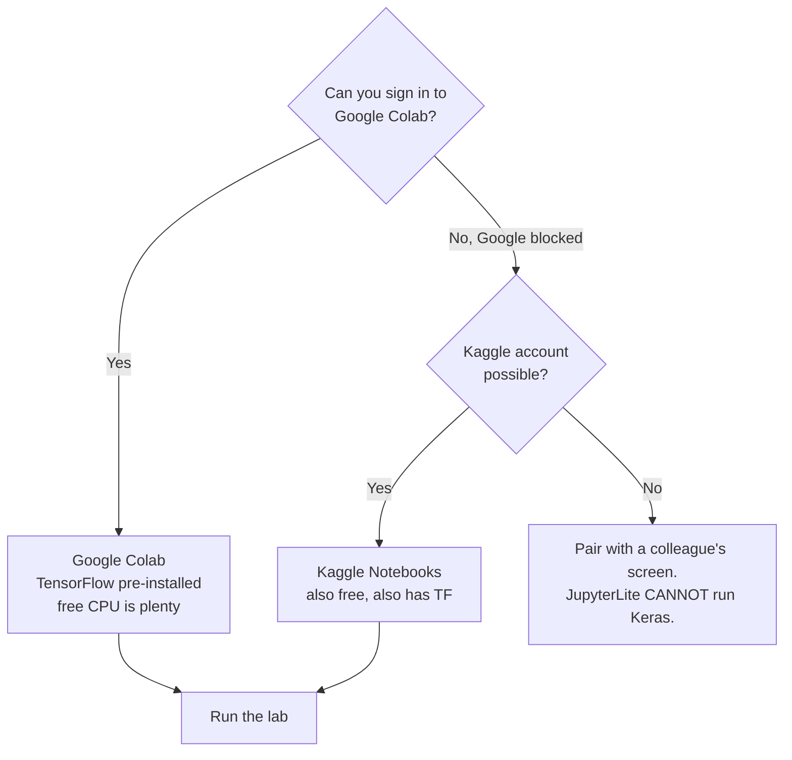

# The Lab Environment — Where This Runs, and What To Do If It Doesn't

Before any deep learning happens, everyone has to be looking at a Python prompt that already has TensorFlow in it. This is the least interesting part of the session and the most common way it fails, so it gets its own page.

## The decision



*Caption: the environment decision. There are only three outcomes, and one of them is "watch someone else's screen" — which is an acceptable outcome, not a failure.*

## Why Colab

| Option | Account? | Runs Keras? | Friction | Verdict for this session |
|---|---|---|---|---|
| **Google Colab** | Google account | **Yes** | Needs google.com + googleusercontent open; some corporate proxies block Drive mounts (we don't use Drive) | **Primary.** TensorFlow, pandas, NumPy, scikit-learn, matplotlib all pre-installed. Free tier is far more than enough. |
| **Kaggle Notebooks** | Kaggle account (phone verify for GPU — we don't need GPU) | **Yes** | kaggle.com must be allowlisted | **Backup.** Equivalent experience. |
| **JupyterLite** | **None** — runs in your browser | **No** | Lowest of all; can be self-hosted on an intranet page | **Not usable here.** See below. |
| **Local Python** | — | Yes, after `pip install tensorflow` | Install time, version conflicts, corporate laptop policy | Fine if you already have it; do not attempt it during the session. |

## The JupyterLite caveat, stated plainly

JupyterLite is genuinely excellent and it is the natural answer to "our policy blocks external logins": it runs Python entirely inside the browser via WebAssembly, needs no account and no server, and can be dropped onto an internal web page as static files. NumPy, pandas, matplotlib and scikit-learn all work.

**TensorFlow and Keras do not.** There is no WebAssembly build of them. This is not a configuration problem you can solve on the day.

So: JupyterLite is a fine fallback for the classical-ML sessions in this course, and it can run *parts* of Session 8 (the `sklearn.metrics` half). It cannot run any of Session 7. If Colab is blocked for you, pair up.

## You do not need a GPU

Colab's free tier offers a T4 GPU, and it is tempting to switch it on. Don't bother. Our model has **16 parameters** and our dataset has about 1,300 rows. It trains in a couple of seconds on a CPU; the GPU would spend longer being allocated than training. Reaching for a GPU by reflex is a good example of the "when all you have is a hammer" instinct this course keeps warning about.

A GPU earns its keep when the model has millions of parameters and the data has millions of rows. That is not today.

## Reproducibility: what the seeds do and don't do

```python
import numpy as np, tensorflow as tf
tf.random.set_seed(42)
np.random.seed(42)
```

Neural networks begin with **random** weights, and training shuffles data. Two runs of identical code therefore give different results. Setting a seed makes the random-number generators start from the same place, which makes runs *far* more comparable.

It does not make them identical. Parallel operations on CPU and GPU can complete in a nondeterministic order, and floating-point addition is not associative, so tiny differences creep in and get amplified over hundreds of epochs. Expect your accuracy to land within a percentage point or two of the numbers in this material, not exactly on them.

> **The habit worth taking from this:** any single training run is a **sample**, not a measurement. If run A scores 0.958 and run B scores 0.951, you have not learned that A's configuration is better. You have learned nothing. To claim a real difference you need several runs of each, and in Session 8 you will start doing exactly that.

## Checklist before the session starts

- [ ] I can open [colab.research.google.com](https://colab.research.google.com) and create a new notebook.
- [ ] `import tensorflow as tf; print(tf.__version__)` prints a `2.x` version.
- [ ] `pd.read_csv("https://tinyurl.com/y2qmhfsr")` returns a table with four columns. *(If not — the lab's Cell 1b generates an equivalent dataset offline. No panic required.)*

Three minutes of this before the session beats fifteen minutes of it during.
