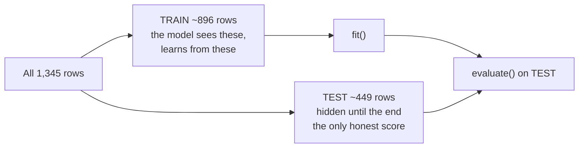

# The Data, the `/255`, and the Split

Everything a supervised model knows, it learns from a table. Before writing a single line of Keras, we need to understand what is in that table, put its numbers into a range the network can work with, and hide some of it from the model so we can find out later whether it actually learned anything.

## The dataset

| Property | Value |
|---|---|
| **Rows** | ~1,300 background colours |
| **Columns** | `RED`, `GREEN`, `BLUE` (each 0–255), `LIGHT_OR_DARK_FONT_IND` (0 or 1) |
| **Features (X)** | the three colour channels |
| **Label (y)** | which text colour is readable on that background |
| **Task type** | binary classification |
| **Source** | `https://tinyurl.com/y2qmhfsr` → `raw.githubusercontent.com/thomasnield/machine-learning-demo-data/...` — confirmed live 2026-07-17, **re-verify at delivery** |

A sample row might be `(255, 255, 204, 1)`: a pale cream background, and the label says use dark text on it. Which is what your eye would say too.

**The problem is deliberately trivial.** A rule based on perceived brightness — `0.299·R + 0.587·G + 0.114·B` — gets this nearly right without any machine learning at all. That is a feature of the teaching example, not a flaw: we can check the model's answers against our own eyes, and the whole thing is small enough to hold in one head. Do not conclude that this is what neural networks are *for*.

## Why scale by 255

```python
X = df[["RED", "GREEN", "BLUE"]].values / 255.0   # 0..255  ->  0.0..1.0
```

Raw channels run 0–255. Weights start as small numbers near zero. Multiply a weight of 0.3 by an input of 240 and the neuron's raw output is ~72 before it has learned anything — deep in the flat tail of a sigmoid, where gradients are tiny and progress is slow. Scale the input to 0–1 and everything starts on a sane footing.

Three consequences that are worth knowing rather than memorising:

| Without scaling | With scaling |
|---|---|
| Inputs are ~255× larger than the weights expect; early activations are extreme. | Inputs and weights are on comparable scales from step one. |
| The optimiser's single step size has to serve wildly different magnitudes across features. | One step size works reasonably for all three channels. |
| Training is slower and run-to-run variance is larger — sometimes it works, sometimes it stalls. | Training is faster and more repeatable. |

Challenge 1 in the lab has you remove the scaling and see this rather than take it on faith. Note the honest wording there: it usually gets *worse*, not always catastrophically. Three input features on a nearly-linear problem is about the friendliest possible case for getting away with bad practice. On thirty features of wildly different units, you do not get away with it.

**Why `/255` and not a fitted scaler.** Because 255 is a *known* maximum, fixed by the colour format, not something we have to estimate from the data. When the range is not known in advance — as with the 30 medical measurements in Session 8's second dataset — you fit a `StandardScaler` **on the training data only** and apply it to the test data. Fitting a scaler on all your data before splitting leaks information from the test set into training. Here, `/255` sidesteps the question entirely.

## Why hold data back

```python
X_train, X_test, y_train, y_test = train_test_split(
    X, y, test_size=1/3, stratify=y, random_state=42)
```



*Caption: the split. The model's score on the training rows tells you what it memorised; its score on the test rows tells you what it learned. Only the second one is news.*

- **`test_size=1/3`** — a third held back. Conventions vary (70/30, 80/20, or a three-way 70/15/15 when you also need a validation set for tuning). With ~1,300 rows a third is a comfortable ~450 test rows, enough that the score is not pure noise.
- **`stratify=y`** — keeps the class proportions the same in both halves. Without it, a random split can hand you a test set that is 70% one class, and your accuracy number then measures the split as much as the model.
- **`random_state=42`** — makes the split repeatable so two people comparing results are comparing the same thing.

## Check which way the labels point

This is the step everyone skips, and it costs entire afternoons.

We have defined our model's output as **the probability that the background needs DARK text**, with **≥ 0.5 → DARK**. That definition is only meaningful if label `1` in the file actually *is* the dark-text class. Check it, don't assume it:

```python
lum = 0.299*df.RED + 0.587*df.GREEN + 0.114*df.BLUE
for k in (0, 1):
    print(f"label {k}: mean background brightness = {lum[df.LIGHT_OR_DARK_FONT_IND == k].mean():.1f}")
# Example:
# label 0: mean background brightness = 55.0     <- dark backgrounds -> light text
# label 1: mean background brightness = 198.0    <- bright backgrounds -> DARK text
```

Bright background → dark text. So the class with the higher mean brightness is the "dark text" class. If that is label `1`, we are aligned. If it is label `0`, flip with `y = 1 - y` and carry on.

A model trained on inverted labels **still trains beautifully**. Loss falls, accuracy climbs, everything looks healthy — and every prediction is exactly wrong. Nothing in the training log can warn you. Only checking the semantics can.

> **This is one of the two source-deck errors we are correcting** (`AI_input.md` §6, error #1). The original material states the threshold rule one way on one slide (`≥ .5 → DARK`) and the opposite way on another (`≥ .5 → light`). We hold **≥ 0.5 → DARK** consistently across Sessions 6, 7 and 8, on the grounds that the output is defined as the probability of *dark*. The lesson generalises well past this dataset: **pick a direction, write it down, and verify the data agrees with it.**

## The shape of what you now have

| Object | Shape | Contents |
|---|---|---|
| `X_train` | (~896, 3) | scaled RGB, the rows the model learns from |
| `y_train` | (~896,) | 0/1 labels for those rows |
| `X_test` | (~449, 3) | scaled RGB, unseen until evaluation |
| `y_test` | (~449,) | 0/1 labels for those rows |

Four objects. That is the entire input to everything that follows.
