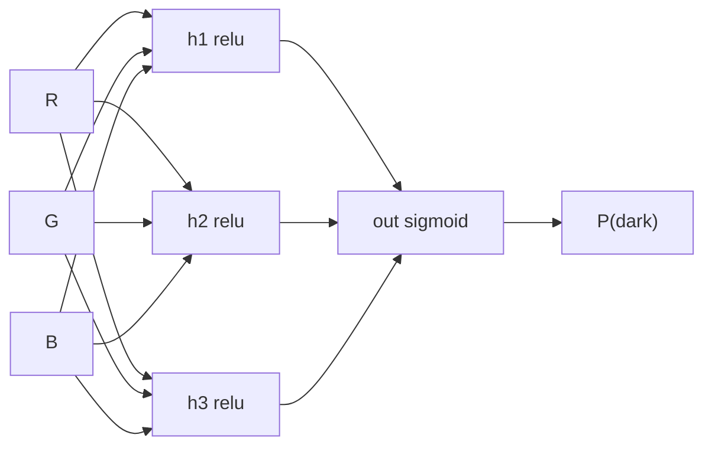

# Building the Network — Five Lines, Explained Line by Line

Here is the model. It is not an excerpt or a simplification; this is the whole thing.

```python
model = tf.keras.Sequential([
    tf.keras.layers.Input(shape=(3,)),                # three inputs: R, G, B
    tf.keras.layers.Dense(3, activation="relu"),      # hidden layer, 3 neurons
    tf.keras.layers.Dense(1, activation="sigmoid"),   # output, one probability
])
model.summary()
# Expected:
#  dense   (Dense)   (None, 3)    12
#  dense_1 (Dense)   (None, 1)     4
#  Total params: 16
```

Session 6 spent forty minutes on what this structure *means*. This page is about what each token *declares*.



*Caption: the 3 → 3 → 1 network the code above declares. Every arrow is a weight; every hidden and output neuron also has a bias.*

## Every token, and why

| Token | What it declares | Why this choice here |
|---|---|---|
| `Sequential([...])` | A linear stack of layers — each layer's output feeds the next, no branches, no skips. | Our network is a straight pipe. The alternative (`Functional` API) exists for models with multiple inputs, multiple outputs, or skip connections; we need none of that. |
| `Input(shape=(3,))` | Each example has three numbers. | R, G, B. The shape is **per example** — the number of rows is deliberately absent, which is why `summary()` shows `(None, 3)`. `None` means "any batch size". |
| `Dense(3, ...)` | A fully connected layer: **every** input connects to **every** one of its 3 neurons. | "Dense" is the plain-vanilla layer type. Convolutional layers exploit spatial structure in images; recurrent layers exploit order in sequences. Three independent colour channels have neither, so Dense is correct, not merely simple. |
| `activation="relu"` | `max(0, z)` — negatives clamp to zero, positives pass through unchanged. | The default hidden-layer activation, for good reasons: it is one comparison to compute, and it does not saturate for large positive values, so gradients keep flowing (no vanishing-gradient stall). |
| `Dense(1, ...)` | One output neuron → one number per row. | One binary question, one answer. |
| `activation="sigmoid"` | Squashes any real number into (0, 1). | Turns a raw score into a readable **probability of dark text**. |

## Where the 16 parameters are

`model.summary()` reports 12 + 4 = 16, and it is worth being able to derive that rather than accept it.

| Connection | Weights | Biases | Total |
|---|---|---|---|
| 3 inputs → 3 hidden neurons | 3 × 3 = **9** | one per hidden neuron = **3** | 12 |
| 3 hidden → 1 output neuron | 3 × 1 = **3** | one for the output = **1** | 4 |
| | | | **16** |

The general rule for a Dense layer: `params = (inputs × neurons) + neurons`.

**Sixteen numbers.** All random at the start, all adjusted by training, and that is the model in its entirety. A large language model is this same structure with a few hundred billion of them and a different arrangement of layers. The mechanism does not change with the count — a genuinely useful anchor to carry into Session 9.

## What "activation" is doing, in one paragraph

Without a nonlinearity between layers, a stack of Dense layers is algebraically equivalent to a *single* Dense layer: a linear function of a linear function is still linear. You could stack a hundred of them and still only be able to draw a straight boundary. ReLU's kink at zero is what breaks that collapse and lets successive layers build curved, composite boundaries.

Which raises an honest question this lab makes you confront: **does our problem need one?** Challenge 2 replaces `relu` with `linear` and the model usually still does fine — because brightness genuinely is close to a weighted sum of R, G and B, so the true boundary really is close to a straight line. That is a slightly deflating result and it belongs in the session. Nonlinearity is essential *in general* and barely earning its keep *here*.

## Choosing the activation for the output layer

This is the one activation choice you do not get to make by taste — it is determined by the task.

| Task | Output layer | Loss to pair with it |
|---|---|---|
| **Binary classification** (ours) | `Dense(1, activation="sigmoid")` | `binary_crossentropy` |
| Multi-class, one label per row | `Dense(n_classes, activation="softmax")` | `sparse_categorical_crossentropy` |
| Multi-label (several can be true) | `Dense(n_labels, activation="sigmoid")` | `binary_crossentropy` |
| Regression (predict a number) | `Dense(1)` — no activation | `mse` |

Getting this pairing wrong is the most common beginner error in Keras, and it rarely announces itself with an exception — it just trains badly. Session 8's extension exercises use the softmax row.

## What Keras actually put in those 16 slots

```python
w_hidden, b_hidden = model.layers[0].get_weights()
print(np.round(w_hidden, 3))
print(b_hidden)
# Example:
# [[-0.72  0.61  0.90]
#  [ 0.15 -0.86  0.34]
#  [ 0.98  0.42 -0.55]]
# [0. 0. 0.]
```

Small random numbers, **positive and negative**, roughly symmetric around zero — Keras's default **Glorot-uniform** initialiser, whose range is scaled to the layer's width so signals neither blow up nor die as they pass through. Biases start at exactly **zero**.

> **The second source error we are correcting** (`AI_input.md` §6, error #2). The original deck states that weights are initialised "between −1 and 1", while its own accompanying code calls `np.random.rand`, which returns values **between 0 and 1** — all positive. Both cannot be right, and the all-positive version is materially worse: a neuron whose weights are all positive begins unable to express "more of this input makes the answer *less* likely", and must spend early training climbing out of that hole. Rather than repeat either claim, the lab **prints the real values**. The general point matters more than the specific fix: *initialisation is a design choice with consequences, and the library has already made a good one for you.*

## Why the weights must be random at all

A fair question: why not start every weight at zero? Because then every neuron in the hidden layer would compute exactly the same thing, receive exactly the same gradient, and update identically — forever. Three identical neurons are worth precisely one neuron. The randomness exists to **break the symmetry** so the three hidden neurons can specialise into different features.

This is also the reason two runs of your identical notebook produce slightly different results, and the reason a single run is a sample rather than a measurement.
