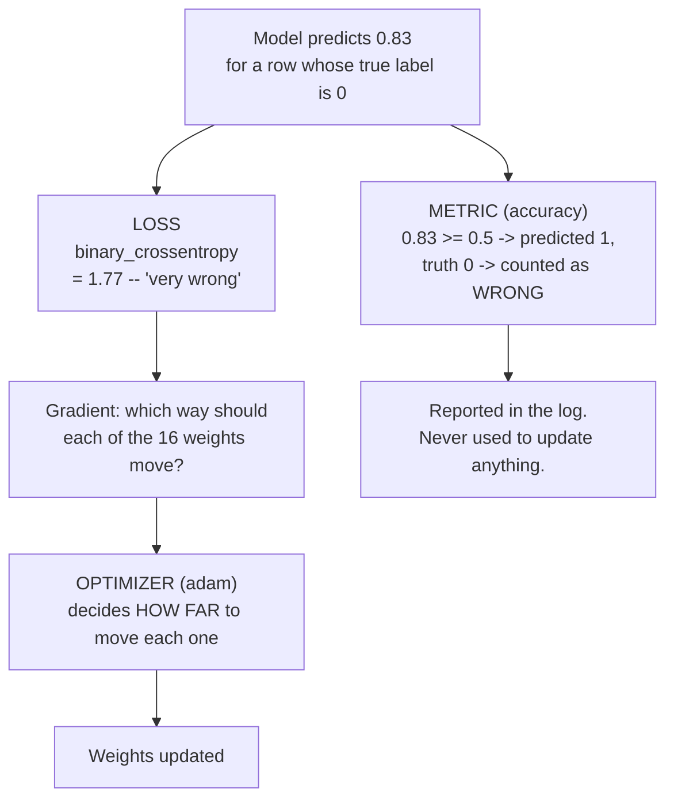
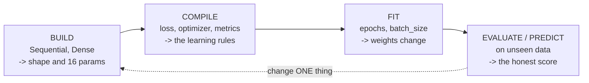

# Compiling the Model — Three Arguments, Three Different Jobs

Building the model defined its **shape**. Compiling defines **how it learns**. They are separate steps because they answer separate questions, and confusing them is a reliable source of models that train but do not work.

```python
model.compile(
    optimizer="adam",                # HOW to change the weights
    loss="binary_crossentropy",      # WHAT counts as wrong
    metrics=["accuracy"],            # what to REPORT to humans
)
```



*Caption: the loss drives learning; the metric only informs you. They look at the same prediction and do entirely different jobs.*

## The loss — what "wrong" means numerically

The loss function turns "the model predicted 0.83 and the answer was 0" into a single number that training tries to shrink. Everything the model learns, it learns from this number.

**Binary cross-entropy** for a single example is:

- if the true label is 1: `−log(p)`
- if the true label is 0: `−log(1 − p)`

Worked, so it is not just notation:

| True label | Prediction `p` | Loss | Reading |
|---|---|---|---|
| 1 | 0.99 | 0.01 | confident and right — almost no penalty |
| 1 | 0.60 | 0.51 | right but hesitant — modest penalty |
| 1 | 0.50 | 0.69 | no opinion — this is the "chance" loss, and it is why an untrained model's loss starts near **0.69** |
| 1 | 0.10 | 2.30 | confidently wrong — heavy penalty |
| 1 | 0.01 | 4.61 | very confidently wrong — brutal |

Notice the asymmetry: being confidently wrong costs vastly more than being hesitantly right. That is deliberate. It is what pushes the model toward calibrated confidence rather than toward guessing hard in one direction.

> **A number to remember:** a loss around **0.69** (`= ln 2`) on a balanced binary problem means the model is saying 0.5 to everything — no skill. If your loss sits at 0.69 and will not move, the model is not learning at all, and that is a different problem from learning slowly.

### Why not squared error?

The source deck this material derives from compiles with `MeanSquaredError`, and it works — but it is the wrong tool, most likely chosen to keep one loss function running across a three-day course (`AI_input.md` §5).

| | Mean squared error | Binary cross-entropy |
|---|---|---|
| Designed for | predicting continuous numbers | predicting probabilities of a 0/1 outcome |
| Gradient when confidently wrong | **small** (the sigmoid has flattened, and MSE multiplies by that flat slope) | **large** — the mistake produces a strong correction |
| Practical effect | trains slowly out of confidently wrong states | recovers briskly |

We use `binary_crossentropy`, and so does Session 8. This is a correction to the source, flagged rather than silently applied.

## The optimizer — how big a step

Session 6 established the picture: the loss defines a landscape, the gradient points downhill, training walks down it. The optimizer is the walking rule.

| Optimizer | Behaviour | When |
|---|---|---|
| `"sgd"` | plain gradient descent: one fixed step size for every weight | teaching, and some very large-scale training with careful schedules |
| `"adam"` | adapts the step size **per weight**, using a running memory of recent gradients | the default you should reach for; robust to a badly chosen initial learning rate |
| `"rmsprop"` | similar adaptive idea, older | occasionally in recurrent models |

`"adam"` uses a default learning rate of `0.001`. To change it explicitly:

```python
model.compile(optimizer=tf.keras.optimizers.Adam(learning_rate=0.01), ...)
```

The learning rate is the single most consequential number in training. Too large and each step overshoots the valley — loss oscillates, or goes to `nan`. Too small and training is correct but far too slow to reach anywhere useful in the epochs you have. Lab challenge 3 sets it to `5.0` so you can recognise the `nan` signature once and diagnose it forever.

## The metric — for you, not for the model

```python
metrics=["accuracy"]
```

Accuracy is the fraction of predictions on the correct side of 0.5. It is reported every epoch and **never used to update a single weight**.

Why not just optimise accuracy directly, since it is what we actually care about? Because accuracy is a **step function**. Nudging a prediction from 0.61 to 0.62 does not change accuracy at all; nudging it from 0.499 to 0.501 changes it abruptly. A function that is flat almost everywhere and jumps at one point has no useful slope, and gradient descent has nothing to descend.

So we do what engineers do all the time: **optimise a smooth proxy, and watch the thing we actually care about.** Loss is the proxy. Accuracy is the thing.

> **This gap matters more than it looks.** Loss and accuracy usually move together, but not always — a model can improve its loss (getting more calibrated) while its accuracy stalls, or the reverse. And accuracy itself is a famously flattering summary; on an imbalanced problem it can be high while the model is useless. Session 8 replaces it with a confusion matrix and Session 13 turns that instinct on a vendor's "99% accurate" claim. For now, just hold the distinction: **the number that trains the model and the number that reassures you are not the same number.**

## The four stages, consolidated



*Caption: build → compile → fit → evaluate, and the loop back. Every Keras program has these four stages; the dotted arrow is where all the real work happens.*

An important practical detail visible in that diagram: **compiling comes before fitting, which means you can evaluate before you fit.** That is not a quirk — it is the hook the next page is built on.
