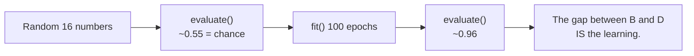

# The Honest Moment — Score It Before You Train It

This is the centre of the session. Everything else is scaffolding for the next four minutes.

The model is built and compiled. It has never seen a row of data. Its 16 numbers are random. **We are going to ask it to do the job anyway.**

```python
loss0, acc0 = model.evaluate(X_test, y_test, verbose=0)
print(f"UNTRAINED accuracy on unseen data: {acc0:.3f}   (loss {loss0:.3f})")
# Example:
# UNTRAINED accuracy on unseen data: 0.549   (loss 0.719)
```

## Why we do this

Almost every tutorial goes build → compile → fit → "look, 96%!" That sequence teaches the wrong lesson, because the audience has no idea what 96% is being compared *against*. Ninety-six percent sounds impressive. Is it? Against what baseline?

Running `evaluate()` first establishes the baseline **empirically, in your own notebook**. You do not take on faith that an untrained network is useless; you measure it. And then, ten minutes later, when accuracy is 0.958, the improvement is something you watched happen rather than something you were told.



*Caption: the honest moment. Without the first measurement, the last one is just a number on a slide.*

## The more interesting question: *how* is it wrong?

The accuracy figure is not the payoff. This is:

```python
probs0 = model.predict(X_test, verbose=0).ravel()
preds0 = (probs0 >= 0.5).astype(int)
print("probability range:", round(probs0.min(), 3), "to", round(probs0.max(), 3))
print("predicted class counts:", np.bincount(preds0, minlength=2))
print("actual    class counts:", np.bincount(y_test,  minlength=2))
# Example:
# probability range: 0.412 to 0.605
# predicted class counts: [  0 449]     <- it answered "DARK" to every single colour
# actual    class counts: [201 248]
```

**The untrained model predicted one class for everything.**

It is not making bad decisions. It is not making decisions at all. Every colour produced a number in a narrow band near 0.5, and thresholding a narrow band near 0.5 gives you one answer for the whole dataset.

### Why it hovers at 0.5

Biases start at exactly zero and weights start small and symmetric around zero, so the raw output of the final neuron is close to 0 for every input. And `sigmoid(0) = 0.5` exactly. The model has no reason to prefer either answer, so it does not — it sits on the fence and then falls off it in whichever direction the random weights happen to lean.

### Why the accuracy is ~0.55 and not exactly 0.50

Because the class balance is not exactly 50/50. Our test set is roughly 201 / 248, so a model that always answers the larger class scores 248/449 ≈ 0.55. **That is precisely what happened here.** The 0.55 is not partial skill. It is arithmetic about the dataset, with the model contributing nothing.

## The lesson to actually carry out of the room

> **An accuracy number, alone, cannot distinguish "learned the problem" from "guessed the majority class."**

Here the deception is small, because the classes are nearly balanced — a do-nothing model gets 55%, which nobody would call impressive. Now scale the thought:

| Problem | Majority class | Do-nothing accuracy | How it sounds in a slide deck |
|---|---|---|---|
| Light/dark text (ours) | 55% | 0.55 | obviously bad |
| Defect in a build pipeline | 95% pass | 0.95 | "95% accurate defect detector" |
| Rare hardware fault | 99.5% healthy | 0.995 | "99.5% accurate — better than human" |
| Fraudulent transaction | 99.9% legitimate | 0.999 | "three nines" |

Every number in the third column is achievable by a model that **predicts the majority class every time and detects nothing whatsoever**. You have now watched exactly that model get built and score respectably, in your own notebook. That memory is worth more than any slide about it.

This is the thread the course pulls for the next several sessions:

- **Session 8** gives you the instrument that exposes it — the confusion matrix, plus precision and recall.
- **Session 13** aims it at a vendor: the "99% accurate" medical test that is right about 14% of the time when you know the base rate; and the model that predicts only people named Michael will quit, and reports 98% accuracy.

## Checkpoint

Before moving on, be able to answer these without looking:

1. **Why does an untrained network output ~0.5 for everything?** Biases are zero, weights are small and symmetric, so the pre-activation output is near 0, and `sigmoid(0) = 0.5`.
2. **Why is the untrained accuracy 0.55 rather than 0.50?** It predicts one class for everything, and that class is 55% of the test set.
3. **What would 0.96 accuracy mean on a dataset that is 96% one class?** Possibly nothing at all. You cannot tell from the accuracy — you need to see which errors were made.

> **A word on staging this live.** Poll the room *before* running `evaluate()`: "the model is built but untrained — what accuracy will it get?" Most will say 50%. Then reveal 0.55, and let someone work out why it is not 50 before you tell them. The class-count line lands hardest when the room has already committed to an answer.
