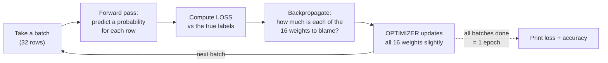

# `fit()` — Watching It Learn

One function call, and the sixteen random numbers become sixteen useful ones.

```python
history = model.fit(
    X_train, y_train,
    epochs=100,        # 100 passes over the training data
    batch_size=32,     # update the weights after every 32 rows
    verbose=1,         # print a line per epoch so we can watch
)
```

## What is happening inside, in five steps

Session 6 taught this; here it is with the code words attached.



*Caption: the training loop. It runs once per batch — with 896 training rows and `batch_size=32`, that is 29 times per epoch, 2,900 times over the whole run.*

Nothing in that loop is mysterious, and nothing in it is smart. It is: guess, measure the error, assign blame, nudge. Repeated a few thousand times, on sixteen numbers.

## Reading the log

```
Epoch 1/100
29/29 ━━━━━━━━━━ 1s 4ms/step - accuracy: 0.5612 - loss: 0.6871
Epoch 2/100
29/29 ━━━━━━━━━━ 0s 3ms/step - accuracy: 0.6398 - loss: 0.6603
...
Epoch 50/100
29/29 ━━━━━━━━━━ 0s 3ms/step - accuracy: 0.9420 - loss: 0.1998
...
Epoch 100/100
29/29 ━━━━━━━━━━ 0s 3ms/step - accuracy: 0.9598 - loss: 0.1361
```

| Field | Meaning | What to watch for |
|---|---|---|
| `Epoch 7/100` | Pass 7 through the whole training set | — |
| `29/29` | 29 batches completed this epoch | `ceil(896 / 32) = 28`, plus rounding — the count tells you how many weight updates per epoch |
| `loss: 0.66` | The number being minimised | Should trend **down**. Bumpy is fine; flat at ~0.69 means no learning; `nan` means the learning rate is too high |
| `accuracy: 0.64` | Fraction correct **on training data** | Rising is good, but this is *not* a trustworthy score — the model has seen these rows |
| `4ms/step` | Time per batch | Irrelevant at this scale; decisive at real scale |

**Read the epoch-1 line carefully.** Accuracy 0.56, loss 0.687 — that is the untrained state we measured on the previous page, confirming itself. Loss near `ln 2 ≈ 0.693` means "saying 0.5 to everything". By epoch 3 it is already at 0.62 and falling. The learning is visible from the first few lines.

## `epochs` and `batch_size`, precisely

These two arguments are frequently glossed over, and they are the two that determine *how much training actually happens*.

| Term | Definition | If you increase it |
|---|---|---|
| **Epoch** | One complete pass over the entire training set | More total learning — until it stops helping and starts memorising (Session 8) |
| **Batch size** | How many rows the model processes before updating its weights | **Fewer** weight updates per epoch; smoother, faster per epoch, often slightly worse generalisation |

The relationship worth internalising:

```
weight updates = epochs × ceil(training_rows / batch_size)
```

With our numbers: `100 × 29 = 2,900` updates. **Not 100.** People routinely assume "100 epochs" means 100 adjustments, and are then baffled that halving `batch_size` changed their results without touching `epochs`. It doubled the number of updates.

| `batch_size` | Updates per epoch (896 rows) | Character |
|---|---|---|
| 1 | 896 | "Stochastic" gradient descent. Very noisy, very slow per epoch, can escape poor local minima |
| 32 | 29 | The common default. A reasonable trade |
| 256 | 4 | Smooth, fast per epoch, fewer corrections — often needs more epochs |
| 896 (all) | 1 | "Full batch". Smoothest possible; usually too few updates to be practical |

## `verbose`, and why you will end up using `verbose=0`

`verbose=1` prints a line per epoch — essential when teaching, and exactly what you want the room watching. In the extension exercises and in Session 8 you will see `verbose=0` used instead, because when you are running five configurations in a loop, five hundred lines of log obscure the one comparison you actually wanted.

## What `history` holds

`fit()` returns a `History` object recording every epoch:

```python
print(history.history.keys())
# Expected: dict_keys(['accuracy', 'loss'])
print("first epoch accuracy:", round(history.history["accuracy"][0], 3))
print("last  epoch accuracy:", round(history.history["accuracy"][-1], 3))
# Example:
# first epoch accuracy: 0.561
# last  epoch accuracy: 0.960
```

Add `validation_data=(X_test, y_test)` to `fit()` and the dictionary also gains `val_loss` and `val_accuracy`, evaluated on held-out data after every epoch. Plotting `accuracy` against `val_accuracy` is the single most informative chart in applied deep learning — and it is the first thing Session 8 puts on the screen.

## The type-along rhythm: change one thing, re-run

This is the working habit the session is really teaching. Hold the block, change exactly one thing, run it again, compare.

```python
def build_and_compile():
    m = tf.keras.Sequential([
        tf.keras.layers.Input(shape=(3,)),
        tf.keras.layers.Dense(3, activation="relu"),
        tf.keras.layers.Dense(1, activation="sigmoid"),
    ])
    m.compile(optimizer="adam", loss="binary_crossentropy", metrics=["accuracy"])
    return m

short = build_and_compile()
short.fit(X_train, y_train, epochs=5, batch_size=32, verbose=0)   # ONLY CHANGE
print("5 epochs   ->", round(short.evaluate(X_test, y_test, verbose=0)[1], 3))
print("100 epochs ->", round(model.evaluate(X_test, y_test, verbose=0)[1], 3))
# Example:
# 5 epochs   -> 0.717
# 100 epochs -> 0.958
```

**Two things this teaches.**

First, **five epochs is underfitting** — the model has begun learning and stopped far too early. Underfitting shows up as both training *and* test scores being mediocre together. (Overfitting, its mirror image, shows up as training high and test low, and is Session 8's opening scene.)

Second, and more important as a habit: **rebuild before you re-run.** Calling `fit()` a second time on the *same* model continues training from wherever it left off; it does not start over. Almost everyone gets caught by this once — running "5 epochs" on an already-trained model and being delighted by the result. The `build_and_compile()` helper exists to make a clean comparison the path of least resistance.

> **The discipline underneath the rhythm:** change one thing at a time. If you change the epochs *and* the batch size *and* the hidden layer size and the score improves, you have learned nothing about which change helped, and you have no way to undo the two that may have hurt. This is not a deep-learning principle; it is experimental method, and it is the part of this session that transfers to work that has nothing to do with neural networks.
