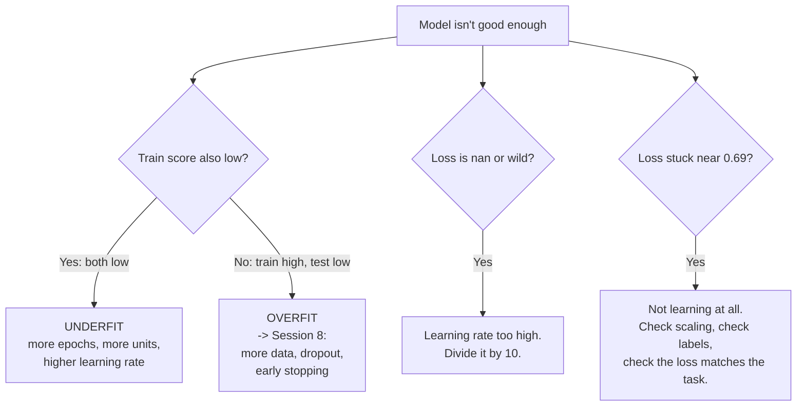

# Knobs You Can Turn — and Reading the Answer

Two things remain: what you are allowed to change, and how to turn a probability into a decision.

## The knobs

Everything in this table is a **hyperparameter** — a number *you* choose, as opposed to the 16 **parameters** the training chooses. That distinction is worth keeping crisp: training optimises parameters; you (or a search) optimise hyperparameters.

| Knob | Where it lives | Typical values | Turn it up | Turn it down | Failure mode at each end |
|---|---|---|---|---|---|
| **Epochs** | `fit(epochs=...)` | 10–500 | more total learning | faster runs | Too few → underfit (both scores mediocre). Too many → overfit (train ≫ test) |
| **Batch size** | `fit(batch_size=...)` | 8–256 | smoother, faster per epoch, fewer updates | noisier, more updates per epoch | Too large → too few corrections. Too small → slow and jittery |
| **Learning rate** | `Adam(learning_rate=...)` | 1e-4 – 1e-1 (default 1e-3) | bigger steps downhill | more careful steps | Too high → oscillation or `nan`. Too low → correct but never arrives |
| **Hidden units** | `Dense(n, ...)` | 2–256 | more capacity for complex patterns | fewer parameters, faster, less overfitting | Too few → underfit. Too many → overfit and waste |
| **Number of layers** | add a `Dense(...)` | 1–3 for tabular | represent more compound structure | simpler, more interpretable | Too deep on simple data → no gain, slower, harder to train |
| **Hidden activation** | `activation=` | `relu` | — | — | `linear` collapses the network to a line; `sigmoid` in hidden layers risks vanishing gradients |
| **Output activation** | `activation=` | `sigmoid` (binary) | — | — | **Not free to choose** — determined by the task, must match the loss |
| **Loss** | `compile(loss=...)` | `binary_crossentropy` | — | — | **Not free to choose** — determined by the task |
| **Optimizer** | `compile(optimizer=...)` | `adam` | — | — | `sgd` needs a well-chosen learning rate; `adam` is forgiving |

**The two rightmost columns are the point of the table.** Almost every knob has a failure mode at *both* ends. There is no direction that is simply "better", which is why tuning is a search rather than a recipe.



*Caption: the first-response triage. Three questions get you to the right knob most of the time.*

## The three failures worth recognising on sight

| Symptom in the log | Diagnosis | First move |
|---|---|---|
| `loss: nan` after a few epochs | Learning rate far too high — steps overshoot and diverge | Divide the learning rate by 10 |
| Loss frozen at ~0.69, accuracy at the majority-class fraction | Not learning at all | Check the inputs are scaled; check the labels are 0/1 and point the right way; check loss matches the output activation |
| Training accuracy → 1.00 while test accuracy stalls | Overfitting — memorisation, not learning | Session 8 in its entirety |

The third one you cannot even *see* today, because we are not tracking the test set during training. Add `validation_data=(X_test, y_test)` to `fit()` and it becomes visible immediately. That single argument is the bridge to the next session.

## Reading the answer: `≥ 0.5 → DARK`

```python
def advise(r, g, b):
    p = float(model.predict(np.array([[r, g, b]]) / 255.0, verbose=0)[0][0])
    return f"P(dark) = {p:.3f} -> {'DARK' if p >= 0.5 else 'LIGHT'} text"

# Example:
# (255,255,204) -> P(dark) = 0.981 -> DARK text
# ( 26, 26, 26) -> P(dark) = 0.008 -> LIGHT text
# (128,128,128) -> P(dark) = 0.604 -> DARK text    <- much less confident
```

Three things to notice, each of which matters more than it appears.

**1. The model outputs a probability, not a label.** The label is something *we* manufacture by comparing to a threshold. The model never says "DARK"; it says 0.981, and we decide what that means.

**2. `0.5` is a choice, not a law of nature.** It is the neutral default, appropriate when the two kinds of error cost about the same. When they do not — a missed fault versus a false alarm — you move it, deliberately, and accept the trade. Session 8 moves it and shows you exactly what it costs.

**3. The confidence is information you are usually throwing away.** Cream gives 0.98; mid-grey gives 0.60. The model is telling you that mid-grey is a genuinely marginal case — which it is, to a human eye too. Collapsing both to "DARK" discards that. Real systems that route the low-confidence cases to a human, and auto-decide only the confident ones, are doing something simple and very effective with a number that is already there and usually ignored.

> **The threshold direction, settled.** We use **`P ≥ 0.5 → DARK`** because the output is defined as the probability of *dark* text. The source deck contradicts itself on this point across two of its own slides (`AI_input.md` §6, error #1); we resolved it in favour of DARK and hold it consistently in Sessions 6, 7 and 8. The general lesson is bigger than the fix: **write down which class "positive" means, verify the data agrees, and never let two documents disagree about it.** Session 8 shows a case where getting this backwards silently reports the wrong recall.

## What we deliberately did not do

An honest inventory, because the gap between "trained a model" and "have a working system" is where this course spends most of its remaining time.

| Not done today | Why it matters | Where it happens |
|---|---|---|
| Look at *which* colours it gets wrong | Accuracy hides the structure of the errors | Session 8 (confusion matrix) |
| Ask whether 96% is good *for this base rate* | A do-nothing model can score higher than 96% on the right dataset | Sessions 8 and 12 |
| Track test performance during training | Overfitting is invisible without it | Session 8 |
| Tune systematically, or repeat runs | One run is a sample, not a measurement | Session 8 |
| Anything about deployment, drift, or accountability | The model is the small part | Sessions 13–14 |

The five lines in the build cell are genuinely the easy part. That is the recalibration to leave with — not cynicism about the technology, but an accurate sense of where the difficulty actually lives.
